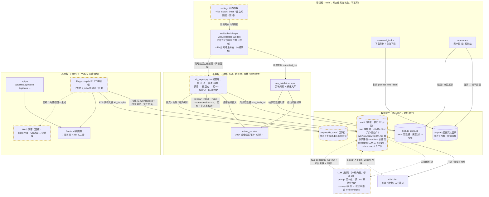

# 知识库沉淀与搜索 — 调研与方案（2026-09-29）

> 主题：把已收录/已沉淀的内容资产（帖子页 HTML 正文）转成**本地 Markdown 知识库**：Obsidian 直接打开（含知识图谱），Web 端提供全文搜索与图谱页，远期接知识库问答（RAG）。
> 状态：**设计中**（尚未实施）。本文先落调研结论与分期方案，作为后续实施的依据；落地后回填「已实施 / 作废」标注与实施记录。
> 修订：2026-09-29 与用户澄清后修正口径——知识库沉淀**与现有内容资产沉淀（媒体目录）完全解耦**，由 `kb_export.py` 单独批次直接读库驱动，vault 纯文本。
> 修订 2：2026-09-29 场景讨论后增补——①日常增量定时化（默认每晚 23:00，「参数设置」页可配，复用既有调度器）；②`auto/` 写入边界从约定升级为**代码级校验**；新增 §六 角色与使用场景。
> 修订 3：2026-09-29 方案风险审查后增补——①调度**触发与执行解耦**（tick 只触发，独立工作线程执行）；②目录名唯一化 + 路径长度预算 + frontmatter YAML 序列化；③**正文内联图片外链**（显示 URL 归一口径）+ 资源清单兜底（用户拍板）；④定时批次收敛为**增量集** + 手动/定时同一把锁互斥；⑤批次状态移出 vault 至 `outputs/kb_state/`（Obsidian 并不默认忽略 `_` 前缀目录）；⑥kb 批次**独立间隔键**入页内白名单（用户拍板）。
> 修订 4：2026-09-29 用户确认——FTS5 中文分词采用 **jieba 预分词**（§五 该待定项落定，设计要点并入 §3.5）。
> 修订 5：2026-09-29 增补——①§3.0 核心模块业务架构总览图；②§3.4 vault 扩为三区结构（auto 来源层 / notes 加工层 / maps 索引层），程序契约仍只写 `auto/`。
> 修订 6：2026-09-29 用户确认（对照业界 raw/wiki/schema 架构讨论后）——①`auto/` **更名 `raw/`**（auto 表达「谁写的」，raw 表达「它是什么」：不可修改原始层）；②每帖**原子落盘 `source.html` 原始 HTML**，raw/ 成为严格意义的原始层（提取器升级可全量重转、不重抓；已落盘帖与站点删帖解耦），幂等判据相应调整。
> 修订 7：2026-09-29 用户确认，§五 待定项**全部落定**——TopN=5（三源统一）；磁力索引 = kb_state JSON 增量；vault 默认 `outputs/vault/`（`TXXY_VAULT_ROOT` 可覆盖）；`/kb` 图谱**不并入**数据总览联动组；实体页**一期实施**（作者/版块确定性聚合，图谱星型化）。
> 修订 8：2026-09-29 第二轮风险审查合入——①重试语义拆分：`--force`（重抓+重转）/ `--reconvert`（仅离线重转）；②FTS 索引磁盘持久化 + 启动后台预热 + 增量重建（首请求不阻塞）；③source.html 安全红线（永不经 HTTP 下发浏览器）+ 落盘护栏（5MB 上限 / 编码记录）；④实体页一致性（待刷新集合入断点状态）+ 空/脏作者规则；⑤修正 4 处前轮残留不一致 + 4 项已知取舍记录（§四-13）。
> 修订 9：2026-09-29 增补——①§六 角色与场景同步至修订 8 口径（新增重转 / 原始件追溯 / 重启即搜等场景）；②实体页**同名消解**（对照业界 raw/wiki 架构概念/实体同名问题）：目录即命名空间（`_entities/authors/`、`_entities/sections/` 分子目录）+ 程序互链一律**全路径 wikilink + alias 短名**，概念/实体同名由人工按 Wikipedia 消歧义惯例加限定符。
> 修订 10：2026-09-29 第三轮风险审查，**方案 A 拍板**——①笔记**文件名=标题**：`raw/<版块>/<标题>.md` + 同目录 `<标题>.html`（原 `<标题>/index.md` 结构废止：文件名是 index，`[[标题]]` 按文件名解析会全部悬空，图谱节点失效——设计级缺陷）；②文件名唯一化扩为**全 vault 范围**（跨版块同名帖加 hash 后缀）；③链接规则统一：帖子互链短名 / 实体页全路径 + alias；④补原始件「非离线完整快照」定位说明、mermaid 补 kb.py→kb_state 边。
> 修订 11：2026-09-30 第三次风险审查（逐条对照代码核实）——①幂等判据**弃用 `posts.update_at`**（抓取为全站重抓、upsert 无条件刷写全表，判「未变」永不成立，会令增量集每批退化为全量重抓；改用 likes/replies/date/url 内容元组，取舍① 同步改判）；②`--date-from/--date-to` 显式绑定 `posts.date` 发布日、禁用 `update_date`（原 29 实测教训）；③`kb_fts.sqlite` 与「Web 端不写 SQLite」前提冲突显式化（web 独占写的派生索引库例外）+ 启动完整性校验；④磁力索引与断点状态同步原子落盘、`--resume` 零请求补提取；⑤唯一化 hash 后缀输入定为稳定键 `url`、映射入断点状态；⑥调度引用更正为现实现 `JobScheduler/ScrapeJob`（`ScrapeScheduler` 为旧名）；⑦kb 批次与抓取批次同 tick 串行 + 时刻重叠提醒；⑧§3.0 图 newmod 标注补全；⑨`web/atomicfile` 跨段引用前提注明；⑩§四-8 增补幂等判据双向验证用例。
> 修订 12：2026-09-30 用户拍板（对照 sdsrs/llm-wiki 文件树评估）——①**`raw/` 收敛为纯原始层**（只存 `<标题>.html` 原始件），`.md` 笔记移入 **`wiki/sources/`**（与 `raw/<版块>/` 逐级镜像，frontmatter 增 `original` 原始件回链，修订 11 字段落地）；②文件名**不加版块前缀**（维持「文件名=标题」，版块由 `raw/`、`wiki/sources/` 的 `<版块>/` 子目录承载，跨版块同名帖仍走 hash 后缀，修订 10/11 口径不变）；③新增 **LLM 编译层**（单列新分期，可与三期 RAG 并行）：source/concept/内容派生实体由 LLM 按 prompt 基于 `raw/` 原始 HTML 正文判定生成（采纳 llm-wiki 架构），硬前提——prompt 规格版本化（`prompts/` 唯一定义，frontmatter 记 `prompt_version` + 模型名）、写入边界（LLM 仅写 `wiki/concepts/` 与派生实体页，不回写 raw/sources）、产出判据（空/格式非法/引用不存在帖 → 计失败不落盘，对齐原 52）、审计与成本（prompt 版本 + 模型 + token 随批次落盘）、实体页分治（确定性实体页保留，LLM 只增内容派生页，互链同全路径 + alias 规则）、人工层 `notes/`/`maps/` 程序与 LLM 均不可达；**一期保持确定性，不引入 LLM 依赖**。
> 修订 13：2026-09-30 用户改主意拍板（评估合流）——①**一期引入 LLM**：原「新分期」并入一期，`kb_export.py` 扩为**三段流水线**（按帖：抓取→raw→转换→sources→LLM 判定→概念索引；批次末：entities SQL 聚合 + concepts 按索引聚合刷新），`kb_compile.py` 不再独立建脚本；新增 `llm_failed` 帖级判据（LLM 失败不阻塞确定性产物、不回滚，`--resume` 补跑）与 `--skip-concepts`（离线/无密钥只出确定性两件套）、`--regen-concepts`（prompt 改版后零抓取零转换重生成）；并发 4~8 路限流 + 单帖 token 上限截断；LLM 内容实体简化为 concept 页（`type: concept`），不建第二套实体目录；`kb_state` 增 `concept_index.json`；详见 §3.8。②**QA 双后端（三期）**：本地 Ollama（OpenAI 兼容）+ 云 API 可配互切——**embedding 单选**（向量库记录模型标识，不一致拒答并提示重建，禁止混存）、generation 自由切换；不做自动 failover / 双索引并存 / 流式输出。③**后端配置进参数页**：`llm_provider/llm_model/ollama_base_url` 页内可改（下拉受限取值、spec 随快照下发、Ollama base_url 保存实测连通性），`embed_provider/embed_model` 页内只读展示（改动走 env + 重启），云 API key 绝不进页/不入 `web_settings.json`；三件套 `default_llm_config()`/活值访问器/`set_llm_config()` 成对（原 55）；一期编译层键 env-only、默认云 API。
> 修订 14：2026-09-30 第四轮风险审查（独立复查，逐条对照 `init_db.py` posts 表 / `web/` 目录核实）——①修正修订 12 层级变更残留：frontmatter `original` 回链相对路径 `../raw/` 改为 `../../../raw/`（笔记在 `wiki/sources/<版块名>/` 下三层深，回链照旧文档全部悬空）；②定时增量集与幂等元组判据口径矛盾显式化：增量集以「笔记存在性」为准、存量帖 frontmatter 元数据（likes/replies）陈旧拍板为已知取舍，§3.2-6 / §四-13① 同步改写；③同版块热帖互链源改判「同 fid + 发布时间邻近窗口 Top5」（全版块全局 Top5 会令全部笔记携带同样 5 条边、图谱退化成超级 hub；修订 7 拍板的 N=5 不变），静态边陈旧记为已知取舍；④新增 Obsidian 图片外链「镜像依赖域名」直连可达性验证用例（§四-11）；⑤跨层同名后缀确定性规则（实体页让帖子）+ 碰撞帖互链必须写唯一化后实际文件名 + 人工区同名警示（§3.3、§四-10）；⑥jieba 版本锁定入 requirements、版本号入 kb_state，不一致整库重建 FTS（§3.5-4）；⑦定时入口 LLM 键缺失自动降级（等效 `--skip-concepts` + 页面可见告警，§3.7-3）；⑧首建全库批次启动时磁盘水位校验（§四-6）；⑨`web/__init__.py` 前提表述更正（该文件不存在，`web/` 为 namespace package 不链式加载 config，修订 11 表述失真）。
> 修订 15：2026-09-30 第五轮风险审查（独立增量复查，对照 `scraper.py` / `web/scheduler.py` 写入与调度侧核实）——①二期图谱**规模策略前置拍板**（万帖节点直渲不可行，按筛选聚合 + 节点上限默认 500、超出加权截断并提示，§3.5）；②LLM 产出判据增补**证据句逐字回查 `raw/` 原始件命中**（防幻觉证据句随批次末聚合固化进知识库资产，§3.2-5）；③sources 笔记**人工修改冲突检测**（写前比对上次生成 hash，不一致跳过计数，仅 `--force`/`--reconvert` 显式覆盖，§3.2-6）；④**「同 url 换 title」风险显式化**（title 主键 upsert 改标题会插入新行：增量集按 `url` 去重取最新行 + 孤儿笔记检测进批次汇总，§3.7-3 / §四-13⑤）；⑤定时增量集**失败帖重试上限**（连续 N 次失败移入「永久失败」不进增量集，§3.7-3）；⑥`--regen-concepts` **旧概念页孤儿清理**（聚合后与索引差集删除，§3.2-11）；⑦kb 与抓取批次同 tick 重叠拍板为**「抓取活跃即记 skipped 不等待」**（§3.7-1）；⑧FTS 语料不含 notes/concepts/entities 显式记为已知取舍（§四-13⑥）；⑨`posts.date` 写入格式核实结论标注（§3.2-1，销项）、`prompts/` 新增顶层目录拍板豁免（§6.2）、文件名尾部 `.`/空格等边界用例补充（§四-10）。
> 关联文档：《内容资产沉淀进度调研与建议.md》（媒体沉淀口径，仅作平行参照，无依赖）、《下载中心设计与实现.md》（媒体沉淀入口，不改动）、《自动下载设计与实现.md》（不改动）。

## 零、结论先行

1. **关键前置事实：正文从未落盘。** `posts` 表只存元数据（title/fid/date/url/likes/author/replies），现有沉淀（`download_files.process_one_detail`）只下载媒体与资源清单，**帖子页 HTML 正文本身没有保存**（全文检索 `download_files.py` 无任何 `.html` 落盘逻辑）。因此「知识库」不是对现有资产的二次加工，而是**新增一种沉淀产物：正文笔记**。
2. **载体选 Markdown vault（Obsidian 生态事实标准）。** 纯文件、无服务、跨机搬迁即拷目录，与「数据是核心资产且跨环境搬迁」前提完全契合；Obsidian 图谱依赖笔记内 `[[wikilink]]` 互链，没有链接就没有图——互链生成是本方案的核心设计点。
3. **搜索选 SQLite FTS5。** 项目已用 SQLite、单人本机、`db.cached` 5s TTL 体系现成，零外部服务；中文分词已定 **jieba 预分词**（修订 4，要点见 §3.5）。
4. **分期推进**：一期 CLI 批次脚本（采集/管理段，含 LLM 编译，修订 13）→ 二期 `/kb` 页面（展示段，只读）→ 三期 RAG 问答（Ollama / 云双后端）。每期独立可交付。
5. **与媒体沉淀完全解耦（2026-09-29 用户拍板）**：`kb_export.py` 单独批次**直接读 `posts` 表**取帖子链接（`txxy_env.to_fetch_url()` 拼访问链抓取），不扫描、不依赖下载根与资源管理目录；vault 为**纯文本**（不落媒体文件；正文内联图片外链 + 资源清单兜底，修订 3）；并顺带**原子落盘帖子页原始 HTML（`<标题>.html`，与笔记同名，修订 10）**，使 `raw/` 成为严格意义的原始层（修订 6；修订 12 落实：`raw/` 只存原始件，笔记移入 `wiki/sources/`，同名异层、镜像子路径）；不进 `assets` 漏斗与资源管理页任何统计口径。

## 一、需求与已拍板决策（2026-09-29 与用户确认）

| 分歧点 | 决策 | 备选（未采纳） |
|---|---|---|
| 正文来源 | **独立 CLI 批次脚本** `kb_export.py`，直接读库驱动，不改动现有下载流程 | 沉淀时同步抓正文；两者都要 |
| 与媒体沉淀的关系 | **完全解耦**：不读下载根/资源目录，vault 可放任意盘 | 扫描已沉淀目录回填；相对路径引用媒体 |
| 笔记内容 | **正文 + frontmatter 元数据 + 资源清单**（vault 纯文本不落媒体文件；**正文内联图片外链** + 图片清单兜底，修订 3 拍板；评论区二期再议） | 仅正文；正文+回复/评论；抄媒体进 vault；图片纯文字 |
| 原始件留存 | **每帖原子落盘原始件 `raw/<版块>/<标题>.html`**（真 raw，可离线重转与追溯；修订 6 拍板，命名随修订 10；修订 12：`raw/` 只存原始件，`.md` 笔记移入 `wiki/sources/`） | 仅存转换笔记（有损、不可回溯） |
| 批次范围 | **默认全库（posts 全表）+ 筛选参数**（`--fid` / `--date-from` / `--date-to`），断点续传 | 仅增量；先增量后回填 |
| 定时增量 | **默认每晚 23:00，「参数设置」页可配**（增补于场景讨论） | 仅手动跑批 |
| Web 搜索形态 | **新建 `/kb` 页面**：全文搜索 + ECharts 图谱，不动既有帖子浏览页 | 并入 /posts；两者都做 |
| QA 方式 | 三期**双后端**：本地 Ollama（OpenAI 兼容）+ 云 API 可配互切（embedding 单选、生成任选、参数页配置，修订 13）；接受内容出本机仍成立（本地档不出） | 仅云 API 单后端（收紧，未采纳） |
| LLM 编译层（concept 判定与 concepts 页） | **一期实施**（修订 13 合并原新分期）：`kb_export.py` 三段流水线内置，prompt 版本化 + 写边界 + 产出判据 + 审计 | 确定性代码全覆盖（未采纳）；独立 `kb_compile.py` 脚本（未采纳，函数级并入） |

## 二、业界做法对照

| 环节 | 业界主流做法 | 本项目适配结论 |
|---|---|---|
| 知识库载体 | Obsidian 生态事实标准 = Markdown vault + YAML frontmatter + `[[wikilink]]`；Logseq / SiYuan 类似 | 采纳：纯文件零服务，契合搬迁前提 |
| HTML → 正文提取 | `trafilatura`（LLM 语料清洗事实标准）/ `readability-lxml`；转 Markdown 用 `markdownify` | 采纳：Python 单依赖，帖子页模板单一效果好 |
| 笔记关联（图谱前提） | Obsidian 图谱完全依赖 `[[互链]]` | 采纳：自动互链三源——同版块热帖 / 同作者帖 / 磁力重复帖 |
| Web 全文搜索 | ① SQLite FTS5（BM25，零服务）② Pagefind（静态索引）③ Meilisearch / Typesense（独立服务，中文分词好但重） | 采纳 FTS5：单人本机无需独立检索服务 |
| 知识图谱（Web 侧） | Obsidian graph（vault 内）或 D3 / ECharts 力导向图自渲染 | 采纳 ECharts graph（项目已有先例，可下钻） |
| 问答（RAG） | 本地：embedding + sqlite-vec/chromadb + Ollama；或云 API | 三期云 API + sqlite-vec（单文件，延续 SQLite 路线） |

## 三、方案设计

### 3.0 核心模块业务架构总览（修订 5 追加）

虚线框 = 本次方案新增，实线 = 既有模块。



读图要点：

1. **两条沉淀线完全平行**：媒体线 `run_batch → download_tasks → outputs/`，知识库线 `scheduler / kb_export → vault/`——不交叉、不互查，`vault` 是新增的独立资产（虚线框）；
2. **`posts.db` 是知识库线的唯一输入**：`kb_export` 只读库拿元数据 + 链接，正文从镜像链现抓（正文从未落盘）；
3. **调度单点**：`scheduler.py` 的 60s tick 是唯一调度入口，kb 定时增量是它的新分支——判时拉起独立工作线程执行（不阻塞 tick 心跳），与手动 CLI 共用同一把文件锁；
4. **`notes/` 人工区没有任何入边**：程序与 LLM 编译层（kb_export 内置，修订 13）对该目录零写入路径（代码级前缀校验），只有 Obsidian 虚线回流（人工 wikilink 互链进图谱）；
5. **Web 端只读 vault**：二期 `kb.py` 扫描建 FTS 索引（索引文件写 vault 外 `kb_state`），三期 RAG 复用同一份笔记，不产生第三份数据副本。

### 3.1 分期总览

| 期 | 交付物 | 所属段 | 依赖 |
|---|---|---|---|
| 一期 | `kb_export.py`：读库批次抓正文 → `raw/<标题>.html` 原始件 + `wiki/sources/<标题>.md` 笔记（镜像子路径 + `original` 回链）+ 实体页 + **LLM 编译 concepts**（三段流水线，修订 13）；定时增量（23:00 默认，参数页可配，scheduler 分支） | 采集/管理（CLI + 调度） | trafilatura、markdownify（新依赖）、OpenAI 兼容 LLM 客户端（云 / Ollama） |
| 二期 | `web/kb.py` + `/api/kb/search`、`/api/kb/graph` + 前端 `/kb` 页 | 展示（只读消费 vault） | FTS5 可用性验证、jieba（新依赖，纯 Python） |
| 三期 | RAG 问答：sqlite-vec 向量库 + 双后端（本地 Ollama / 云 API——embedding 单选、生成任选，§3.8） | 独立脚本 + Web 入口 | Ollama 安装或云 API 密钥、参数页键白名单 |

### 3.2 一期：`kb_export.py`

**定位**：与 `txt_export.py` 同级的独立 CLI 批次工具（修订 13：单批次三段流水线，一次性产出 raw + sources + entities + concepts）。**输入源 = `posts` 表，与媒体沉淀完全解耦**：不扫描下载根、不读资源目录、不 import `web/resources.py`；vault 可放任意盘（含离线镜像交付盘）。

```
kb_export.py [--vault <vault根，默认 outputs/vault/，TXXY_VAULT_ROOT 可覆盖>]
             [--fid 全部|某版块] [--date-from YYYY-MM-DD] [--date-to YYYY-MM-DD]
             [--limit N] [--dry-run] [--force] [--reconvert] [--resume]
             [--skip-concepts] [--regen-concepts]
```

流程：

1. **读库枚举**：直接查 `posts` 表（title 主键、url、fid、date、author、likes、replies 等元数据现成），按 `--fid` / 日期窗筛选（修订 11：**日期窗绑定 `posts.date` 发布日**，禁用 `update_date`/`update_at`——二者是「最近覆盖写入日/时刻」，全站重抓把存量帖天天刷成当天、首次入库帖恒为空，自动下载已有实测教训，原 29。修订 15：`posts.date` 写入格式已核实为 `%Y-%m-%d`（`scraper.py` 写入侧），日期窗字符串比较安全、此项销项），构成本批次全集（**多条件为 AND 组合**；筛选只决定本批次全集，断点状态 / 磁力索引 / kb_state 均为全库同一份，与定时增量批次状态同源互不干扰——修订 15 补充）；只读连接（与 Web 端同口径，Web 端不写库约束不受影响——本脚本是项目根独立 CLI，属采集段）；
2. **拼访问链抓取并落原始件**：库内 `url` → `txxy_env.to_fetch_url()` 拼访问链取回帖子页 HTML（域名/访问链唯一配置源，不另写逻辑）；取回后**先原子落盘原始件 `raw/<版块名>/<标题>.html`（未加工原件，修订 6；修订 12：raw 层唯一内容，与笔记同名异层、镜像子路径）**，再进提取转换——trafilatura 为有损提取，原始件是重转与内容追溯的唯一依据。落盘护栏（修订 8）：**体积上限 5MB**（超限按失败计数，防异常大响应 / 错误页）、原始 HTML 按字节存盘、解码仅在重转时按检测编码进行并记录；**安全红线：原始件是不可信输入，永不经 HTTP 直接下发浏览器**（仅供本地重转与追溯，杜绝 XSS 面）。单帖失败计数并**跳过**，记入断点状态待重跑（见 §四 风险 3）；
3. **提取与转换**：`trafilatura` 提取正文 → `markdownify` 转 MD；同一次 HTML 顺带提取**资源清单**（磁力 / 云盘链接，复用既有 `extract_magnet_links` / `extract_cloud_links`）与资源条数计数；
4. **产出笔记** `vault/wiki/sources/<版块名>/`（修订 12：与 `raw/<版块名>/` 逐级镜像），**纯文本、不落媒体文件**，**文件名=标题（方案 A，修订 10；不加版块前缀，修订 12 确认）**，每帖同名两件（md 在 sources、html 在 raw）：
   - **`<标题>.md`**（1:1 确定性转换，不改写不合并；文件名即标题，短名 wikilink `[[标题]]` 直接可解析，图谱节点自然生成；frontmatter 增 **`original: ../../../raw/<版块名>/<标题>.html`**——source → raw 唯一回链（修订 14 修正层数：笔记在 `wiki/sources/<版块名>/` 下三层深，须回 vault 根再进 raw，修订 10 时代 `../raw/` 口径随修订 12 分层废止）：
   - **`raw/<版块名>/<标题>.html`**（修订 12：原始件归 raw 层）：帖子页原始 HTML **先原子落盘**——真 raw；提取器（trafilatura / 规则）升级后可全量重转、**不重抓**；FTS / RAG 语料只用 `.md`，本文件仅存档与追溯（单文件不含 CSS / 相对资源，**不是离线完整快照**，定位是数据源不是浏览件）；Obsidian 默认不索引 .html，无搜索 / 图谱污染；
   - **frontmatter**：`title / fid / date / url / author / likes / replies / tags`（tags = 版块名，供 Obsidian 属性检索）；**用 PyYAML `safe_dump` 序列化，禁止字符串手拼**（标题/作者含 `:` `#` `[` 等 YAML 特殊字符会解析坏）；
   - **正文** MD：**图片以内联外链 `` 保留**（修订 3 拍板），URL 经 `txxy_env` 显示 URL 归一口径生成、不手拼域名；图床失效属预期衰减，由资源清单兜底；
   - **资源段**：磁力 / 云盘 / **图片** URL 每行一条（清单形态，与 `txt_export.py` 口径一致）+ 资源条数计数；不落媒体文件，与下载根零关联；
   - **See also 段**：自动互链 wikilink（见 3.3）；
5. **LLM 编译（concepts，一期实施，修订 13）**：sources 落盘后按帖调用 LLM（prompt 指令基于 `raw/` 原始 HTML 正文判定 concept 与帖内证据句，**要求严格 JSON 输出**，prompt 规格唯一定义于 `prompts/`、版本化）：schema 校验通过 → 判定结果写入 `kb_state/concept_index.json`（概念名 → 帖引用 + 证据句，与磁力索引同构、随断点同步原子落盘）；空 / 格式非法 / 引用不存在帖、**或证据句未在 `raw/<标题>.html` 原始件正文中逐字（去空白归一化）命中**（修订 15：原判据拦不住「引用存在但证据句编造」的幻觉输出，会随批次末聚合固化进知识库资产，回查成本近零）→ 计 **`llm_failed`**（**不阻塞确定性产物、不回滚已落盘 raw/sources**，`--resume` 补跑；断点清单分「确定性段 / llm 段」两段各自续跑）；单帖 token 上限：正文超长截断（约 8K 字符）并在 prompt 声明；并发 4~8 路限流 + 退避重试；frontmatter 记 `prompt_version` + 模型名，prompt 改版用 **`--regen-concepts`** 显式重生成（零抓取零转换，基于已有 raw/sources）；**`--skip-concepts`** 跳过本步（离线 / 无密钥环境只出确定性两件套，concepts 待补跑）；一期默认云 API（本地小模型 JSON 可靠性差，可配但非默认，见 §3.8）；
6. **断点续传与幂等（修订 8：重试语义拆分）**：批次状态落盘（游标 / 已完成 title 清单 / 失败清单，`web/atomicfile.py` 风格原子写），`--resume` 从断点继续；幂等判据 = 「断点清单已含该帖」∧「原始件 `<标题>.html` 存在」∧「内容元组 `(likes, replies, date, url)` 未变（修订 11：**不采用 `posts.update_at`**——它是最近覆盖写入时刻，全站重抓的 upsert 无条件刷写全表，「未变」永不成立，会把增量集每批拖成全量重抓；改用不被无条件刷新的内容敏感字段，元组随 kb_state 落盘、批次时比对）」→ **跳过抓取**（修订 14：该判据仅在断点续跑 / 笔记缺失重抓场景生效——定时增量集以笔记存在性为准，存量帖元数据陈旧见 §四-13①）。重试语义两档拆分，杜绝二义：**`--force` = 忽略幂等，重抓 + 重转**（源内容可能变化时用）；**`--reconvert` = 仅重转不重抓**（`.md` 缺失、或提取器升级后全量重转，纯本地离线操作）；**人工修改冲突检测（修订 15）**：写 `wiki/sources/<标题>.md` 前若目标笔记已存在且内容 hash 与断点状态记录的上次生成 hash 不一致（人工在 Obsidian 侧编辑过）→ 默认档**跳过并计数「人工修改冲突」**进批次汇总（不静默覆盖——sources 层同受「程序覆盖 vs 人工编辑冲突」影响，此前仅 notes/maps 物理设防）；仅 `--force` / `--reconvert` 显式覆盖（仍计数提示）；生成 hash 随断点状态落盘；
7. **抓取节奏**：页间间隔 / 单页重试默认复用 `scrape_throttle.py` 参数（采集端唯一节流源），**页内白名单 kb 独立间隔键可覆盖调慢**（与 §3.7-2 同一出处，全库批量对镜像链的请求量靠它兜住）；
8. `--dry-run` 只输出计划清单与统计，不写盘（首批抽查用，含 LLM 编译的预计调用量与成本估算，修订 13）；
9. **写入边界校验（代码级，2026-09-29 拍板；修订 12 分层白名单）**：所有写盘路径写前校验必须位于 `vault/raw/`（**只接受 `.html` 原始件**）或 `vault/wiki/`（`sources/`、`entities/`、`concepts/`，**只接受 `.md`**）前缀之内（批次状态在 vault 外 `outputs/kb_state/`，见 §四-4），越界（含路径穿越与扩展名错层）直接拒绝并计数——「原始层/加工层/人工区分离」从约定升级为硬校验，人工笔记区 `notes/`、`maps/` 程序与 LLM 编译层（kb_export 内置，修订 13）均不可达；
10. **文件名唯一化与路径长度预算（修订 3；修订 10 扩为全 vault 范围）**：`sanitize_title()` 碰撞时追加短 hash 后缀（修订 11：**hash 输入 = 稳定键 `url`**，禁用处理顺序派生——两次批次顺序不同会令同一帖文件名漂移、幂等判据失配；「库内标题 → 实际文件名」映射随断点状态落盘），唯一化范围 = **全 vault 文件名**（含跨版块同名帖与实体页名），保证短名 wikilink `[[标题]]` 全局无歧义（修订 12：文件名**不加版块前缀**，版块由 `raw/`、`wiki/sources/` 的 `<版块>/` 子目录承载）；写前校验完整路径长度（Windows MAX_PATH 260 预算），超限拒绝并计数；Windows 保留名（CON/NUL 等）在 sanitize 层排除；
11. **实体页与概念页刷新（修订 7；修订 13 并入 concepts 聚合）**：批次末尾对本次涉及作者 / 版块做确定性 SQL 聚合——**实体页聚合恒为全库口径**（修订 15 补充：按该作者/版块查 posts 全表，含筛选条件外的帖；筛选参数只决定本批抓哪些帖与触发刷新哪些实体页集合，防止 `--fid 7` 单版块批次把作者实体页刷成残缺、后续批次再返工）；刷新 `wiki/entities/` 下实体页（增量覆盖写，同样受步骤 9 前缀校验与步骤 10 唯一化规则约束）；并按 `kb_state/concept_index.json` 聚合刷新 `wiki/concepts/<名>.md`（frontmatter `type: concept` + `prompt_version` + 模型名；正文 = LLM 摘要 + 关联帖引用 + 证据句；**多帖触达同一概念时绝不逐帖直写聚合页**，统一批次末聚合——与实体页同构）；**「待刷新实体页集合」与「待聚合概念集合」均入断点状态文件**（修订 8/13）——批次中断于刷新前时 `--resume` 补做，避免增量集逻辑下批次不再涉及而永久滞后。**`--regen-concepts` 末尾执行孤儿清理（修订 15）**：聚合刷新后对 `wiki/concepts/` 与本次 `concept_index.json` 做差集，删除不再被索引引用的旧概念页（受步骤 9 前缀校验约束内删除、删除计数进批次汇总）——否则 prompt 改版重生成后概念集合变化，旧页残留永久陈旧。

### 3.3 互链策略（图谱的边）

三处关联源 + 实体页（修订 7：N=5 落定、同作者互链改为实体页星型链接），按确定性排序写入 See also：

| 关联源 | 规则 | 备注 |
|---|---|---|
| 同版块热帖 | 同 fid + **发布时间邻近窗口**（发布日 ±90 天）内 `CAST(likes AS INTEGER)` **Top5**（修订 14 改判：全版块全局 Top5 令全部笔记携带同样 5 条边、图谱退化成超级 hub；修订 7 拍板的 N=5 不变） | 窗口宽度实施时可调；See also 为静态落盘，排名变动后旧笔记互链不回刷（`--force` 可重生成）——静态边陈旧为已知取舍 |
| 同作者帖 | 链接**作者实体页** 1 条（`wiki/entities/authors/<作者名>.md`） | 实体页聚合该作者全部帖 wikilink，图谱星型化；多产作者不再需要截断 |
| 磁力重复帖 | 磁力哈希相同的其他帖 **Top5** | 数据源 = `kb_state` 磁力索引（JSON 增量维护，修订 7 落定），来源于本批次抓取的帖子页 HTML 提取结果（不读下载目录清单）；无证据不生成 |

**实体页（一期实施，修订 7 落定；同名消解修订 9）**：

- **目录即命名空间**：`wiki/entities/authors/<作者名>.md`、`wiki/entities/sections/<版块名>.md`——作者与版块同名（作者名恰为某版块名）不再冲突；同一子目录内名字天然唯一（聚合按键字符串），两个 fid 同名的极端情况走短 hash 后缀兜底；**跨层同名（实体页名与帖子标题同名）后缀规则确定性（修订 14）：source 帖保持标题原样、实体页加 hash 后缀**——实体页是批次末聚合产物，改写代价低于全局帖子互链；
- **程序互链一律全路径 wikilink + alias 短名显示**（`[[wiki/entities/authors/张三|张三]]`）：即使人工 `maps/` 概念页与实体页同名（业界常见的概念 / 实体同名，如「redis」技术概念 vs redis 实体），程序的边也永不歧义——Obsidian 按路径解析，shortest-path 设置不影响全路径链接；
- **人工侧约定**：`maps/` 概念页与实体页同名时按 Wikipedia 消歧义惯例加限定符（如 `redis（概念）`），或引用实体页时用全路径；人工在 `notes/`、`maps/` 新建与 source 同名的笔记会重新引入短名歧义——人工侧新建笔记须避开 `wiki/sources/` 已用文件名（程序唯一化只管程序写入侧，修订 14）；
- frontmatter 补 `type: entity` + `entity_type: author / section` + `title`（显示名）+ `aliases`（短名）；每批次末尾确定性 SQL 聚合刷新，聚合内容 = 全部关联帖 wikilink + 基础统计（帖数 / 累计互动）；
- **author 为空的帖不生成作者实体页、不产生同作者互链**；超长 / 含特殊字符名字走 §3.2 第 10 步唯一化（修订 8）。

**链接规则统一（修订 10）**：**帖子互链用短名** `[[标题]]`（全 vault 文件名唯一化后无歧义，人工引用同样方便；碰撞帖必须写**唯一化后的实际文件名（含 hash 后缀）**，修订 14）；**实体页互链用全路径 + alias**（`[[wiki/entities/authors/张三|张三]]`，修订 9）——两类边各一条规则，实现时禁止混用自创形态；LLM 编译层（一期内置，修订 13）生成的 concept 页（`wiki/concepts/`，`type: concept`）互链同此规则——不再另建「内容派生实体」目录。

互链只写「目标帖已有或将有笔记」的标题；Obsidian 的悬空链接同样进图谱，不必等目标笔记存在。

### 3.4 vault 目录与「生成物 / 人工笔记分离」（修订 5 扩为三区；修订 6 更名 raw/ + 落原始件；修订 12 分层重构——raw 只存原始件 / wiki 加工层 / concepts 预留 LLM 层）

业界通行分层（Zettelkasten 文献笔记 → 永久笔记；LYT 的 Maps of Content 索引层；raw/wiki/schema 的不可修改原始层）：原始层 → 加工层 → 索引层。本方案采纳分层，但**程序契约按层认边界**（修订 12）：程序可写 `raw/`（**仅 `.html` 原始件**）与 `wiki/`（**仅 `.md` 笔记**），其余目录程序不可达（代码级前缀 + 扩展名校验）；`notes/`、`maps/` 的内部组织是人工工作流，程序与 LLM 编译层（一期内置）均不感知、不强制、空目录不建也不影响运行。

```
vault/
├── raw/           # 原始层（修订 12：只存原始件）：kb_export 唯一可写 html
│   └── <版块名>/
│       └── <标题>.html      # 帖子页原始 HTML（未加工原件，先落盘；Obsidian 不索引）
├── wiki/          # 加工层（程序可写，修订 12 新增层）
│   ├── sources/            # source 层：确定性转换笔记，<版块>/ 与 raw/ 逐级镜像
│   │   └── <版块名>/<标题>.md   # 文件名=标题；frontmatter original 回链 raw 原始件
│   ├── entities/           # 实体页（确定性 SQL 聚合，目录即命名空间，修订 9）
│   │   ├── authors/<作者名>.md
│   │   └── sections/<版块名>.md
│   └── concepts/           # LLM 概念页（一期产出，修订 13：批次末按 concept_index.json 聚合刷新）
├── notes/         # 加工层：人工整理 / 永久笔记（程序与 LLM 均不可达）
├── maps/          # 索引层（MOC 专题地图，可选、纯人工）
└── （.obsidian/ 由 Obsidian 自建自管，程序同样不可达）
```

命名与对照说明（修订 6；修订 12 分层重构）：`auto/` 更名 `raw/`——auto 表达「谁写的」，raw 表达「它是什么」（不可修改的原始层）；修订 12 后 `raw/` **只存原始件 `<标题>.html`**（严格意义的原始层，而非仅「相对下游的 raw」），`.md` 笔记归 `wiki/sources/`（与 raw 镜像子路径、`original` 回链），LLM 概念页归 `wiki/concepts/`（一期产出，修订 13）——业界 raw/wiki/schema 架构中「LLM 编译层」的空位由 `kb_export.py` 内置 LLM 编译补上（prompt 规格版本化即其 schema/、token 审计补齐其审计面），后端可配 Ollama / 云（§3.8）；概念页与 maps/（人工 MOC）分治；确定性实体页（作者/版块）**一期实施**（修订 7 落定，设计见 §3.3 / §3.2-11）。

三区职责与理由：

| 区 | 层 | 谁写 | 价值 |
|---|---|---|---|
| `raw/` | 原始（不可修改原始层，事实来源） | 程序 | `<标题>.html` 原始件（可重转、可追溯、抗删帖） |
| `wiki/` | 加工（sources 确定性转换 + entities 确定性聚合 + concepts LLM 编译） | 程序（一期，内置 LLM 编译） | 机抓正文 + 元数据 + 资源清单 + 自动互链 + 实体页 + LLM 概念页（受 prompt 版本 + 产出判据 + 审计约束的受控生成层） |
| `notes/` | 加工（永久笔记） | 人 | 心得、综述、批判性整理——知识密度最高的人工产物 |
| `maps/` | 索引（MOC） | 人 | **图谱枢纽节点**：自动互链是「机械边」，MOC 提供人写的主题锚点，把散落的 sources 笔记按专题组织；也是三期 RAG 的天然高质量语料（人工筛选过的主题摘要） |

不做成「程序生成 maps/」的原因：MOC 的价值恰恰在人写，程序生成的索引又退化成机械边。这是「程序生成 vault」类方案的最大坑（程序覆盖 vs 人工编辑冲突）的业界通行解法：程序写入与人工区域物理分离，且人工侧保留分层自由。LLM 编译层（`concepts/`，一期内置）与人工 `maps/` 物理分目录且语义不同源：LLM 产出受 prompt 版本 + 产出判据 + 审计约束（受控生成层），MOC 仍是人工锚点——两者与实体页同名时按 Wikipedia 消歧义惯例加限定符。

### 3.5 二期：Web 端（展示段，只读）

**FTS5 中文分词 = jieba 预分词（修订 4 已定）**，实现要点：

1. FTS 表双列：`text_seg`（jieba 切词、空格分隔，参与索引，tokenizer 用默认 unicode61）+ `text_raw`（原文，`unindexed` 列）；**索引与查询共用同一个 `segment()` 函数**（唯一实现，口径单一）；默认 unicode61 会把连续中文当一个 token，中文场景必须替换——此为既定前提；
2. 查询：用户关键词先过 `segment()` 再 `MATCH`，BM25 按词排序；与 `simple` 扩展（原生 DLL 分发/加载风险）、`trigram`（MATCH 最少 3 字符，中文两字词需 LIKE 兜底）两候选对比后选定 jieba（纯 Python，与 trafilatura / markdownify 同批入 requirements）；
3. 高亮：FTS `highlight()` 作用在分词文本上不可用——改为 Python 侧在 `text_raw` 原文上定位查询词 + 取摘要窗口；
4. **FTS 索引持久化 + 后台预热（修订 8）**：全量 jieba 分词秒级~几十秒，若只存进程内存，重启后首个 `/kb` 请求会阻塞重建（踩原 44「必须测重启后首个请求」红线）——索引持久化到独立磁盘文件（`outputs/kb_state/kb_fts.sqlite`），启动时**后台线程预热** + 变化签名（文件数 + max mtime）比对做增量重建，首请求永不阻塞重建；**前提口径显式化（修订 11）**：CODEBUDDY.md 前提 3「Web 端不写 SQLite」指**业务库 `posts.db`**（web 进程只读打开），`kb_fts.sqlite` 是 web 进程**独占写**、可随时整库重建的派生索引库，属「文件系统状态」例外——实施时须把该限定同步回 CODEBUDDY.md 前提 3；变化签名检测不了索引文件自身损坏，启动预热先做一次廉价完整性校验（试查询失败即整库重建）；jieba 版本锁定（修订 14）：内置词典随包版本漂移会使持久化索引与升级后的查询分词不一致、召回静默下降——requirements 锁死 jieba 版本，jieba 版本号随 kb_state 落盘，不一致即整库重建（同 embedding 模型标识处理模式）；
5. 三期 RAG 不受影响：BM25 关键词召回与向量语义召回并存互补。

其余设计：

- 新增 `web/kb.py`：扫描 vault `wiki/sources/` → 进程内重建 SQLite FTS5 虚表（`kb_fts`，语料只用 `<标题>.md`，不含 `raw/` 原始件 `.html`；修订 15：亦不含 `notes/`/`concepts/`/`entities/`，取舍见 §四-13⑥）→ 供 `db.cached` 包裹的查询；写操作（重扫）同请求内失效依赖缓存（对齐原 21/40/43）；
- 接口：`GET /api/kb/search`（BM25 + 高亮摘要）、`GET /api/kb/graph`（节点 = 笔记，边 = wikilink 解析结果）；错误统一 `HTTPException(detail)`；
- 前端 `/kb` 页（路由七条变八条）：搜索框 + 结果列表（点击跳原帖同源中继 / 复制 Obsidian 相对路径）+ ECharts graph 图谱（复用 DashboardView 既有 option 结构，节点点击下钻；**不并入数据总览联动组**——修订 7 落定，知识库域与总览口径不同源；图谱节点含笔记与实体页两类，实体页节点作视觉枢纽；**图谱规模策略（修订 15 前置拍板）**：全库万帖节点直渲不可行（ECharts 力导向万节点卡死浏览器 + `/api/kb/graph` 响应数 MB）——默认按当前筛选（fid / 实体）聚合出图 + **节点数上限 500**（超出按互动加权截断、前端明示「已截断」，上限值可调），万级全图不提供）；
- HTTP 封装沿用 `src/api/index.ts`，前端加同名方法。

### 3.6 三期：RAG 问答

- 检索：sqlite-vec 向量库（单文件、无服务，延续 SQLite 路线）+ **embedding 双后端单选**（Ollama 本地 / 云 API；向量库记录模型标识，不一致拒答并提示重建，禁止混存——§3.8-2）；
- 生成：**Ollama / 云 API 任选**（OpenAI 兼容同一客户端抽象，与检索解耦、可本地嵌入 + 云生成），密钥按项目惯例 `os.getenv` + `raise ValueError`（无共享 env_loader），不入库、不下发前端、**不进参数页**（key 不入 `web_settings.json`、快照剔除）；
- 形态：向量召回 TopK → 拼笔记正文 → 返回答案 + 引用笔记列表（可点回 `/kb`）；
- 前置：二期 FTS5 全文搜索先做扎实——单人自用场景 BM25 覆盖大部分需求，RAG 边际价值在语义/口语化提问。

### 3.7 定时增量与参数设置（2026-09-29 增补，归属一期交付）

日常增量定时化：**默认每晚 23:00，「参数设置」页可配**。落点与约束：

1. **触发与执行解耦（修订 3；修订 11 更正引用）**：**复用 `web/scheduler.py` `JobScheduler` 的 60s tick**（`ScrapeScheduler` 为旧名，现实现为 `JobScheduler`/`ScrapeJob`/`ScheduledJob`，tick 已挂抓取与沉淀两类任务——kb 增量按同模式注册第三类 `ScheduledJob`），tick 只负责判时**拉起独立工作线程**执行批次（长批次不阻塞 tick，心跳照常落盘——调度线程打不死）；工作线程与手动 CLI 共用**同一把 OS 文件锁**互斥（抢锁失败方拒绝启动，不得写持有者信息），防「定时批次执行中手动再跑一份」并发写坏断点状态；**kb 批次与抓取批次之间无互斥锁**（该锁只互斥 kb 定时 vs kb 手动）——同一 tick 两类任务同时到点时的重叠语义**拍板为「抓取活跃即跳过」**（修订 15）：kb 任务触发前判 `runs.has_active_run()` / 抓取 pid 活跃 → 记 skipped（页面可见，与「错过不补跑」同口径），**不等待抓取完成**（现有 ScrapeJob 防重判据只判「抓取已在跑」，不提供等待语义；等待实现复杂且无必要）；设置页保存 `kb_export_times` 时对与抓取时刻重叠给出提醒（修订 11，防两批次并发叠加镜像链压力）；触发判据幂等落盘 + pid 文件防重空窗；错过执行**不补跑、次日再执行**，下次执行时间页面可见（六条硬约束逐条对齐，见《定时抓取调度调研与建议.md》）；
2. **参数键**：`kb_export_times`（计划时刻列表）。默认值取 `web/config.py` 独立常量（默认 `["23:00"]`），**与运行态活值分离**（对齐原 22）；规格化复用 `web/config.py: normalize_times()`（丢弃非法、去重、升序、限量 `MAX_SCHEDULE_TIMES`，不复制第二份）；上限常量唯一定义在后端、经白名单 `spec.max` 随快照下发，前端达上限拦截提交（对齐原 23/54）。另新增 **kb 批次独立间隔键**（页内白名单，修订 3 拍板）：页间间隔默认取 `scrape_throttle` 同值，独立键可覆盖调慢（与定时抓取同窗口运行时降低镜像链并发压力），默认值同样独立于运行态；
3. **定时批次 = 增量集（修订 3）**：定时入口默认只枚举「库内 − 已有笔记」的帖（断点清单 + 磁盘笔记双重判据）；增量帖同样过 LLM 编译段（修订 13，日增几十帖成本可忽略）；**全量重抓用 `--force`、全量重转用 `--reconvert`**（修订 8 语义拆分），均为显式手动操作，不占用定时入口；首建全库走手动批次；**LLM 键缺失自动降级（修订 14）**：定时入口启动时检测云 API key 缺失 → 等效 `--skip-concepts` 只出确定性两件套，跳过原因随运行记录页面可见（不逐晚堆积 `llm_failed`）；**失败帖重试上限（修订 15）**：增量集按「笔记存在性」判据会每晚重试全部历史失败帖、失败集只增不减——连续 N 次失败（默认 3，常量唯一定义在 kb_export 归属模块）的帖移入「永久失败」清单、不再进定时增量集（页面可见，仅 `--force` 显式重置）；**增量集枚举按 `url` 去重取最新行（修订 15）**：`posts` 以 title 为主键、`ON CONFLICT(title)` upsert 语义下站点改标题会插入新行，同 url 多 title 时只处理最新行并检测旧 title 笔记孤儿（进批次汇总，不自动清理），防同帖双份抓取与双笔记；
4. **状态同源**：定时入口与手动 CLI 跑批**写回同一份批次状态与断点文件**（`outputs/kb_state/`，vault 外），无论从哪触发，「已完成/失败/游标」口径一致（对齐原 21/40/43「手动触发与定时入口写回同一份调度状态」）；
5. **观察性**：调度心跳 = 每 tick 周期性落盘（事件时间戳不作心跳展示），健康判据「距上次心跳 < 3×tick」由服务端时钟计算下发；kb_export 批次的成功/失败/跳过计数随运行记录可见。

### 3.8 LLM 编译层与后端配置（修订 13）

1. **归属一期**：编译层为 `kb_export.py` 三段流水线内置（§3.2-5 / §3.2-11），不建独立脚本、不建独立调度分支；
2. **双后端架构（一期编译与三期 RAG 共用客户端抽象）**：Ollama 原生提供 OpenAI 兼容接口（默认 `http://127.0.0.1:11434/v1`），与云 API 收敛到**同一个薄客户端**（OpenAI 兼容 HTTP，不引入重型 SDK）；**embedding 单选**——sqlite-vec 库文件头记录 embedding 模型标识（如 `bge-m3@ollama`），启动/查询时与当前配置比对，不一致**拒答并提示重建**（全量重嵌 1 万帖约 10~30 分钟，进度落盘复用 kb_state 模式），**禁止混存两种模型的向量**；**generation 自由切换**（生成与检索解耦，可「本地嵌入 + 云生成」）；定位口径：Ollama = 离线兜底 + 免费试跑，云 = 默认质量档（本地生成 7B~14B 中文质量明显低于云，不承诺等效）；本机生成能力实施时先实测再定档；
3. **不做清单**：自动故障切换 / 健康探测路由、双向量索引并存、Ollama 模型拉取/管理封装、流式输出（首版非流式）；Ollama 未启动报错给明确 detail（「Ollama 未运行，启动后重试或切 provider=cloud」），不做自动探测等待；
4. **成本与时延量级**（首轮 1 万帖）：输入约 30~60M token ≈ ¥50~300 一次性；串行不可接受，并发 4~8 路限流后约 2~6 小时——「一夜批次」预期；增量期日增几十帖成本可忽略；
5. **参数页配置面**（三期 RAG 实施时进页内白名单，键名与 spec 现在定死）：`llm_provider`（下拉 `ollama|cloud`，受限取值，原 53）、`llm_model`、`ollama_base_url`（保存实测连通性，失败拒存并给明确 detail）页内可改；`embed_provider` / `embed_model` 页内**只读展示**（当前生效值 + 来源链 `web_settings.json` → `.env` → 代码默认，原 31；改动走 env + 重启——页内一键改会触发整库重嵌，不做成页内操作）；白名单 spec 随快照下发（原 54）；三件套 `default_llm_config()`（env/代码默认，reset 回落目标）/ 活值访问器 / `set_llm_config()` 成对补齐（原 55，照抄访问链先例），`apply_runtime` 重建客户端工厂，实测「保存 → 生效 → reset 回落」三段；切换后 `/api/kb/*` 下一次请求即用新后端（原 21）；**云 API key 绝不进页、不入 `web_settings.json`、快照下发剔除**；
6. **一期编译层的键 env-only**（`TXXY_LLM_PROVIDER` 等），默认云 API——concept 判定要求严格 JSON 输出，本地小模型格式失败率高（产出判据虽能拦截但重跑浪费批次时长），Ollama 可配但非默认。

## 四、风险与验证要点

1. **新增 Python 依赖**（`trafilatura`、`markdownify`；修订 13 增 LLM 客户端——OpenAI 兼容 HTTP 直连，云 API 与 Ollama 同协议，不引入重型 SDK）属采集段新能力：入 requirements 并实测；正文提取效果依赖站点模板，先拿 3~5 个不同版块帖子 `--dry-run` 抽查质量再批量。
2. **FTS5 可用性验证**：先验证本机 Python 的 sqlite3 编译了 FTS5（Windows 官方包默认有）；分词方案**已定 jieba 预分词**（修订 4），无待定项。
3. **已删帖 / 抓取失败**：与媒体沉淀无关，独立存在；默认**跳过**并记入断点状态，运行汇总计数（不生成只有元数据卡的空壳笔记——对齐原 29「无证据不拼空壳记录」）；重跑 `--resume` 自动补抓失败帖；**已落原始件（`<标题>.html`）的帖与站点存活解耦**，随时可离线重转（修订 6）。
4. **全库批量的请求量与断点状态**：分母是 posts 全表，对镜像链请求量显著——默认节流复用 `scrape_throttle.py`，页内白名单提供 **kb 独立间隔键**可调慢（修订 3）；批次状态文件**放 vault 外**（`outputs/kb_state/`，修订 3 修正：Obsidian 并**不**默认忽略 `_` 前缀目录，vault 内会被全文搜索 / 图谱扫描污染），与笔记目录彻底分离。
5. **对既有口径零影响回归**：本工具不写 `download_history.json`、不进 `assets` 漏斗 / 资源管理页 / 下载中心任何统计；实施后按源码路由枚举做一次回归确认无新增共享状态。
6. **磁盘与性能**：vault 纯文本（含原始件 `<标题>.html`：约 50~200KB/帖，1 万帖约 0.5~2GB，仍远小于媒体），水位影响可忽略；**首建全库批次例外（修订 14）**：0.5~2GB 是本项目最大单次写盘，批次启动时校验一次剩余空间（复用媒体下载线 20GB 水位默认值），低于阈值拒绝启动并提示；FTS 索引**磁盘持久化 + 启动后台预热 + 变化签名增量重建**（修订 8，见 §3.5-4），首请求不阻塞——仍须实测「重启后首个请求」（对齐原 42/44）。
7. **交付验证纪律**（原 13/15/23/47）：CLI 真实跑通贴输出证据；Web 端接口带 `/api` 前缀核对 JSON 形态；隔离实例（独立端口 + 临时持久化文件）实测写操作；回归清单从 `@router.(get|post|put|delete)(` 枚举。
8. **定时增量调度验证**：六条硬约束逐条落（幂等键落盘 / 错过不补跑且页面可见 / 复用唯一 tick + pid 防重空窗 / 单实例 OS 文件锁 / 心跳每 tick 落盘 / 触发原子）；**触发与执行解耦实测**——模拟长批次运行中 tick 心跳不中断；**手动 CLI 与定时工作线程同锁互斥双向验证**；**kb 触发遇抓取活跃断言记 skipped 页面可见、不等待（修订 15）**；参数页实测「保存 → 生效 → reset 回落」三段（原 22，含新增 kb 独立间隔键）；定时批次增量集口径与手动全库批次的实测证据（状态同源）；**幂等判据双向用例（修订 11）**：构造「update_at 已变但 likes/replies/date/url 未变」断言跳过抓取、构造 likes 变化断言触发重抓；磁力索引中断恢复后断言互链无缺边；`kb_fts.sqlite` 人工损坏后启动断言自动整库重建。
9. **手动 CLI 产出的变化检测**（二期 S11）：scheduler 批次完成可直接失效 kb 缓存，但**手动 CLI** 跑完 web 进程无从得知——`web/kb.py` 重建判据加**廉价变化签名**（vault 文件数 + max mtime，内存缓存比对，变了才重扫；对齐原 42）；
10. **目录名冲突与路径长度实测（修订 3）**：构造 sanitize 碰撞对、超长中文标题、Windows 保留名、**尾部 `.` / 尾部空格 / 纯符号标题**（修订 15：Windows 与 Obsidian 双重禁忌，sanitize 层处理并入用例）用例，验证唯一化后缀与拒写计数；Obsidian 内验证 wikilink 无歧义、frontmatter 属性面板正常解析；**文件名=标题解析验证（修订 10）**：短名 `[[标题]]` 可解析、跨版块同名帖经全 vault 唯一化后无歧义、全路径 wikilink 含中文目录可用；**跨层同名与唯一化后互链用例（修订 14）**：构造实体页名与帖子标题同名断言「实体页加后缀、source 保持原样」的确定性、碰撞帖互链写唯一化后实际文件名（含 hash 后缀）且 Obsidian 可解析；
11. **图片外链实测（修订 3）**：Obsidian 打开笔记确认内联图片经显示 URL 归一口径可加载；断网 / 图床失效时笔记仍可读（清单兜底）；**镜像依赖域名直连实测（修订 14）**：实施前先取真实帖子页图片 URL 分布（CDN / 站点域名占比）——Obsidian 无 `/mirror` 同源中继，凡需镜像 host 替换才可达的域名外链必裂图，若存在此类域名则内联图片改指原始图床 URL 或仅保留清单；
12. **文档同步**（原 14）：每期落地后本文标注「已实施」并回填偏离说明，README 同步功能与接口清单。
13. **已知取舍（修订 8，记录不实施）**：①内容变化检测（修订 11 改判）：`update_at` 是「最近覆盖写入时刻」，全站重抓 upsert 无条件刷写全表——**不是内容变化信号、每批必刷，故幂等判据不采用它**（见 §3.2 步骤 6，改用 likes/replies/date/url 元组）；**存量帖元数据陈旧（修订 14 拍板）**：定时增量集以「笔记存在性」为判据（§3.7-3），likes/replies 变化的老帖不进增量集，存量帖 frontmatter 元数据停留在首抓时点——接受为已知取舍（元组判据仅在断点续跑与笔记缺失重抓场景生效；如需刷新元数据走 `--force`，暂不做低频 `--refresh-meta` 入口）；暂不做正文哈希比对；②图床防盗链可能拒绝 Obsidian 外链图片——退化路径为资源清单（已有），可选增强（图片引用本机 Web 中继 URL）不做默认、依赖服务在线；③jieba 对站内专名 / 黑话切分偏差——后续可用自定义词典优化，不阻塞；④同 title 换 url（覆盖更新）会覆盖旧 `<标题>.html` 原始件——单人自用可接受；⑤**同 url 换 title（修订 15）**：`posts` 以 title 为主键、`ON CONFLICT(title)` upsert，站点改标题会插入新行而非更新旧行——增量集按 url 去重取最新行（§3.7-3），旧 title 笔记残留为孤儿（检测进汇总，不自动清理，单人自用可接受）；磁力索引按标题映射随之漂移（旧标题互链悬空，Obsidian 悬空链接进图谱可接受）；⑥**FTS 语料不含 `notes/`/`concepts/`/`entities/`（修订 15）**：Web 搜索只覆盖 `wiki/sources/`，与「notes 是知识密度最高的人工产物」定位存在张力——显式记录为取舍，如需收录二期扩展语料再议。
14. **分层结构与 LLM 编译层验证（修订 12）**：①`raw/` ↔ `wiki/sources/` 镜像子路径逐帖 1:1、frontmatter `original` 回链指向存在文件且在 Obsidian 可解析；②写入边界双向用例（`raw/` 拒 `.md`、`wiki/` 拒 `.html`、`notes/`/`maps/` 拒一切程序与 LLM 写入）；③路径深度 +1 后重跑 MAX_PATH 预算用例；④LLM 编译层（一期内置，修订 13）实施时：prompt 版本变更触发增量重生成的实测、空/格式非法/引用不存在帖的产出拦截（原 52 精神）、prompt 版本 + 模型 + token 成本随批次落盘可查、`concepts/` 与 `maps/`/实体页同名消解。
15. **一期 LLM 编译验证（修订 13）**：schema 校验双向用例（合法 JSON 落盘 / 空·非法·幻觉引用计 `llm_failed` 且不落盘；**证据句逐字回查 raw 未命中同样计 `llm_failed`**，修订 15）；`--skip-concepts` 与 `--regen-concepts` 实测（断点确定性段 / llm 段各自续跑）；并发限流与退避重试实测；prompt 版本变更触发重生成的实测；prompt 版本 + 模型 + token 成本随批次落盘可查；**首轮真实成本/时延贴输出证据**（交付验证纪律，1 万帖量级先小样本外推）。
16. **双后端与参数页验证（三期，修订 13）**：embedding 模型标识不一致拒答 + 重建流程实测（进度可见、禁止混存）；Ollama 未运行的报错 detail 明确；参数页「保存 → 生效 → reset 回落」三段（原 55，含 `llm_provider`/`llm_model`/`ollama_base_url`）；快照下发确认不含 key（原 31 链路取证）；本地生成质量抽测（预期管理：离线兜底档）。

## 五、实施前拍板项（2026-09-29 全部落定，修订 7）

| 待定项 | 结论 |
|---|---|
| See also 互链 TopN 的 N 值 | **N = 5**，三源统一截断 |
| 磁力互链索引存储形态 | **`outputs/kb_state/` 内 JSON 增量维护**（磁力哈希 → 标题映射，**与断点状态同步原子落盘：每 N 帖随断点一并刷**——修订 11：避免批次中断于索引落盘前、`--resume` 按幂等跳过已含帖导致磁力互链静默缺边；`--resume` 另对「断点已含但索引缺失」的帖从本地 `<标题>.html` **零请求补提取**；O(1) 查重，不依赖笔记格式） |
| vault 根目录默认位置 | **`outputs/vault/`**，`TXXY_VAULT_ROOT` 环境变量可覆盖，纳入原 47 隔离实例环境变量表 |
| `/kb` 图谱是否并入数据总览联动组 | **不并入**（知识库域与总览的发布时间轴 / 版块榜单口径不同源，强行联动易出「点了没反应」类交互问题；后续如需并入须逐条对齐联动边并双向验证） |
| 实体页（作者 / 版块） | **一期实施**：确定性 SQL 聚合生成，放 `wiki/entities/`（修订 12 自 raw/_entities/ 迁出）；帖子同作者互链简化为 1 条实体页链接（图谱星型化，多产作者不再污染图谱） |

## 六、角色与使用场景（2026-09-29 场景讨论）

单人自用项目的「角色」= 同一人的不同使用场景，不是多用户。4 个使用者角色 + 3 个系统角色：

### 6.1 使用者角色

| 角色 | 典型场景 | 核心工作 |
|---|---|---|
| 批次运维者（跑 kb_export） | S1 首次建库（dry-run 抽查→全库批次→实体页自动刷新）；S2 日常增量（**每晚 23:00 定时跑**，增量集 = 库内 − 已有笔记）；S3 中断恢复（`--resume` 续跑，**补做待刷新实体页**）；S4 失败复盘（按原因分类：抓取失败 / 5MB 超限 / 解码异常 / 拒写 / 路径超限）；S5 提取器升级**全量重转**（`--reconvert`，零请求）；S6 源内容疑似变化**重抓**（`--force`）；S18 prompt 改版**重生成 concepts**（`--regen-concepts`，零抓取零转换，修订 13）；S19 离线/无密钥跑批（`--skip-concepts`，只出确定性两件套，修订 13） | CLI 参数面（两档重试 + 两支 concepts 开关）；断点状态读写（游标 / 已完成 / 失败 / **待刷新实体页集合 / 待聚合概念集合**，确定性段与 llm 段两段清单）；按原因分类汇总（含 `llm_failed`）；节流（默认 + 独立间隔键 + **LLM 并发限流**）与单帖失败隔离；幂等判据；原始件 `<标题>.html` 落盘护栏（5MB / 字节存 / 编码记录）；token 上限截断 |
| Obsidian 读者/写者 | S7 按版块浏览笔记（frontmatter 可筛选）；S8 **星型图谱漫游**（实体页枢纽，帖绕实体）；S9 **原始件追溯**（经 frontmatter `original` 回链 `raw/<版块>/<标题>.html`，本地文件无安全面）；S10 在 `notes/` 写永久笔记、`maps/` 写 MOC（程序与 LLM 编译层均零写入，修订 12）；S11 整 vault 拷走即用（含原始资产，不依赖站点存活） | frontmatter 规范稳定（YAML 序列化）；实体页聚合（空作者跳过 / 脏名唯一化 / **同名消解**）；互链三源（Top5 / 实体页 1 条 / 磁力 Top5，全路径 wikilink）；`raw/` 写入边界 + `notes/`/`maps/` 不可达契约（代码级校验）；图片外链 + 清单兜底 |
| Web 检索者（`/kb`） | S12 关键词搜索（BM25 + 原文高亮，跳原帖 / 复制 vault 路径）；S13 **重启即搜**（FTS 磁盘持久化 + 后台预热）；S14 图谱浏览（笔记 / 实体页两类节点，实体页作视觉枢纽，下钻）；S15 批次跑完立即可搜（变化签名增量重建） | `wiki/sources/` 扫描（语料只用 `<标题>.md`）；FTS 持久化 + 预热 + 增量重建 + 缓存失效闭环；`/api/kb/search`、`/api/kb/graph`（含实体页节点）；前端 `/kb` 页（不并入数据总览联动组）；jieba 预分词（已定） |
| 问答使用者（三期） | S16 语义级口语化提问（BM25 覆盖不到）；S17 带引用追问（回 `/kb` 或 vault 对照笔记与原始件 `<标题>.html`）；S20 离线问答（Ollama 本地档，修订 13） | sqlite-vec 向量库（embedding 单选，索引模型标识）；检索→拼 `<标题>.md` 语料→生成（Ollama / 云任选）→引用回链；密钥 `os.getenv` 管理（key 不进页） |

### 6.2 系统角色

| 系统角色 | 职责边界 | 复用点 |
|---|---|---|
| `kb_export.py`（修订 13：内置 LLM 编译，三段流水线） | 读库→抓取→转换→LLM 判定→写 vault；只写 `vault/raw/`（html）、`vault/wiki/`（sources/entities/concepts，md）与 `outputs/kb_state/`（写前前缀 + 扩展名 + 路径长度校验）；两档重试 + `--skip-concepts` / `--regen-concepts`；`llm_failed` 不阻塞确定性产物；原始件 `<标题>.html` 护栏与安全红线 | `txxy_env`（URL/访问链/显示 URL 归一）、`scrape_throttle`（节流默认）、`extract_*`（资源清单）、`http_headers`（UA）、`web/atomicfile.py write_json_atomic()`（唯一原子写实现；已核实 `web/` 无 `__init__.py`——namespace package，`import web.atomicfile` 不链式加载 config，修订 14 更正修订 11 前提表述；禁自写第二份原子落盘）、`normalize_times`（时刻规格化）、PyYAML（frontmatter 序列化）、OpenAI 兼容 LLM 客户端（云 / Ollama 同协议，`os.getenv` 密钥）、`prompts/` 版本化规格（项目根新增顶层目录，修订 15 拍板豁免「禁随意新增顶层目录」约束） |
| `web/kb.py` + `/api/kb/*` | 只读 vault（语料只用 `wiki/sources/<标题>.md`）→ 搜索/图谱服务；不写 vault，仅维护 `kb_state` 内 FTS 索引文件（web 独占写、可随时整库重建的派生索引库——前提 3 例外口径见 §3.5-4，修订 11） | `db.cached`、统一 `HTTPException(detail)`、FTS 磁盘持久化 + 预热线程（含启动完整性校验）、变化签名（文件数 + max mtime） |
| `web/scheduler.py` `JobScheduler`（新增 kb 任务分支；修订 11 更正：`ScrapeScheduler` 为旧名） | tick 判时**拉起独立工作线程**执行 kb_export 函数级入口；不新建调度器、不阻塞 tick | 既有 60s tick（`JobScheduler`/`ScheduledJob` 任务注册模式，抓取与沉淀两类已有先例）、幂等落盘、pid 防重、心跳机制、OS 文件锁（与手动 CLI 同锁） |

### 6.3 场景反推的核心工作清单

| # | 核心工作 | 角色 | 期 |
|---|---|---|---|
| 1 | CLI 参数面 + 断点状态读写 + 批次汇总 | 1 | 一期 |
| 2 | 读库枚举 + 访问链抓取 + 节流 + 失败隔离 | 1 | 一期 |
| 3 | trafilatura 正文提取 + markdownify 转换 | 1 | 一期 |
| 4 | frontmatter（YAML 序列化 + `original` 回链）/ 图片外链 + 资源清单 / See also 生成规范 | 1、2 | 一期 |
| 5 | 幂等 + `--resume` + `--dry-run` + 两档重试（`--force` / `--reconvert`） | 1 | 一期 |
| 6 | 磁力索引（kb_state JSON 增量维护，互链第三源数据底座） | 1、2 | 一期 |
| 7 | 实体页：作者 / 版块确定性 SQL 聚合 + `wiki/entities/` 生成与刷新（待刷新集合入断点状态） | 1、2 | 一期 |
| 8 | 定时增量：tick 触发 + 工作线程执行 + `kb_export_times` 与独立间隔键白名单 | 1 | 一期 |
| 9 | `vault/raw/`（仅 html）+ `vault/wiki/`（仅 md）双层写入边界 + 路径长度预算代码级校验；目录名唯一化 | 2 | 一期（防御性） |
| 10 | vault 扫描 + FTS5 持久化 / 预热 / 增量重建 + 缓存失效闭环 | 3 | 二期 |
| 11 | `/api/kb/search` + `/api/kb/graph` | 3 | 二期 |
| 12 | `/kb` 前端页（搜索 + 图谱 + 下钻） | 3 | 二期 |
| 13 | sqlite-vec + 云 API RAG 链路 | 4 | 三期 |
| 14 | LLM 编译（一期内置）：prompt 规格化 + concept 索引与 `wiki/concepts/` 批次末聚合 + 产出判据 + 审计 | 1 | 一期 |
| 15 | RAG 双后端（Ollama / 云）：embedding 单选 + 索引模型标识 + 参数页配置面 | 4 | 三期 |

**非目标**：改动现有下载/沉淀流程；资源管理页与 `assets` 漏斗感知知识库；评论区收录（二期再议）；Obsidian 内反向写回采集数据；LLM 自动故障切换 / 双向量索引 / 流式输出（修订 13 不做清单）。
