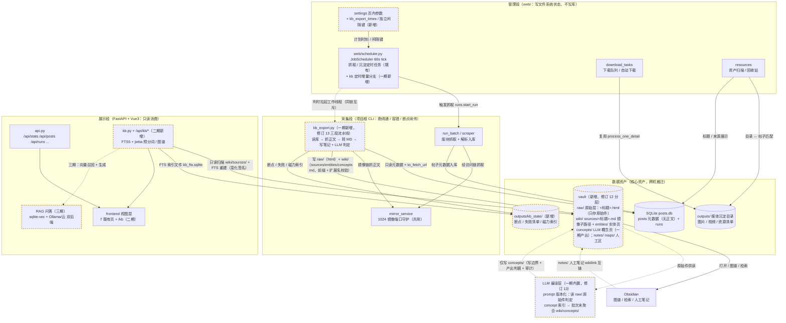

# 知识库沉淀与搜索 — 调研与方案（2026-09-29）

> 主题：把已收录/已沉淀的内容资产（帖子页 HTML 正文）转成**本地 Markdown 知识库**：Obsidian 直接打开（含知识图谱），Web 端提供全文搜索与图谱页，远期接知识库问答（RAG）。
> 状态：**设计中**（尚未实施）。本文先落调研结论与分期方案，作为后续实施的依据；落地后回填「已实施 / 作废」标注与实施记录。
> 修订：2026-09-29 与用户澄清后修正口径——知识库沉淀**与现有内容资产沉淀（媒体目录）完全解耦**，由 `kb_export.py` 单独批次直接读库驱动，vault 纯文本。
> 修订 2：2026-09-29 场景讨论后增补——①日常增量定时化（默认每晚 23:00，「参数设置」页可配，复用既有调度器）；②`auto/` 写入边界从约定升级为**代码级校验**；新增 §六 角色与使用场景。
> 修订 3：2026-09-29 方案风险审查后增补——①调度**触发与执行解耦**（tick 只触发，独立工作线程执行）；②目录名唯一化 + 路径长度预算 + frontmatter YAML 序列化；③**正文内联图片外链**（显示 URL 归一口径）+ 资源清单兜底（用户拍板）；④定时批次收敛为**增量集** + 手动/定时同一把锁互斥；⑤批次状态移出 vault 至 `outputs/kb_state/`（Obsidian 并不默认忽略 `_` 前缀目录）；⑥kb 批次**独立间隔键**入页内白名单（用户拍板）。
> 修订 4：2026-09-29 用户确认——FTS5 中文分词采用 **jieba 预分词**（§五 该待定项落定，设计要点并入 §3.5）。
> 修订 5：2026-09-29 增补——①§3.0 核心模块业务架构总览图；②§3.4 vault 扩为三区结构（auto 来源层 / notes 加工层 / maps 索引层），程序契约仍只写 `auto/`。
> 修订 6：2026-09-29 用户确认（对照业界 raw/wiki/schema 架构讨论后）——①`auto/` **更名 `raw/`**（auto 表达「谁写的」，raw 表达「它是什么」：不可修改原始层）；②每帖**原子落盘 `source.html` 原始 HTML**，raw/ 成为严格意义的原始层（提取器升级可全量重转、不重抓；已落盘帖与站点删帖解耦），幂等判据相应调整。
> 修订 7：2026-09-29 用户确认，§五 待定项**全部落定**——TopN=5（三源统一）；磁力索引 = kb_state JSON 增量；vault 默认 `outputs/vault/`（`TXXY_VAULT_ROOT` 可覆盖）；`/kb` 图谱**不并入**数据总览联动组；实体页**一期实施**（作者/版块确定性聚合，图谱星型化）。
> 修订 8：2026-09-29 第二轮风险审查合入——①重试语义拆分：`--force`（重抓+重转）/ `--reconvert`（仅离线重转）；②FTS 索引磁盘持久化 + 启动后台预热 + 增量重建（首请求不阻塞）；③source.html 安全红线（永不经 HTTP 下发浏览器）+ 落盘护栏（5MB 上限 / 编码记录）；④实体页一致性（待刷新集合入断点状态）+ 空/脏作者规则；⑤修正 4 处前轮残留不一致 + 4 项已知取舍记录（§四-13）。
> 修订 9：2026-09-29 增补——①§六 角色与场景同步至修订 8 口径（新增重转 / 原始件追溯 / 重启即搜等场景）；②实体页**同名消解**（对照业界 raw/wiki 架构概念/实体同名问题）：目录即命名空间（`_entities/authors/`、`_entities/sections/` 分子目录）+ 程序互链一律**全路径 wikilink + alias 短名**，概念/实体同名由人工按 Wikipedia 消歧义惯例加限定符。
> 修订 10：2026-09-29 第三轮风险审查，**方案 A 拍板**——①笔记**文件名=标题**：`raw/<版块>/<标题>.md` + 同目录 `<标题>.html`（原 `<标题>/index.md` 结构废止：文件名是 index，`[[标题]]` 按文件名解析会全部悬空，图谱节点失效——设计级缺陷）；②文件名唯一化扩为**全 vault 范围**（跨版块同名帖加 hash 后缀）；③链接规则统一：帖子互链短名 / 实体页全路径 + alias；④补原始件「非离线完整快照」定位说明、mermaid 补 kb.py→kb_state 边。
> 修订 11：2026-09-30 第三次风险审查（逐条对照代码核实）——①幂等判据**弃用 `posts.update_at`**（抓取为全站重抓、upsert 无条件刷写全表，判「未变」永不成立，会令增量集每批退化为全量重抓；改用 likes/replies/date/url 内容元组，取舍① 同步改判）；②`--date-from/--date-to` 显式绑定 `posts.date` 发布日、禁用 `update_date`（原 29 实测教训）；③`kb_fts.sqlite` 与「Web 端不写 SQLite」前提冲突显式化（web 独占写的派生索引库例外）+ 启动完整性校验；④磁力索引与断点状态同步原子落盘、`--resume` 零请求补提取；⑤唯一化 hash 后缀输入定为稳定键 `url`、映射入断点状态；⑥调度引用更正为现实现 `JobScheduler/ScrapeJob`（`ScrapeScheduler` 为旧名）；⑦kb 批次与抓取批次同 tick 串行 + 时刻重叠提醒；⑧§3.0 图 newmod 标注补全；⑨`web/atomicfile` 跨段引用前提注明；⑩§四-8 增补幂等判据双向验证用例。
> 修订 12：2026-09-30 用户拍板（对照 sdsrs/llm-wiki 文件树评估）——①**`raw/` 收敛为纯原始层**（只存 `<标题>.html` 原始件），`.md` 笔记移入 **`wiki/sources/`**（与 `raw/<版块>/` 逐级镜像，frontmatter 增 `original` 原始件回链，修订 11 字段落地）；②文件名**不加版块前缀**（维持「文件名=标题」，版块由 `raw/`、`wiki/sources/` 的 `<版块>/` 子目录承载，跨版块同名帖仍走 hash 后缀，修订 10/11 口径不变）；③新增 **LLM 编译层**（单列新分期，可与三期 RAG 并行）：source/concept/内容派生实体由 LLM 按 prompt 基于 `raw/` 原始 HTML 正文判定生成（采纳 llm-wiki 架构），硬前提——prompt 规格版本化（`prompts/` 唯一定义，frontmatter 记 `prompt_version` + 模型名）、写入边界（LLM 仅写 `wiki/concepts/` 与派生实体页，不回写 raw/sources）、产出判据（空/格式非法/引用不存在帖 → 计失败不落盘，对齐原 52）、审计与成本（prompt 版本 + 模型 + token 随批次落盘）、实体页分治（确定性实体页保留，LLM 只增内容派生页，互链同全路径 + alias 规则）、人工层 `notes/`/`maps/` 程序与 LLM 均不可达；**一期保持确定性，不引入 LLM 依赖**。
> 修订 13：2026-09-30 用户改主意拍板（评估合流）——①**一期引入 LLM**：原「新分期」并入一期，`kb_export.py` 扩为**三段流水线**（按帖：抓取→raw→转换→sources→LLM 判定→概念索引；批次末：entities SQL 聚合 + concepts 按索引聚合刷新），`kb_compile.py` 不再独立建脚本；新增 `llm_failed` 帖级判据（LLM 失败不阻塞确定性产物、不回滚，`--resume` 补跑）与 `--skip-concepts`（离线/无密钥只出确定性两件套）、`--regen-concepts`（prompt 改版后零抓取零转换重生成）；并发 4~8 路限流 + 单帖 token 上限截断；LLM 内容实体简化为 concept 页（`type: concept`），不建第二套实体目录；`kb_state` 增 `concept_index.json`；详见 §3.8。②**QA 双后端（三期）**：本地 Ollama（OpenAI 兼容）+ 云 API 可配互切——**embedding 单选**（向量库记录模型标识，不一致拒答并提示重建，禁止混存）、generation 自由切换；不做自动 failover / 双索引并存 / 流式输出。③**后端配置进参数页**：`llm_provider/llm_model/ollama_base_url` 页内可改（下拉受限取值、spec 随快照下发、Ollama base_url 保存实测连通性），`embed_provider/embed_model` 页内只读展示（改动走 env + 重启），云 API key 绝不进页/不入 `web_settings.json`；三件套 `default_llm_config()`/活值访问器/`set_llm_config()` 成对（原 55）；一期编译层键 env-only、默认云 API。
> 修订 14：2026-09-30 第四轮风险审查（独立复查，逐条对照 `init_db.py` posts 表 / `web/` 目录核实）——①修正修订 12 层级变更残留：frontmatter `original` 回链相对路径 `../raw/` 改为 `../../../raw/`（笔记在 `wiki/sources/<版块名>/` 下三层深，回链照旧文档全部悬空）；②定时增量集与幂等元组判据口径矛盾显式化：增量集以「笔记存在性」为准、存量帖 frontmatter 元数据（likes/replies）陈旧拍板为已知取舍，§3.2-6 / §四-13① 同步改写；③同版块热帖互链源改判「同 fid + 发布时间邻近窗口 Top5」（全版块全局 Top5 会令全部笔记携带同样 5 条边、图谱退化成超级 hub；修订 7 拍板的 N=5 不变），静态边陈旧记为已知取舍；④新增 Obsidian 图片外链「镜像依赖域名」直连可达性验证用例（§四-11）；⑤跨层同名后缀确定性规则（实体页让帖子）+ 碰撞帖互链必须写唯一化后实际文件名 + 人工区同名警示（§3.3、§四-10）；⑥jieba 版本锁定入 requirements、版本号入 kb_state，不一致整库重建 FTS（§3.5-4）；⑦定时入口 LLM 键缺失自动降级（等效 `--skip-concepts` + 页面可见告警，§3.7-3）；⑧首建全库批次启动时磁盘水位校验（§四-6）；⑨`web/__init__.py` 前提表述更正（该文件不存在，`web/` 为 namespace package 不链式加载 config，修订 11 表述失真）。
> 修订 15：2026-09-30 第五轮风险审查（独立增量复查，对照 `scraper.py` / `web/scheduler.py` 写入与调度侧核实）——①二期图谱**规模策略前置拍板**（万帖节点直渲不可行，按筛选聚合 + 节点上限默认 500、超出加权截断并提示，§3.5）；②LLM 产出判据增补**证据句逐字回查 `raw/` 原始件命中**（防幻觉证据句随批次末聚合固化进知识库资产，§3.2-5）；③sources 笔记**人工修改冲突检测**（写前比对上次生成 hash，不一致跳过计数，仅 `--force`/`--reconvert` 显式覆盖，§3.2-6）；④**「同 url 换 title」风险显式化**（title 主键 upsert 改标题会插入新行：增量集按 `url` 去重取最新行 + 孤儿笔记检测进批次汇总，§3.7-3 / §四-13⑤）；⑤定时增量集**失败帖重试上限**（连续 N 次失败移入「永久失败」不进增量集，§3.7-3）；⑥`--regen-concepts` **旧概念页孤儿清理**（聚合后与索引差集删除，§3.2-11）；⑦kb 与抓取批次同 tick 重叠拍板为**「抓取活跃即记 skipped 不等待」**（§3.7-1）；⑧FTS 语料不含 notes/concepts/entities 显式记为已知取舍（§四-13⑥）；⑨`posts.date` 写入格式核实结论标注（§3.2-1，销项）、`prompts/` 新增顶层目录拍板豁免（§6.2）、文件名尾部 `.`/空格等边界用例补充（§四-10）。
> 修订 16：2026-09-30 第四轮风险审查升级为**对照真实库况实测**（只读查询 `posts` 表，总数 165,555 帖）——①规模失真 16 倍：全篇「1 万帖」量级估算作废，§3.8-4 / §四-6 按 16.5 万帖重算，首建全库强制日期窗分片（原 57）；②互链 Top5 判据 `CAST(likes AS INTEGER)` 对约 70% 帖失效（likes 大量非数字：`.::` 81,289 / `原創` 17,944 / `新作` 11,920 / `赞 5` 1,638），改「正则提取数字 + 失败计 0」唯一清洗函数（原 58）；③标题超 80 字符 15,123 条（9.1%，最长 200），§3.2-10「超限拒绝」改为确定性截断 + hash 后缀（原 59），拒绝仅留非法名；④LLM 证据句回查口径显式化：去标签 + 实体解码 + 空白归一化纯文本、与喂 LLM 的正文同源同截断（§3.2-5）；⑤定时增量集并入未达上限的 `llm_failed` 清单（§3.7-3，否则 LLM 失败帖永久滞留）；⑥vault 与 kb_state 必须成对搬迁、生成 hash 缺失按「疑似人工修改」跳过（§3.2-6 / §四-11）；⑦源自帖子正文的一切下发内容前端禁 `v-html`（§3.2-2 / §3.5）；⑧FTS 语料剥离 frontmatter（§3.5）；⑨kb 与抓取互斥单向记为已知取舍（§四-13⑦）；⑩kb 工作线程是第三种执行模式而非「同模式注册」（§6.2）。
> 修订 17：2026-09-30 独立增量复查（对照 `web/resources.py` 扫描根与 `posts` 表只读实测，165,555 帖）——①Obsidian 大 vault 性能预期显式化（约 33 万+文件，全局图谱 / 索引衰减属预期，§四-17）；②§3.5-4 jieba 全量重建时间口径修正（「秒级~几十秒」为 1 万帖旧量级残留未随修订 16 联动重算，实为约 20~80 分钟，原 57 同源）+ 重建期间 `/api/kb/search` 降级响应；③kb 批次入口补 `mirror_service.ensure_web_service()`（手动 CLI 单跑时镜像可能未在线，§3.2-2 / §6.2）；④trafilatura 楼层回复混入正文语料风险显式化（`replies` p99=248 / max 26,039、≥300 回复帖 1,118 个），入 §四-1 dry-run 判定项；⑤互链 Top5 补确定性 tie-break（同分 date 降序 + url 字典序，§3.3）；⑥销项取证：`COUNT(DISTINCT author)`=3,743（实体页规模可控）、资源扫描根为 `downloads/` 与 `outputs/vault/` 无交集（无口径污染），`date` 下界 1970-01-12 与既有记载一致。
> 修订 18：2026-09-30 第六轮风险审查（独立增量复查，含「旧量级残留」专项全文 grep，原 60 同源复发）——①§3.8-2 全量重嵌时间「1 万帖约 10~30 分钟」为修订 16 漏改残留，按 16.5 万帖同吞吐外推修正为约 3~8 小时 + 重嵌期间 RAG 拒答进度页面可见（对齐 FTS 重建降级口径，§3.8-2 / §四-15）；②定时增量集增**单批帖数上限**与 kb_state「首建完成」标记守护（防 vault 缺失 / 换机漏拷 / 首建未完成时增量集退化为 16.5 万帖全库批次——一夜跑不完、文件锁被占致次日起永久 skipped，§3.7-3）；③「同 url 换 title 取最新行」排序键定为 **rowid 最大**（`posts` 无自增列、`update_at` 每批无条件刷写不可作时序信号，§3.7-3 / §四-13⑤）；④kb_state 丢失（vault 保留）场景记为已知取舍⑧ + 「扫描 `raw/` 零请求重建断点清单」内置恢复函数（§四-13⑧）；⑤图谱边数据源定义：FTS 重建扫描时同步预提取 wikilink 互链表落盘 kb_state，graph 接口只查预提取表、禁止第二次全库扫描（§3.5）；⑥FTS 变化签名增补相对路径集合滚动 hash（rename 保 mtime 且总数不变会漏检，§3.5-4 / §四-9）；⑦`.md` 笔记落盘显式原子写（§3.2-4）；⑧修订 16/17 列表顺序倒置更正；⑨批次运行中 web 扫描与 kb_export 写 vault 并发撕裂读取记为已知取舍⑨（§四-13）。
> 修订 19：2026-09-30 第七轮风险审查（独立增量复查，对照 `scraper.py` upsert 语句 / `web/scheduler.py` tick 持锁现状 / `web/resources.py` 扫描根核实——rowid 语义、第三种执行模式前提、vault 无口径污染三项均证实）——①定时增量集**截断保留顺序定死为 `posts.date` 降序（新帖优先）** + 积压超阈值页面可见告警（防历史积压占满单批上限饿死当日新帖，§3.7-3）；②「首建完成」**置位机制拍板为 `--mark-initial-done` 显式置位**（首建强制分片、分片总数程序不可知，分片结束不自动置位，§3.2 CLI / §3.7-3 / §五）；③concept 页落盘前对 LLM 输出的帖引用 wikilink 做「库内标题 → 唯一化实际文件名」**映射改写**，映射缺失计 `llm_failed`（LLM 只见标题、无从得知 hash 后缀，§3.2-5）；④`concept_index.json` 从「索引类文件可整库重建」表述中**剔除并单独定级**——它是 kb_state 中唯一不可低成本再生的资产（重算 = 全库重调 LLM），落盘启用 `.bak` 轮转（§四-13⑧ / §五）；⑤5MB 超限拍板为**截断落盘 + `truncated` 标记、属确定性结果不进重试**（§3.2-2）；⑥LLM prompt 注入面记为已知取舍⑩ + concept 摘要缓解约束（§四-13⑩）；⑦互链 Top5 窗口**全库一次物化、禁止逐帖查询**（首建 16.5 万次查询违反原 10，§3.3）；⑧LLM 批次费用累计落盘 + 可选单批费用上限熔断（§3.8-4）；⑨kb 分支 **`handle_slot` 必须秒回**（判活跃 → mark + pid → 起线程三步）——现状 tick 持锁内同步调 handle_slot，同步长执行会占死 tick 锁（§3.7-1 / §6.2）。
> 修订 20：2026-09-30 第八轮风险审查（对照 `scheduler.py` 类锁结构 / `init_db.py` posts 表 DDL / `scraper.py` upsert 语句逐条核实）合入——①§3.5-4 变化签名「内存比对毫秒级」表述失真更正：比对是内存操作，但**计算**签名需全量扫描 vault（33 万+文件约 10~60 秒），签名重算设进程内 TTL memo 限频（原 57/60 同源）；②「rowid 最大」时序信号补 VACUUM 脆弱性取舍⑪（前提：库永不 VACUUM、不删行，现状已核实）；③kb 任务**独立锁实例拍板**（`ScheduledJob._lock` 为类属性、全子类共用，且 `PrecipitateJob.handle_slot` 持锁内同步执行分钟级自动下载——kb 直接继承共享锁会被拖过错过容差记 missed，§3.7-1）；④三期向量库文件单写者归属补定（web 独占写，同 kb_fts 口径，§3.6）；⑤concept 页文件名接入全 vault 唯一化注册表、冲突 concept 让位加后缀（§3.2-5 / §3.2-10）；⑥kb_state 恢复后首次 `--reconvert` 须 `--force` 二次确认（用户拍板：恢复不重建生成 hash，直接重转会被冲突检测全量跳过、静默无效，§3.2-6 / §四-13⑧）；⑦§3.8-4 时延量级补「待实测回填」交叉引用；⑧增量集磁盘判据标预期耗时、禁 glob 全枚举；⑨dry-run 判定项补截断 HTML 提取用例。
> 修订 21：2026-09-30 第九轮风险审查（独立增量复查，对照 `extract_torrents.py sanitize_title` 实现 / `scrape_throttle.py` 默认值 / `scraper.py` upsert 语句核实）——①首建**抓取段总时延**首次显式化（§3.8-4 原只算 LLM 段：按 `scrape_throttle` 页间间隔默认 3s 串行，16.5 万帖约 5.7 天，总时间轴抓取+LLM 约 1~2 周，原 57 同源；kb 独立间隔键改双向可调，§四-6 / §3.2-7）；②concept 页**数量级未估算**——prompt 增每帖概念数上限常量 + dry-run 增概念产出密度实测项（§3.2-5 / §四-1，原 57 精神）；③`sanitize_title` 复用口径矛盾显式化：既有实现 80 字符截断写死 / 空名兜底为当天日期而非拒绝 / 字符表缺 Obsidian wikilink 语法字符 `#` `[` `]` `^`，kb 侧收编为参数化唯一实现（§3.2-10 / §四-10）；④LLM 成本估算锚定模型单价档 + 输出 token 计入 + 「先确定性全库、LLM 段按预算分批补」定为推荐路径 + 增量期成本改月度量级（§3.8-4）；⑤磁力互链**跨批缺失**（边从未生成）记入取舍①扩展（§四-13①）；⑥定时工作线程抢 OS 文件锁失败显式记 skipped 页面可见（§3.7-1）；⑦`TXXY_KB_STATE_ROOT` 新键并入原 47 表（§五）；⑧证据句回查归一化补 NFC 与全半角映射（§3.2-5）。
> 修订 22：2026-09-30 第十轮风险审查（独立增量复查，对照 `web/scheduler.py` 锁结构 / `init_db.py` DDL / `extract_torrents.py` / `scrape_throttle.py` 逐条核实，前轮全部代码前提证实）——①**`--skip-concepts` 补跑闭环拍板**（skip 非失败：不进 `llm_failed`、笔记已落盘又不进增量集，存量 LLM 段唯一入口 = 断点 llm 段待办清单——置位前禁清理 + 余量页面可见，置位后清理、改走 `--regen-concepts` 增量档补 concept_index 缺失帖，§3.7-3 / §3.8-4）；②**变化签名重算线程归属显式化**：重算只在后台预热线程执行、请求路径永远读缓存签名（TTL memo 是限频不是异步），kb 批次活跃期间暂停重算（§3.5-4 / §四-9）；③dry-run 增补 concept_index.json / 磁力索引体积实测（定「每 N 帖刷写」的 N，§四-1）；④concept 页让位 hash 输入定死「概念名 + prompt_version」稳定键（防批次间漂移令孤儿差集误删，§3.2-5）；⑤**一期验收线与延伸目标拆分**：验收 = 确定性两件套全库 + 定时增量闭环 + 降级路径实测，concepts 全库补完非验收线（§3.1 / §3.8-4）；⑥图谱 500 节点截断补确定性 tie-break（复用 §3.3，防 0 分池拓扑漂移，§3.5）；⑦原始件本地 file:// 打开记取舍⑫（§3.2-2 / §四-13）；⑧三期前置项增补 sqlite-vec 扩展加载验证（§四-2）；⑨§6.3 工作清单按「必做 / 降级注释与计数 / 不做」三档控制实施成本。
> 修订 23：2026-09-30 第十一轮风险审查（独立增量复查，对照 `web/runs.py` runs 写入与拉起语义 / `extract_magnets.py` / `extract_clouds.py` 函数落点核实）——①**一期「页面可见」载体拍板**：一期交付物无新 API / 页面，job 级状态（skipped 原因 / 积压告警 / 心跳）挂既有 `/api/schedule` 调度快照，批次级汇总与 llm 段余量降级为「CLI 批次汇总输出 + `kb_state` JSON 字段定义」，全文既有「页面可见」表述统一按此两级口径解释、不再逐处改写；②§3.7-5「批次计数随运行记录可见」删除更正——`runs` 记录由 run_batch 子进程自己写库、`runs.start_run` 语义为拉起 run_batch 子进程，kb 只读连接与 §6.2 写边界均不容 kb 批次写 runs；③`--regen-concepts` 一旗两义拆为显式档位（默认全量重生成 / `--regen-concepts incremental` 增量档），**孤儿差集删除仅全量档执行**——增量档补跑中途执行差集会把尚未补到的 concept 页误删；④kb_state 恢复函数数据源更正：扫 `raw/` 得断点清单 + 读 `wiki/sources/` frontmatter 得元组与 title→唯一化文件名映射（raw 原始 HTML 无结构化元数据，原表述「扫 raw/ 重建元组」不可实现）；⑤`original` 回链定 **wikilink 全路径形态**（纯文本路径字符串 Obsidian 不渲染为链接，§四-14①「可解析」验收按原字段定义必然不通过）；⑥kb_fts.sqlite 全量重建补落盘顺序（临时文件 → 关旧连接 → replace，失败保留旧索引重试）；⑦§3.2-3 复用函数模块归属更正（`extract_magnets.py` / `extract_clouds.py`，不在 `extract_torrents.py`）；⑧积压告警按「llm 段积压」单独分列（llm_failed 存量帖 date 偏老、date 降序截断下长期排队）；⑨§五 增「LLM 首建预算上限」拍板行。
> 修订 24：2026-09-30 第十二轮风险审查（独立增量复查，全文一致性专项：调度口径 / 增量集定义 / 图谱节点 / 依赖清单 / 场景交叉引用逐处核对）——①§3.7-1「按同模式注册第三类 ScheduledJob」残留更正为「第三种执行模式而非同模式注册」（§6.2 修订 16 同源）；②§3.7-3 LLM 键缺失降级「随运行记录页面可见」更正为挂 `/api/schedule` 调度快照（kb 不进 runs，修订 23② 同源残留）；③kb 独立间隔键「仅可调慢」残留改双向可调（§3.7-2 / §四-4，修订 21 同源）；④`/api/kb/graph`「节点 = 笔记」更正为笔记与实体页两类（§3.5，与前端 / S14 口径对齐）；⑤S2 增量集定义补 llm_failed 并入、S4 失败分类补 `llm_failed`（§6.1，与 §3.7-3 对齐）；⑥S15「批次跑完立即可搜」改「滞后至多一个 TTL 周期」（§6.1，与 §3.5-4 对齐）；⑦§四-9 场景错引 S11 → S15；⑧§3.0 图 concepts「预留」改一期产出、kb_export 写边补 concepts；⑨§6.2 kb.py 变化签名补相对路径集合滚动 hash（修订 18 同源残留）；⑩§6.3 一期必做清单「签名重算线程归属」标注属二期；⑪新增依赖清单补 PyYAML（实测 requirements.txt 现无此依赖，§3.1 / §四-1）；⑫实体页「累计互动」绑定 likes 唯一清洗函数（原 58，§3.3）；⑬§五 TopN 行「三源统一截断」更正为「两源截断 + 同作者实体页 1 条」。
> 修订 25：2026-09-30 第十三轮风险审查（独立增量复查，对照 `web/atomicfile.py` / `web/runs.py` / `web/settings.py` 白名单 / `web/config.py` 核实——`runs.has_active_run()` 存在、`write_json_atomic` 为 JSON 专用、`spec.max` 下发机制存在三项均证实）——①一期「页面可见」补读端拍板：设置页调度区透出 kb job 级字段（skipped 原因 / 积压告警 / llm 段余量），列入一期必做清单（原 62：API 返回字段 ≠ 页面可见）；②vault `.md`/`.html` 原子写载体拍板：`atomicfile.py` 同模块泛化 `write_text_atomic()` 唯一实现，kb_export 复用，禁止另写第二份 tmp+replace；`os.replace` 撞 Obsidian 占用加短重试（3 次 × 0.5s）+ 失败计数；③图谱预提取互链表扫描范围显式定 = sources + entities + concepts 三目录（FTS 语料仍仅 sources），否则实体页 / concept 节点无来源、与 §3.0 / S14 冲突；④同批次内磁力互链顺序缺边拍板：批次末对磁力组受影响帖补写 See also（比对生成 hash 一致才补写），跨批缺失维持取舍①；⑤`--resume` 默认跳过「永久失败」清单、仅 `--force` 重入（语义二义消除）；⑥kb_fts.sqlite 磁盘量级（数百 MB~GB 级）入 §四-6；⑦变化签名扫描排除 `*.tmp` / `*.bak`（原子写中间产物会被计为文件变化）。
> 修订 26：2026-09-30 第十四轮风险审查（独立增量复查，修订 25 副作用推演 + 余留前提核实）——①**变化签名扫描范围收窄拍板**：只扫影响索引的 `wiki/sources/` + `entities/` + `concepts/` 三目录，显式排除 `.obsidian/`（workspace.json 被 Obsidian 持续重写，入扫描则签名永变、每 TTL 周期重扫风暴）、`.trash/`、`raw/`（重转时 `.md` 同步重写、由 sources 捕获）、`notes/`/`maps/`（不进 FTS 与程序边）——扫描量 33 万 → 约 16.5 万文件，计算耗时同比减半（§3.5-4 / §四-9）；②原始件「按字节存盘」与文本原子写矛盾显式化：`write_text_atomic` 若仅 utf-8 文本写会把非 UTF-8 页面落盘即转码、「重转按记录编码解码」将对已转码文件用错编码——atomicfile 泛化入口须含二进制载荷分支（§3.2-2 / §3.2-4）；③批次末磁力补写中断恢复补齐：补写受影响集合入断点状态 + 幂等判据「期望 See also 段与现文件一致即跳过」（§3.3）；④MAX_PATH 预算须预留原子写 `.tmp` / `.bak` 后缀长度（§3.2-10）。
> 修订 27：2026-09-30 第十六轮风险审查（独立增量复查，16 条代码前提逐条对照源码核实：15 条完全证实、1 条表述精确化；全文旧量级残留专项 grep 通过——「1 万帖」「秒级」「毫秒级」「10~60 秒」仅存于修订历史叙述，正文口径一致）——①§3.7-1 持锁主体表述精确化：`handle_slot` 的同步长执行发生在 `ScheduledJob.tick` 的**类属性共享锁**内（`with self._lock:` → `handle_slot`），`JobScheduler.tick` 本身不持锁、仅逐任务调 `job.tick()`——与修订 20③「`ScheduledJob._lock` 为类属性」口径统一（§3.7-1 / §6.2，源码证实）；②§五 表格结构修正：表头原 2 列但「首建完成标记置位方式」「LLM 首建预算上限」两行携带第 3 列「备选」单元格致渲染错位，表头补齐「备选（未采纳）」列——纯排版缺陷，无口径变化。本轮未发现新高 / 中风险，余留项均为已记录取舍（①~⑫）或 dry-run / 实施实测项。
> 修订 28：2026-09-30 第十七轮风险审查（独立增量复查，专项排查人工侧文件操作与恢复 / 重生成路径边界——前十六轮未覆盖盲区）——①**人工重命名 / 移动 / 删除 sources 笔记场景拍板（新发现，中风险）**：增量集磁盘判据按唯一化注册表映射路径 `exists()`，人工改名 / 移动后映射路径缺失 → 帖进增量集，但幂等判据（断点已含 + raw 在 + 元组未变）令其跳过抓取——「从 raw 补转」与「整体跳过」两条分支行为原表述均未定义：前者会与人工改名文件并存生成重复笔记（新文件再撞唯一化注册表加 hash 后缀），后者令该帖笔记永久缺失；拍板：**映射存在而目标文件缺失 → 记「疑似人工移动 / 删除」计数跳过、不重抓不重转**（与生成 hash 缺失同口径「宁漏勿重复」），批次汇总提示用 `--reconvert` 补转（人工改名件保留原样、重建件与其并存由人工处置），§3.7-3 同步；②**FTS 全量重建换入重试触发解耦（低风险）**：原表述「下轮签名周期重试换入」依赖签名变化——签名不变则无重建触发，待换入产物永久滞留（重试自锁）；改为 TTL 周期检查「同目录待换入临时产物存在」即重试换入、与签名比对解耦（§3.5-4）；③**零概念帖显式空记录（低风险）**：合法判定「零概念」的帖在 `concept_index.json` 无记录，与「从未判定」不可区分，`--regen-concepts incremental` 以「无记录」为补跑判据会对零概念帖每次重调 LLM（白耗 + 产出漂移）；拍板：零概念判定落显式空记录，「无记录」严格等价「从未判定」（§3.2-5）。
> 修订 29：2026-09-30 第十八轮风险审查（独立增量复查：全文量级 / 交叉引用 / 表格渲染复扫 + 修订 27、28 落点逐处复核；本轮新发现均为低风险收尾项，无中高风险）——①**concept_index.json「零概念显式空记录」承载结构显式化**：原表述索引为「概念名 → 帖引用 + 证据句」单结构、键为概念名，零概念帖在该结构下无处落记录，修订 28③ 实际不可实现；拍板双结构：帖 → 概念列表正向段（三态：无记录 = 从未判定 / 空列表 = 零概念 / 非空 = 有概念，`--regen-concepts incremental` 补跑判据改读正向段）+ 概念名 → 帖引用 + 证据句反段落（批次末聚合读取）（§3.2-5）；②**kb_state 文件级写者归属集中声明**：kb_export 写断点 / 失败清单 / 磁力索引 / concept_index / 唯一化映射 / 生成 hash，web 进程写 `kb_fts.sqlite` 与互链表——同目录不同文件、互不交叉，任何文件禁止出现第二写者（web 独占写前提与 concept_index 定级均依赖此划分，此前仅分散表述）（§3.5-4）；③**「首建完成」标记纳入 kb_state 丢失恢复函数显式处理**：恢复函数不自动置位（分片总数程序不可知，同修订 19），恢复报告须显式提示「标记缺失、人工核对分片完成后重新 `--mark-initial-done` 置位」——否则恢复后定时入口以「首建未完成」长期 skipped 且无解释（§3.2-6 / §四-13⑧）；④签名扫描量级表述补 concepts 页（数万级，修订 21 警告的量级盲区）：「约 16.5 万文件」更正为「约 17~20 万文件（含 concepts，以 dry-run 实测为准）」，耗时估算同比放宽（§3.5-4 / §四-9）。
> 修订 30：2026-09-30 角色扮演式场景推演（按 §6.1 四类使用者角色代入各自场景反推核心工作）后合入的清单补齐——①§6.1 角色一补 3 个已拍板但未入表的场景：**S21 换机 / 离线镜像交付**（`vault` 与 `kb_state` 成对搬迁；只拷 vault 则生成 hash 缺失、全部笔记按「疑似人工修改」跳过，走内置恢复函数）、**S22 人工侧改名 / 移动 / 删除 sources 笔记后的增量期处置**（映射存在而文件缺失 → 记「疑似人工移动 / 删除」跳过 + 汇总提示 `--reconvert`，修订 28）、**S23 磁盘水位不足**（分片启动低于 20GB 水位阈值拒绝该片并提示，§四-6）；②§6.3 核心工作清单补编号 **16~19**（此前只存在于「实施成本分档」文字、表中无编号）：16 vault 文本 / 二进制原子写泛化、17 磁力互链批次末补写、18 设置页调度区透出 kb job 级字段、19 签名重算线程归属锁定；③实施成本分档文字与上表编号对齐（引用 16~19）。
> 修订 31：2026-09-30 第十九轮风险审查（独立增量复查，**对照真实库况只读实测**取证：总帖 166,121 / fid 13 个 / `date` 全表 10 位无空值 / 同 url 多行 514 个 / 空作者 0 条 / 按年月分布 / 同 fid ±90 天窗口规模实测）——本轮新发现 3 项中高风险：①**定时增量「日增几十帖」严重低估 20~40 倍**：实测 2026-08 单月 42,588 帖、2026-09（截至 30 日）34,570 帖 → 日均约 1,150~1,375 帖（原 57 同源），连锁重算：单批帖数上限必须 **≥ 实测日均增量 × 2**（否则积压只增不减、永久追不上）、增量期 LLM 成本由「月数十~百元级」改「月数百~数千元级」、首建数周期间积压 = 首建天数 × 日均增量须在 `--mark-initial-done` 置位后按单批上限分批消化（§3.7-3 / §3.8-4）；②**互链 Top5 窗口计算量从未估算且朴素实现不可行**：实测同 fid ±90 天窗口 Σ 邻帖数 = **9.22 亿**、最大窗口 21,614、88.3% 的帖窗口内 >1000 帖——§3.3「内存滑窗」若按「每帖遍历窗口全量取 Top5」落地即 9.22 亿次元素处理（数十分钟~数小时/批）；拍板算法 = 按 fid 分组 + `(date, url)` 排序 + **滑动窗口配惰性删除堆**（摊销 O(n log w)），禁止每帖全窗口扫描，真实耗时与内存入 dry-run 实测项（§3.3 / §四-1）；③**日期窗分片粒度从未定义且按年分片实测不可行**：2026 单年 147,306 帖（占 88.7%），按年分片 = 单片 5.1 天抓取 + 7~29GB 落盘、远超 20GB 水位；拍板 **按自然月分片**（最大月 2026-08 = 42,588 帖 ≈ 1.5 天抓取 + 2~8.5GB；2025-01 起 21 个月 + 2006~2024 合计 5,353 帖并作 1 片 ≈ 22 片），单片启动校验 20GB 水位、超限再按旬细分（§四-6 / §五 / §6.1-S1）。另合入 5 项中低风险收尾：④`--regen-concepts` 与筛选参数（`--fid` / `--date-from` / `--date-to` / `--limit`）同时出现 → 全量档孤儿差集源只含窗口内概念、会把窗口外 concept 页**全部误删**（重建 = 全库重调 LLM，数千元 + 数天）；拍板**显式拒绝该组合并给明确提示**（§3.2 CLI / §3.2-11）；⑤全量档 `--regen-concepts` **中断续跑入口缺失**（断点只分确定性段 / llm 段，未定义 regen 的 llm 段待办清单如何初始化，中断即白费已完成的 LLM 调用）；拍板：启动时把待重生成帖集**灌入 llm 段待办清单并原子落盘**、逐帖消费即删，`--resume` 续跑、未消费完不执行差集删除（§3.2-6 / §3.2-11）；⑥concept 页孤儿差集**比对键定为 frontmatter `concept` 字段**（文件名可能因让位带 hash 后缀、反推概念名不可靠，§3.2-5 / §3.2-11）；⑦磁力 Top5 **补确定性 tie-break**（同 §3.3：likes 清洗值 → date 降序 → url 字典序）——组内 >5 帖时未定义取舍会令边集批次间漂移（修订 17 tie-break 同源，§3.3）；⑧销项与口径标注：`author` 空/空白实测 **0 条**（空作者跳过分支当前不触发，保留但标注）、`date` 实测全表 10 位无空值（日期窗字符串比较安全，销项）、同 url 多行实测 **514 个 url**（修订 15 风险非理论）、总帖数实测 166,121（2026-09-30，「16.5 万」保留为量级表述）、§四-17 vault 文件量级补 concepts 数万页（33 万 → 36~40 万）与单目录文件数提示（最大 fid 21,619 个 html 同目录）、`PAGE_INTERVAL_INIT=3` 是「页间」间隔而 kb_export 每帖一次详情页请求 → 明确「套用页间间隔到帖子页请求」口径（§3.2-7 / §3.8-4，原 5.7 天估算成立）。
> 修订 32：2026-09-30 第二十轮风险审查（**对照 Obsidian 官方文档原文取证 + 真实库况只读实测**：166,121 帖 `title` 字符分布 / 作者与版块聚合规模 / 清洗后碰撞率 / `exists()` 判据耗时外推）——本轮新发现 2 项高风险、2 项中风险：①**`original` 回链形态双重缺陷（高风险，失效面 100%）**：官方《Internal links》原文「Folder paths start at the vault root and use forward slashes (`/`), even on Windows」、**未列入任何向上相对导航形态**——现文案 `[[../../../raw/<版块名>/<标题>.html|原始件]]`（修订 14 改层数、修订 23 定为 wikilink 全路径）按文件系统向上相对路径书写，与 §3.3 实体页互链 `[[wiki/entities/authors/张三|张三]]`（vault 根相对）自相矛盾，16.6 万条回链按官方口径全部悬空；且官方《Accepted file formats》清单只含 md / base / canvas / 图片 / 音频 / 视频 / pdf，**不含 HTML**——指向 `.html` 的 wikilink 不被认作 vault 文件，点击还可能在 vault 内新建 `*.html.md` 污染 raw 层契约。拍板：路径一律 **vault 根相对**（`raw/<版块名>/<标题>.html`）、**禁用 wikilink 形态**（含 `|原始件` 别名），字段降级为纯文本路径、不承诺 Obsidian 内点击跳转，验收改为「文件系统层面指向真实文件 + 点击不在 vault 内建 `.md`」，是否升级为标准 md 相对链接由 dry-run 实测决定（§3.2-4 / §四-11 / §四-14① / §6.1-S9）；②**图谱边规模与单节点度数从未估算（高风险）**：实测实体页若列全部关联帖，最大作者 `wwg101` = 26,748 帖、>1000 帖作者 28 个、最大版块 fid=22 = 21,619 帖 → 预提取互链表上界 ≈ **216 万条边**（sources ≤11 条/帖 ≈ 183 万 + 实体页全量列举 33 万），单实体页节点度数达 2.6 万——§3.5「500 节点上限」只约束节点、**不约束边数与度数**，含该节点的请求会回吐 MB 级 payload。拍板：实体页单页列举设上限（默认 300，实测把实体页出边从 33 万降到 7.9 万，−76%）+ `/api/kb/graph` **边集随节点集同源裁剪**（两端均在节点集内才下发）+ 单节点度数上限 + 互链表落盘体积按 ~200 万行估算并入 §四-6 磁盘预算（§3.3 / §3.5）；③**实体页 / concept 页人工编辑被静默覆盖（中风险）**：§3.2-6 冲突检测只覆盖 `wiki/sources/`，entities / concepts 为「增量覆盖写」，人工在实体页写的批注会被下次刷新静默抹掉，与 notes / maps 受保护口径不一致。拍板：两者纳入「上次生成 hash 比对」，不一致**仍覆盖**（跳过会令实体页永久陈旧，比覆盖更糟）但计数 + 批次汇总告警，并明示为纯生成物、人工批注请写 `notes/` 引用（§3.2-6 / §3.4）；④**清洗字符表缺权威依据与遗漏项（中风险）+ 空名拒写会丢资产**：官方明示「A string which contains the following characters may not work as a link: `# | ^ : %% [[ ]]`」——现表缺 `%`（实测 165 条）、零宽 / 双向控制字符（21 条）、ASCII 控制字符（2 条）；拍板字符表 = **Windows 非法字符集 ∪ 官方链接风险字符集 ∪ 控制 / 零宽字符集**并注明权威来源；实测「删除法」清洗后唯一率 **99.92%**（碰撞 134 组 / 270 帖 = 0.16%，方案可行、此前的量级疑虑销项）；**实测 3 条标题清洗后为空**（纯标点帖 `.....` / `。。。。`），按原「拒绝清洗后为空」口径会令其永久无笔记也无原始件 → 改 `unnamed-<url 短 hash>` 兜底文件名（§3.2-10）；⑤低风险收尾：`author` 名实测无特殊字符、最长 14 字符（实体页文件名安全，销项）；增量集磁盘判据 `exists()` 实测外推 166,121 次约 **6 秒**（本机 NTFS，非原文估算的 1~3 分钟，§3.7-3）；`sections/` 实体页无程序生成入边（13 个枢纽节点仅靠 notes / maps 人工链接）记为取舍⑬（§四-13）；`%` / 零宽字符清洗用例补入 §四-10。
> 修订 33：2026-10-01 第二十一轮风险审查（独立增量复查，代码前提逐条核实 + 只读实测复核：`ScheduledJob._lock` 类属性与 tick 持锁内同步 `handle_slot` / `runs.has_active_run` / `normalize_times`+`MAX_SCHEDULE_TIMES` / requirements 现无 PyYAML / `extract_magnet_links`·`extract_cloud_links` 落点——修订 20/23/24/25/32 全部前提证实；实测：总帖 166,121 / 标题含 `[/]` 占比 72.4%（120,270 条）/ 标题含 `%` 165 条 / 同 url 多行 514 / FTS5 本机虚表创建成功）——本轮新发现 2 项中风险、5 项低风险：①**实体页批次末聚合查询形态未拍板**：§3.2-11「按该作者/版块查 posts 全表」按字面实现即「循环内逐实体查全表」——首建单月片涉及作者可达 1,000+，166,121 行 × 1,000+ 次全表扫描踩原 10 红线；拍板聚合 = 全表一次 `GROUP BY author`/`GROUP BY fid` 批量查询后取涉及集合行（§3.2-11）；②**concept_index.json 损坏（非缺失）处置未定义**：它是 kb_state 唯一不可低成本再生资产（修订 19），主文件 JSON 解析失败若按缺失处理 → 正向段清零 → `--regen-concepts incremental` 把全部已判定帖误判「从未判定」全量重调 LLM（§3.8-4 数千元量级）；拍板：解析失败自动回退 `.bak`，`.bak` 亦不可解析则计告警并**拒绝增量档启动**、全量档不受限（显式全量重生成本就预期全量）（§3.2-5 / §四-8）；③**FTS 查询构造语法安全缺失**：用户关键词含 `"` `(` `)` `^` `-` 及 `AND`/`OR`/`NOT`/`NEAR` 等查询语法字符/保留词时，segment() 产物裸拼 MATCH 会 OperationalError 或改变语义；拍板逐 token `"..."` 引号包裹 + token 内 `"` 转义，构造函数与 segment() 同为唯一实现（§3.5）；④**FTS 结果行元数据承载缺失**：语料进索引前剥离 frontmatter（修订 16）后，S12「跳原帖 / 复制 vault 路径」依赖的 url/title/date 无处取；拍板 FTS 表附 unindexed 元数据列（§3.5）；⑤**`--reconvert` 对 raw 原始件缺失帖行为未定义**（S22 变体：note 与 raw 均被人工删除时 reconvert 无从补转）；拍板计失败类目、提示唯一入口 `--force` 重抓（§3.2-6 / §6.1-S22）；⑥**定时增量批次启动缺磁盘水位校验**（年增 20~85GB，§四-6，水位防线不应只挂首建分片）；拍板低于 20GB 阈值记 skipped 原因页面可见（§3.7-3）；⑦**LLM 概念名清洗后为空**（纯标点概念名）分支未定义；拍板计 `llm_failed` 不兜底文件名（概念可再生，区别于标题的 `unnamed-` 兜底）（§3.2-5）。销项与取证标注：⑧「72% 的标题含 `[`/`]`」断言复核成立（120,270/166,121 = 72.4%，2026-10-01 只读实测）；⑨FTS5 本机可用性已实测（§四-2 该项销项；sqlite-vec 扩展加载仍未验证）；⑩版块名 13 项（`txxy_env.SECTIONS` 源码逐项核对）无 Obsidian 风险字符与 Windows 非法字符、可直接作 vault 目录名，新增版块条目须复检（§3.2-10）。
> 修订 34：2026-10-01 第二十二轮风险审查（独立增量复查，对照真实库况只读实测取证：总帖 166,121 / 年份分布全表 / `url` 空值 / 同 url 多行组内日期与 fid 差异 / `date` 位数复核；旧量级残留专项 grep 复扫通过——旧口径仅存修订历史叙述）——本轮新发现 2 项中风险、1 项低中风险、3 项低风险收尾：①**首建 / 手动批次同 url 多行未去重（中风险，实测坐实）**：修订 15 拍板的「url 去重取 rowid 最大行」只挂在定时增量集（§3.7-3），首建与手动筛选批次读库枚举（§3.2-1）按 title 主键逐行枚举、未去重——实测 514 个 url 对应 **1,063 行**，首建将重复抓取 549 行并生成 **549 篇重复笔记**（两行 title 不同 → 文件名不同，全 vault 唯一化注册表不拦），连锁：LLM 对重复行重复调用（549 × 8K token 输入量级）、FTS 语料重复命中、互链窗口与磁力组把同帖两行当两帖；拍板：**全部批次入口（首建 / 手动筛选 / 定时增量）读库枚举统一按 `url` 去重取 rowid 最大行**（§3.2-1，与 §3.7-3 同一判据唯一实现，取舍⑪ VACUUM 前提同源适用），被去重旧行已有笔记时走孤儿检测计数、不自动清理；②**首建分片计划未覆盖 1970/1971 脏值 18 帖（实测坐实）**：年份分布实测 `date` < 2006-01-01 共 **18 帖**（1970 年 17 + 1971 年 1），分片计划（2006~2024 并作 1 片 + 2025-01 起 21 个月）并集不含这 18 帖——按分片清单跑完即置位 `--mark-initial-done`，18 帖漏建且与「首建完成」语义矛盾（定时增量集虽可按「库内 − 已有笔记」捡回，但 date 降序截断下永久排尾）；拍板：`date` < 2006-01-01（含脏值 18 帖）并入 2006~2024 片（§五 / §四-6 / §四-13⑦），脏值帖正常进批次建笔记、仅不进互链邻近窗口（§3.3 下界语义不变）；③**批次写盘水位只在启动校验、未持续判（对齐原 37/38）**：§四-6 仅拍板每片启动校验一次 + 定时批次启动校验（修订 33⑥），单月片写盘 2~8.5GB、启动贴近水位时片内写穿会成片失败；拍板：批次内随断点刷写节奏（每 N 帖）持续复检水位，低于阈值写完当前帖即停、记「水位中止」进批次汇总，`--resume` 续跑（复用媒体线水位判据唯一实现，不建第二份常量）；④低风险收尾：FTS 查询构造补「segment() 产物为空（关键词清洗后无有效 token）直接返回空结果、不拼 MATCH」（§3.5-2）；图谱节点措辞统一为「sources 笔记、concept 页、实体页三类」（§3.5 / S14，对齐修订 25③ 三目录扫描口径）；销项取证：`url` 空值 / NULL 实测 **0 条**（`to_fetch_url` 前提成立）、`date` 非 10 位实测 **0 条**（复销项）、同 url 514 组内 fid 不同 **0 组**（无跨版块双行）、组内跨自然月仅 **3 组**（分片撕裂面趋零，去重拍板后消失）。
> 修订 35：2026-10-01 用户拍板——**LLM 编译层升级 prompt v2 双产出（concept + entity），恢复修订 12 的「内容派生实体」设计（部分回滚修订 13 的简化）**：①用户三项拍板：实体类型范围先不定、跑小样本验证效果再扩；实现路线选 A（扩展现有 prompt 一次调用双产出，接受 PROMPT_VERSION 递增纪律）；同名共存（实体页与概念页目录隔离，修订 9 目录即命名空间，图谱允许同名双节点，程序侧不查重不互斥）。②落地口径：`prompts/concept_extract.v2.md` 为 prompt 唯一定义（v1 废止删除），`PROMPT_VERSION = "concept-extract@v2"`；输出 JSON 扩为 `{"concepts": [...], "entities": [{"name","type","summary","evidence"}]}`，实体段缺失即 schema 违规整帖作废（严格校验同概念段），实体数上限 `ENTITY_PER_POST_MAX = 10`（常量唯一定义 kb_export，随 prompt 版本生效），实体证据句同口径逐字回查；`concept_index.json` 扩为四结构（`forward` / `reverse` / `entity_forward`（title → [{"name","type"},...]，三态语义同 forward）/ `entity_reverse`），仍是唯一不可低成本再生资产、`.bak` 轮转与损坏≠缺失处置不变（修订 19/33 口径沿用）。③实体页落位：`wiki/entities/derived/<实体名>.md`，与确定性实体页（authors/sections）目录隔离互不覆盖，注册键前缀 `entity:` 与 `concept:` / 帖标题键空间隔离，frontmatter 增 `entity_type: derived` + `llm_type`（小样本阶段类型仅展示不作分支），写入冲突 `warn_only=True`（覆盖 + 告警计数，对齐 concept 页口径）。④存量迁移：`--regen-concepts incremental` 判据扩为「concept 或 entity 任一正向段无记录 = 未判定」（v1 存量 `entity_forward` 恒缺 → 自动迁移 v2 口径）；全量档孤儿差集清理扩至实体页（比对键 = frontmatter `entity` 字段，待办清单未消费完禁删的修订 31③ 防线同源适用）。⑤小样本验证路径：`--date-from/--date-to/--fid` + `--force` 对既有批次重抓重判（幂等判据被 force 短路是重判唯一入口；`--reconvert` 不重判）；全量重生成成本（token / 时延）须在 incremental 迁移前对真实批次实测换算，禁凭估算拍板（原 57）。**已实施**。
> 修订 36：2026-10-01 用户拍板——**后端 LLM 配置进参数页（落地修订 13③）**：①三项拍板：`llm_provider` / `llm_model` / `llm_base_url` 进设置页「知识库」卡（`TXXY_LLM_API_KEY` 仍 env-only，绝不进页 / 不入 `web_settings.json`）；②默认值唯一定义迁至 `web/config.py`（`LLM_PROVIDER_DEFAULT` / `LLM_MODEL_DEFAULT` / `LLM_CLOUD_BASE_URL_DEFAULT` / `LLM_OLLAMA_BASE_URL_DEFAULT` / `default_llm_base_url()`），白名单默认值取 env 覆盖的代码默认（原 55：禁取运行态活值）；`llm_base_url` 默认层不按 provider 预拼死值（页内切档后空地址须落在**生效 provider** 的默认上，只能在使用点 `kb_export._llm_config()` 解析）；③`kb_export.llm_ready()` / `_llm_judge` 改经 `_llm_config()` 读三元组（页内覆盖 > env > 代码默认，原 31 链），key 仍直读 env；④`llm_base_url` ollama 档保存连通性实测（`GET {base}/models` 3s，失败 400 拒绝落盘；cloud 档不实测——key 不进页、匿名 GET 状态码不构成可靠判据）；⑤**实测抓出缺口（原 68）**：同一 PUT 内先改 `llm_provider=ollama` 再存不可达 base_url，校验器经 `_load()` 读旧 `_values` 缓存误判档位整体跳过实测 → 200 放行污染态；修复为校验器接收合并后新值作参数；隔离端到端实测（独立端口 8188 + 临时 `TXXY_WEB_SETTINGS_FILE` + 调度全关）20/20 通过：保存 → 生效（快照回显 + CLI 子进程 `_llm_config()` 读到页内覆盖）→ reset 回落三段全绿。**已实施**。
> 修订 37：2026-10-01 用户拍板——**LLM 多后端化 + 增量日期范围枚举化（需求调整）**：①`llm_provider` 从 `cloud/ollama` 双档扩为 **`deepseek` / `glm` / `ollama` / `custom`** 四档，规格表 `LLM_PROVIDER_SPECS`（label / base_url / models）唯一定义 `web/config.py`、随快照 `providers` 字段下发，前端切后端**一次 PUT 联动回填**该后端的 `llm_base_url` 与 `llm_model` 默认值（官方地址取证：DeepSeek `https://api.deepseek.com/v1`（api-docs.deepseek.com，OpenAI 兼容）、GLM `https://open.bigmodel.cn/api/paas/v4`（docs.bigmodel.cn）、Ollama `http://127.0.0.1:11434/v1`），均可手改；`llm_model` 前端改「下拉（预置模型）+ 可输入」双形态；`default_llm_base_url()` 未知档位回落默认档、`_llm_config()` 对存量脏值（旧 cloud 档）归一；②**API 密钥口径变更**：旧 `TXXY_LLM_API_KEY` 单键废除，改按后端拼接 `{PROVIDER 大写}_API_KEY` 读取（`DEEPSEEK_API_KEY` / `GLM_API_KEY` / `CUSTOM_API_KEY`；Ollama 无需密钥），唯一实现 `web/config.llm_key_env()` / `llm_api_key()`，`llm_ready()` / `_llm_judge` 同步改读（不做旧键兼容）；③`kb_only_today` 布尔升级为 `kb_date_scope` 枚举（all / today / yesterday / 3d / 7d，代码默认 all 与原布尔默认同语义），日期窗换算唯一实现 `web/config.kb_date_window()`（YYYY-MM-DD 字符串闭区间比较，未知值回落不限），kb_export 增量筛选与 summary 键同步改 `filter_date_scope`；④存量 `outputs/web_settings.json` 一次性迁移：`kb_only_today:true → kb_date_scope:"today"`（防默认回落 all 把增量集放大成全库）、`llm_provider:"ollama" → "glm"`（原为混档脏值：ollama 档配 GLM 地址与 glm 模型，新口径下 ollama 档无密钥直打 GLM 必 401）。**已实施**（隔离实测见交付记录）。
> 修订 38：2026-10-01 用户拍板——**LLM 内容风控拒绝（bigmodel `contentFilter` / `error.code=1301`）识别后立即定性，不占失败重试额度**：①动机：小样本实测（fid 7 / 2026-10-01，27 帖）两轮 `--regen-concepts incremental` 复盘确认失败两类根因——`非 200 状态 400` = 云厂商内容风控（响应体实测 `contentFilter[...] + code 1301`，时政 / 成人正文被拒，**确定性失败、重试必 400**）；`3 次尝试均失败` = 并发 6 路触发 TPM 限流（同一帖单独重测 200 通过坐实瞬态；flash 档 reasoning 模型单帖 20~60s）。标题预筛被实测否决：明显时政帖（微历史 / 微博谈）与明显成人帖均**通过**、被拒两帖标题特征反而更弱——风控判据是完整输入的黑盒，标题正则会双重误伤，不引入。②落地：`_llm_judge` 对非 200 响应体解析 `contentFilter` 字段或 `error.code=1301` → 返回机器可识别原因 `content_filter(1301)`；`run_llm_stage` 对该原因**一次定性**：直接进 `permanent`（不 append 重复项、清 failed 条目）、独立计数 `llm_content_filtered`，普通失败仍走 `_bump_fail` 三次进 permanent 的原路径；`summarize_reason` 汇总文案改「永久失败 N（含风控拒绝 M）」。mock 三用例验证（1301 风控体 / 普通 400 / 仅 contentFilter 字段）全过。③运维口径：并发限流建议 `TXXY_KB_LLM_CONCURRENCY=2`（flash 档），风控拒绝属常态损耗，厂商风控放宽后可 `--force` 显式重入。**已实施**。
> 修订 39：2026-10-01 可观测性补强——**增量批次批次开始前输出「增量口径」摘要行**：动机为增量 0 帖时日志无法区分「窗口无数据」与「窗口内全部已沉淀」（实测案例：fid=7 ∧ 2026-09-30，库内 68 行、url 去重后 67 帖、全部 done，旧日志仅「待处理 0 帖」）。落地：`kb_export.run_batch` 增量枚举增加计数器（窗口命中 / 已处理 / 永久跳过），枚举完成后输出单行「增量口径：窗口命中 N 帖，已处理 N，永久跳过 N，疑似移动/删除 N，llm_failed 待补 N，新帖超单批上限截断 A→B，待处理新帖 N」（恒为零的项不展示，对齐原 20）；结构化字段 `filter_matched` / `filter_processed` / `filter_permanent` 并入 summary 随 `last_summary` 持久化；dry-run 同样输出（不加锁不写盘）。实测：dry-run（fid=7 / yesterday）输出「增量口径：窗口命中 67 帖，已处理 67，待处理新帖 0」，与库内只读取证一致。**已实施**。
> 修订 40：2026-10-02 缺陷修复——**笔记正文无协议相对链接污染 Obsidian 图谱**：用户图谱出现 `search.php?authorid=642042&digest=1` / `read.php?tid=7446469&toread=5` 灰节点，取证坐实为论坛页装饰性锚（精華徽章 / 帖头导航）经 trafilatura+markdownify 原样转成 `[文本](相对URL)`，Obsidian 对无协议目标按库内路径解析 → 未解析节点（实测 157 篇命中 38 篇 / 71 处，全是导航 / 徽章 / 广告跳转锚）。拍板：①`extract_markdown` 增加唯一后处理 `_demote_relative_links`（目标不以 http(s):// / mailto: / # 开头的普通链接降级为纯文本，图片 `` 不动；帖间互链由热帖物化 wikilink 承担，不依赖源页锚，降级零信息损失）；②存量一次性清理（字节级读写保留行尾、先干跑后实写），清理后全 vault 残留 0，真实 raw 走新路径实测 3 篇残留 0。教训归档原 73。**已实施**。
> 修订 41：2026-10-02 二期生产实测后的检索语料口径定版——①sources 语料 = **标题 + 正文**（标题是用户最自然的检索入口，实测「汽车保险也跟着涨」标题词在正文无重复、检索落空；frontmatter 其余字段仍按修订 16 剥离）；②jieba 分词改**搜索引擎模式 `cut_for_search`**（长词附带子词，否则查询「摩托」匹配不到只含整词「摩托车」的文档、召回静默缺失）。分词器标识 `segmenter = jieba 版本 + cut_for_search + corpus2`，任一变化整库重建（`web/kb.py: _segmenter_id()` 唯一定义）。**已实施**。
> 修订 42：2026-10-02 **三期 RAG 实施**（`web/kb_rag.py` + `/api/kb/ask|rag/status|rag/rebuild` + `/kb` 页问答卡）。实施口径与方案偏差见文首「三期实施状态」；sqlite-vec KNN 语法实测取证教训归档原 75。**已实施**。
> 关联文档：《内容资产沉淀进度调研与建议.md》（媒体沉淀口径，仅作平行参照，无依赖）、《下载中心设计与实现.md》（媒体沉淀入口，不改动）、《自动下载设计与实现.md》（不改动）。
>
> **实施状态（2026-10-01 更新）：一期已实施**（`kb_export.py` + `prompts/concept_extract.v1.md` + 调度 KbJob 分支 + 页内参数 + 设置页透出；`trafilatura` / `markdownify` / `PyYAML` 入 requirements）。二、三期（`/kb` 页与 RAG）仍为设计中。实施与方案偏差记录：
> ① concept 判定的证据句回查输入 = 喂给 LLM 的同一份 markdown 正文（同源同截断，修订 16 口径），LLM 不输出帖引用、关联帖 wikilink 由程序从 reverse 索引 + 唯一化注册表生成——修订 19 的「标题 → 唯一化文件名映射改写」在 prompt schema 层面消除（不出现即不需改写），映射缺失不落盘语义由聚合阶段「注册表查不到即跳过」承接；
> ② 资源清单段暂记「磁力条数 + 首条截断 + 图片前 20 条」形态（完整磁力链接清单仍以 `txt_export.py` 与原始件为准），未复刻 `save_lines_txt` 全量清单；
> ③ `--resume` 语义由幂等判据天然承载（断点已含 + raw 在 + 元组未变即跳过），未单列游标文件；楼街区（楼层回复）混入正文为 §四-1① 已记录 dry-run 判定项、未在本期实现剥离；
> ④ 实测通过项：隔离 vault 全链路 2 帖（raw 按字节落盘 + 笔记 + 实体页 + 5MB 护栏路径）、handle_slot 三判据秒回（首建未置位 / 错过 / 水位 skipped）、设置页「保存 → 生效 → reset 回落」三段、隔离 Web 实例 `/api/schedule` 含 kb job 级字段（backlog 166,121 与库况一致）与 `/api/config` 白名单 4 个 kb 键。
> ⑤ **需求调整（2026-10-01 当日，用户拍板）**：①设置页「知识库」组新增「立即执行增量」按钮（`POST /api/kb/run`，异步工作线程执行，防重 / 抓取活跃 / 水位拒绝 → 409，结果写回调度 last 与定时同源）；②新增增量筛选条件 `kb_fids`（版块白名单）+ `kb_only_today`（仅限当天发布，按 posts.date），定时与手动同一份筛选（状态同源）；③**暂缓全库首建、只做增量**——「首建未置位即拒绝定时增量」（修订 18/19）的硬守卫**随之移除**（用户明确不做全量），防增量集退化全库的职责由**单批帖数上限**（修订 18 拍板的原始动机）+ 筛选条件承担，`initial_done` 标记与 `--mark-initial-done` 保留、降级为状态展示（后续按需首建仍用）。操作手册改为增量优先主线。实测：隔离实例保存筛选（fid=999 空集）→ 手动触发 started → 执行中双击 409 → 批次完成回写 last=done。
> ⑥ **交付审计补齐（2026-10-01 晚，用户拍板「按建议补齐」）**：一期实施与方案逐条核对后发现 2 处偏差并补齐——①§3.2-9 写入边界「代码级显式校验」此前仅靠固定模板路径结构性保证：补 `_assert_write_boundary()` 白名单校验（`raw/` 仅 `<版块>/<名>.html`、`wiki/sources|entities|concepts` 仅 `.md`，拒绝盘符 / 穿越 / 空段 / 人工区前缀），接入笔记写入、原始件写入、磁力补写三个写盘点，越界计 `boundary_rejected` 进批次汇总（`summarize_reason` 分列文案）；②修订 25/26「磁力补写受影响集合入断点状态」此前为批次内存集合：补 `progress.magnet_pending`（循环内登记随断点落盘，批次末与 `batch_magnet_titles` 并集补做、完成后清空），`--resume` 空批次也能补做残留待补集合；连锁：`want` 热帖物化集并入待补帖 url（防补写时 hot_map 缺边误删热帖边）。**附带实测发现并修复 1 个存量缺陷**：增量集已处理帖的「笔记存在性」判据误用注册表值（raw 原始件名 `.html`）查 sources 目录 `.md` 笔记，永假 → 已处理帖每夜被误判「疑似人工移动/删除」跳过、`llm_failed` 补跑分支不可达（隔离实测 2 帖全误判坐实；修复 = `Path(fname).with_suffix(".md")`，教训归档原 72）。补齐后隔离实测全绿：边界用例 5 合法通过 / 9 非法全拦截、残留待补集合 `--resume` 补写 2 篇成功且断点清空、二跑幂等 0 改写、已处理帖 0 误判。
> **二期实施状态（2026-10-02 更新）：二期已实施**（`web/kb.py` + `/api/kb/search|graph|status` + 前端 `/kb` 页，路由七条变八条）。实施要点与方案偏差记录：
> ① 索引载体 = `kb_state/kb_fts.sqlite`（web 独占写，前提 3 例外口径已同步 CODEBUDDY.md）：FTS5 双列 `text_seg`（jieba 预分词——**搜索引擎模式 `cut_for_search`**（长词附带子词，否则查询「摩托」匹配不到只含整词「摩托车」的文档、召回静默缺失，2026-10-02 生产实测后修正）+ 保序去重，`segment()` 索引与查询唯一实现，修订 4）+ `text_raw`（UNINDEXED，8000 字符摘要截断面）+ unindexed 元数据列 `rel/title/url/date/fid/kind`（方案四列外增 `rel/kind`——「复制 vault 路径」与图谱节点关联所需，修订 33 精神）；`nodes`（三类图谱节点）/ `edges`（预提取互链表，sources+entities+concepts 三目录扫描，修订 25）/ `files`（增量判据 mtime+size）/ `meta`（签名 / jieba 版本 / **分词器标识 segmenter = jieba 版本 + 切分模式**，任一变化整库重建——修订 14 同机理）同库落盘；
> ② 变化签名 = 文件数 + max mtime + 相对路径集合滚动 hash（含 mtime/size，修订 18/26：扫描范围三目录、排除 `.obsidian`/`.trash`/`*.tmp`/`*.bak`），进程内 TTL memo 300s、只在后台预热线程重算（修订 22），kb 批次活跃（`kb_batch.lock` 非阻塞试锁探测、不写持有者信息）期间暂停；增量重建与 files 表逐文件比对（变更占比 >20% 转全量）；全量重建走同目录 `.new` 临时文件 → 关旧连接 → `os.replace` 换入，占用失败置 `pending_swap` 由 tick 独立重试（与签名解耦，修订 28）；启动完整性校验 + jieba 版本不一致整库重建（修订 11/14）；重建期间 search/graph 统一 503 明确 detail、进度经 `GET /api/kb/status` 页面可见（修订 17 + 原 62 读端）；
> ③ 查询语法安全（修订 33）：逐 token `"..."` 包裹 + 内部 `""` 转义，`build_match_query()` 与 `segment()` 同文件唯一实现；segment 产物为空直接返回空结果 + hint、不拼 MATCH（修订 34）；高亮 = Python 侧原文定位取窗 + 前端 tokens 切分标记（纯文本插值，无 v-html，修订 16）；BM25 排序 + unindexed 元数据随行下发（修订 33④）；
> ④ 图谱（修订 32/34/15）：节点三类（sources 笔记 / concept 页 / 实体页），节点上限默认 500（截断排序确定性：类型优先 entity→concept→source → weight 降序 → rel 字典序，修订 22 tie-break），**边集随节点集同源裁剪 + 单节点度数上限 120**；`fid` 筛选聚合并保留与筛选结果连通的实体 / concept 节点；`center` 下钻一跳子图（S14 节点点击下钻）；响应经 `db.cached` 5s TTL、重建 / 增量写后 `db.invalidate('kb')` 定向失效（原 21）；**graph 接口只查预提取边表、零全库扫描**（修订 18）；
> ⑤ 与方案偏差：重建进度落盘载体 = `kb_fts.sqlite` meta 表（web 写者归属内的派生库，非独立 JSON）；**增量重建只重算变更文档自身出边**，「他帖指向新增笔记」的入边待源文档变更或全量重建补齐（单人自用接受，与取舍①同性质）；互链解析一律读磁盘全文（实施中曾误用 8000 字符 `text_raw` 截断面解析 sources 互链、会丢尾部 See also 段，已修正为磁盘读取）；悬空 wikilink 目标不进 Web 图谱（图谱节点 = 三类真实页面，修订 34 口径；Obsidian 侧保留悬空语义，取舍不新增）；**sources 语料 = 标题 + 正文**（修订 16「剥离 frontmatter」动机是排除 url/author/tags 元数据噪声，标题是用户最自然的检索入口且实测「汽车保险也跟着涨」标题词正文无重复、检索落空，遂把标题并入语料、其余 frontmatter 字段仍剥离——方案偏差⑥）；
> ⑥ 实测（原 13/15/47，隔离实例独立端口 + 临时 `TXXY_VAULT_ROOT`/`TXXY_KB_STATE_ROOT`/`TXXY_WEB_SETTINGS_FILE` + 调度全关）：隔离端到端 **24 用例全 PASS**——首请求不阻塞（重建中 503 明确 detail，0.0s 返回）/ 状态机与计数 / 正常搜索与元数据字段 / `"` `(` 语法安全 / 纯语法字符空结果+hint / fid 筛选双向 / 节点三类 / 边同源裁剪 / concept+entity 出边预提取 / center 下钻 / 增量重建（新增笔记重启后 docs+1 可搜）/ 索引库损坏自动整库重建 / jieba 版本不一致整库重建 / 批次锁探测双向（IDLE/ACTIVE）/ 真实 kb_state 零污染（写者归属）；过程中抓出并修复 3 个静态检查全绿缺陷（①FTS 语料越界收录 entity/concept 页；②kb_state 目录缺失致重建线程静默失败；③**重启恢复路径缺失**——签名未变化且索引健康时状态永停 `empty`、search/graph 恒 503，生产实例重启实测坐实后修复为「健康即就绪」，教训归档原 74）；另生产实测修正 2 个检索口径（jieba 默认精确模式子词召回缺失 → 改 `cut_for_search`；标题词正文无重复致检索落空 → 语料并入标题，见 ①/⑤）。`vue-tsc --noEmit` 0 错误、`npm run build` 通过。
> **三期实施状态（2026-10-02 更新）：三期已实施**（`web/kb_rag.py` + `POST /api/kb/ask`、`GET /api/kb/rag/status`、`POST /api/kb/rag/rebuild` + `/kb` 页问答卡，requirements 增 `sqlite-vec==0.1.9`）。实施要点与方案偏差记录：
> ① **索引载体 = `kb_state/kb_vec.sqlite`**（web 进程独占写、可随时整库重嵌的派生索引库，前提 3 例外口径扩及该文件；kb_export 属主文件零触碰）：`chunks`（chunk_id/rel/idx/title/url/date/fid/text）+ `files`（mtime+size 增量判据）+ `meta`（embed_id / dim / built_at / 进度）+ **vec0 虚表**（`chunk_id INTEGER PRIMARY KEY, embedding float[dim]`，dim 固定进建表声明——维度变化即新库、由全量重嵌重建）；全量重嵌走同目录 `.new` 临时文件 → 关连接 → `os.replace` 换入，占用失败置 `pending_swap` 由 tick 独立重试（修订 23/28 同机理）；
> ② **embedding 配置 env-only**（方案 §3.8-5 拍板，不进设置页白名单）：`TXXY_EMBED_PROVIDER` / `TXXY_EMBED_MODEL` / `TXXY_EMBED_BASE_URL` / `TXXY_EMBED_DIMENSIONS`（默认值唯一定义 `web/config.py` EMBED_PROVIDER_SPECS，来源链 env → 代码默认）；默认档 **glm / embedding-3**（官方文档取证 2026-10-02：`POST https://open.bigmodel.cn/api/paas/v4/embeddings` OpenAI 兼容、input ≤64 条、单条 ≤3072 Tokens、dimensions 256–2048 可选**不传默认 2048**——dimensions 漂移即新旧向量混存，故纳入模型标识；Ollama 官方 docs.ollama.com/api/openai-compatibility 明列 `POST /v1/embeddings` 支持；DeepSeek 官方文档无 embeddings 端点，不设档）；密钥复用 LLM 的 `{PROVIDER 大写}_API_KEY` 解析（GLM_API_KEY / CUSTOM_API_KEY，Ollama 无需），绝不入库 / 下发 / 进快照；
> ③ **embedding 单选 + 禁止混存（§3.8-2）**：模型标识 `embed_id = provider|model|base_url|dimensions` 四元组（`web/config.embed_id()` 唯一定义）落盘 meta，与当前配置不一致 → 状态 `mismatch`、ask 503 拒答 + 页面显式提示**手动**点「重建向量索引」（不自动重嵌——全量重嵌涉外部 API 费用与小时级时延，自动触发违反「费用失控无停损面」预防原则）；查询向量维度与库 dim 不一致同样拒答；
> ④ **语料与解析复用唯一实现**：向量语料 = `wiki/sources` 笔记（标题 + 正文，修订 41 corpus2 同口径），复用 `web/kb.py: parse_doc()`（`_iter_md_files` / `_stat_files` 参数化 `subs=("sources",)`，禁止第二份扫描 / 解析器）；分块 = 段落累积 900 字符 + 超长硬切 + 尾部碎块并前块，**不做重叠**（单帖 ≤8000 截断面 → ≤9 块，重叠只放大嵌入量不增召回——显式取舍）；实体页 / concept 页不进向量语料（与 FTS 取舍⑥同性质）；
> ⑤ **生成与检索解耦**：生成配置复用一期编译层三元组（`kb_export._llm_config()`，设置页「知识库」组可改）——可「云嵌入 + 本地生成」任选；Ollama 档生成走原生 `/api/chat` + `"think": false`（原 70）；prompt 要求仅依据资料作答 + `[n]` 引用标注 + 资料不足明示，非流式（§3.8-3 不做清单维持：无自动故障切换 / 双索引并存 / 流式输出）；
> ⑥ **状态机五分支穷举**：`empty`（未建索引）/ `ready` / `rebuilding`（进度内存 + meta 双写、`/api/kb/rag/status` 读端）/ `mismatch`（待人工重建）/ `error`（根因 detail 页面可见）；**重启恢复 = 库健康即就绪（原 74 同机理显式置位）**，且 `error` 根因不被恢复路径覆盖回 `empty`（e2e E3 坐实后修复——与原 74 同源的「状态被静默改写」变体）；增量比对 TTL 300s 限频、变更占比 >20% 转全量；kb 批次活跃期暂停比对（取舍⑨同口径）；
> ⑦ **sqlite-vec 用法实测取证（原 64；§四-2 前置项销项）**：本机 Python sqlite3 3.42.0 `enable_load_extension` 可用，vec0 虚表创建 + 插入 + KNN 查询全链路通过；**实测抓出：vec0 KNN 查询在 JOIN 语境下外层 `LIMIT` 不被识别**（报 `A LIMIT or 'k = ?' constraint is required on vec0 knn queries`）——修复为两步查询（vec0 表显式 `k = ?` 取 chunk_id + distance，再回 chunks 表取元数据），教训归档原 75；
> ⑧ **实测（原 13/15/47，隔离实例端口 8189 + 临时 vault / kb_state / web_settings + 调度全关；真实 GLM embedding-3 + glm-4.5-flash 全链路）**：隔离端到端 **23 用例全 PASS**——A 空状态（empty / ask 503 明确 detail）/ B 真实重嵌（3 chunks、embed_id 落盘、embed+generation 生效配置只读回显）与真实问答（答案含 `[1]` 引用标注、引用含已知笔记、569 tokens、模型名回显；空串 422 入口校验 / 纯空白 400）/ C 模型标识不一致（dimensions 变化 → mismatch 拒答 → 手动重建 → ready 且 embed_id 更新为 `|512`）/ D 重启恢复（健康即就绪）+ 增量重嵌（chunks 3→4、新笔记可被召回）/ E embed 配置缺失（custom 档无模型 → rebuild → error 根因页面可见、跨 tick 不被覆盖、ask 503 透出根因）。`vue-tsc --noEmit` 0 错误；
> ⑨ **与方案偏差**：§3.8-5「embed_provider / embed_model 参数页只读展示」落点改为 **/kb 页问答卡配置行**（使用场景处可见，一处事实一处表达——原 46，不在设置页重复展示）；`dimensions` 参数为方案未述的实施补充（GLM 官方「不传默认 2048」，必须显式纳入标识防漂移）；mismatch 后**不自动重嵌**为实施收紧（方案「提示重建」语义的人工触发落地）；重建触发按钮挂 `POST /api/kb/rag/rebuild`（重嵌中 / kb 批次活跃 → 409）；**重建执行日志**（2026-10-02 用户反馈补齐）：`web/kb_rag.py` 进程内环形缓冲（限 800 行，与 kb_export.log_snapshot 同机理）+ `GET /api/kb/rag/logs?after=` 增量读端，前端抽成共用组件 `components/FollowLogDrawer.vue`（设置页 kb 批次日志抽屉与 /kb 页 RAG 重建日志共用同一交互形态与样式，禁止两份跟随滚动逻辑）；隔离实测 6 用例全 PASS（空日志 / 排队 running / 关键行齐全 / 执行中进度可见 / after 游标零重复 / 二次重建 seq 递增）。

## 零、结论先行

1. **关键前置事实：正文从未落盘。** `posts` 表只存元数据（title/fid/date/url/likes/author/replies），现有沉淀（`download_files.process_one_detail`）只下载媒体与资源清单，**帖子页 HTML 正文本身没有保存**（全文检索 `download_files.py` 无任何 `.html` 落盘逻辑）。因此「知识库」不是对现有资产的二次加工，而是**新增一种沉淀产物：正文笔记**。
2. **载体选 Markdown vault（Obsidian 生态事实标准）。** 纯文件、无服务、跨机搬迁即拷目录，与「数据是核心资产且跨环境搬迁」前提完全契合；Obsidian 图谱依赖笔记内 `[[wikilink]]` 互链，没有链接就没有图——互链生成是本方案的核心设计点。
3. **搜索选 SQLite FTS5。** 项目已用 SQLite、单人本机、`db.cached` 5s TTL 体系现成，零外部服务；中文分词已定 **jieba 预分词**（修订 4，要点见 §3.5）。
4. **分期推进**：一期 CLI 批次脚本（采集/管理段，含 LLM 编译，修订 13）→ 二期 `/kb` 页面（展示段，只读）→ 三期 RAG 问答（Ollama / 云双后端）。每期独立可交付。
5. **与媒体沉淀完全解耦（2026-09-29 用户拍板）**：`kb_export.py` 单独批次**直接读 `posts` 表**取帖子链接（`txxy_env.to_fetch_url()` 拼访问链抓取），不扫描、不依赖下载根与资源管理目录；vault 为**纯文本**（不落媒体文件；正文内联图片外链 + 资源清单兜底，修订 3）；并顺带**原子落盘帖子页原始 HTML（`<标题>.html`，与笔记同名，修订 10）**，使 `raw/` 成为严格意义的原始层（修订 6；修订 12 落实：`raw/` 只存原始件，笔记移入 `wiki/sources/`，同名异层、镜像子路径）；不进 `assets` 漏斗与资源管理页任何统计口径。

## 一、需求与已拍板决策（2026-09-29 与用户确认）

| 分歧点 | 决策 | 备选（未采纳） |
|---|---|---|
| 正文来源 | **独立 CLI 批次脚本** `kb_export.py`，直接读库驱动，不改动现有下载流程 | 沉淀时同步抓正文；两者都要 |
| 与媒体沉淀的关系 | **完全解耦**：不读下载根/资源目录，vault 可放任意盘 | 扫描已沉淀目录回填；相对路径引用媒体 |
| 笔记内容 | **正文 + frontmatter 元数据 + 资源清单**（vault 纯文本不落媒体文件；**正文内联图片外链** + 图片清单兜底，修订 3 拍板；评论区二期再议） | 仅正文；正文+回复/评论；抄媒体进 vault；图片纯文字 |
| 原始件留存 | **每帖原子落盘原始件 `raw/<版块>/<标题>.html`**（真 raw，可离线重转与追溯；修订 6 拍板，命名随修订 10；修订 12：`raw/` 只存原始件，`.md` 笔记移入 `wiki/sources/`） | 仅存转换笔记（有损、不可回溯） |
| 批次范围 | **默认全库（posts 全表）+ 筛选参数**（`--fid` / `--date-from` / `--date-to`），断点续传 | 仅增量；先增量后回填 |
| 定时增量 | **默认每晚 23:00，「参数设置」页可配**（增补于场景讨论） | 仅手动跑批 |
| Web 搜索形态 | **新建 `/kb` 页面**：全文搜索 + ECharts 图谱，不动既有帖子浏览页 | 并入 /posts；两者都做 |
| QA 方式 | 三期**双后端**：本地 Ollama（OpenAI 兼容）+ 云 API 可配互切（embedding 单选、生成任选、参数页配置，修订 13）；接受内容出本机仍成立（本地档不出） | 仅云 API 单后端（收紧，未采纳） |
| LLM 编译层（concept 判定与 concepts 页） | **一期实施**（修订 13 合并原新分期）：`kb_export.py` 三段流水线内置，prompt 版本化 + 写边界 + 产出判据 + 审计 | 确定性代码全覆盖（未采纳）；独立 `kb_compile.py` 脚本（未采纳，函数级并入） |

## 二、业界做法对照

| 环节 | 业界主流做法 | 本项目适配结论 |
|---|---|---|
| 知识库载体 | Obsidian 生态事实标准 = Markdown vault + YAML frontmatter + `[[wikilink]]`；Logseq / SiYuan 类似 | 采纳：纯文件零服务，契合搬迁前提 |
| HTML → 正文提取 | `trafilatura`（LLM 语料清洗事实标准）/ `readability-lxml`；转 Markdown 用 `markdownify` | 采纳：Python 单依赖，帖子页模板单一效果好 |
| 笔记关联（图谱前提） | Obsidian 图谱完全依赖 `[[互链]]` | 采纳：自动互链三源——同版块热帖 / 同作者帖 / 磁力重复帖 |
| Web 全文搜索 | ① SQLite FTS5（BM25，零服务）② Pagefind（静态索引）③ Meilisearch / Typesense（独立服务，中文分词好但重） | 采纳 FTS5：单人本机无需独立检索服务 |
| 知识图谱（Web 侧） | Obsidian graph（vault 内）或 D3 / ECharts 力导向图自渲染 | 采纳 ECharts graph（项目已有先例，可下钻） |
| 问答（RAG） | 本地：embedding + sqlite-vec/chromadb + Ollama；或云 API | 三期云 API + sqlite-vec（单文件，延续 SQLite 路线） |

## 三、方案设计

### 3.0 核心模块业务架构总览（修订 5 追加）

虚线框 = 本次方案新增，实线 = 既有模块。



读图要点：

1. **两条沉淀线完全平行**：媒体线 `run_batch → download_tasks → outputs/`，知识库线 `scheduler / kb_export → vault/`——不交叉、不互查，`vault` 是新增的独立资产（虚线框）；
2. **`posts.db` 是知识库线的唯一输入**：`kb_export` 只读库拿元数据 + 链接，正文从镜像链现抓（正文从未落盘）；
3. **调度单点**：`scheduler.py` 的 60s tick 是唯一调度入口，kb 定时增量是它的新分支——判时拉起独立工作线程执行（不阻塞 tick 心跳），与手动 CLI 共用同一把文件锁；
4. **`notes/` 人工区没有任何入边**：程序与 LLM 编译层（kb_export 内置，修订 13）对该目录零写入路径（代码级前缀校验），只有 Obsidian 虚线回流（人工 wikilink 互链进图谱）；
5. **Web 端只读 vault**：二期 `kb.py` 扫描建 FTS 索引（索引文件写 vault 外 `kb_state`），三期 RAG 复用同一份笔记，不产生第三份数据副本。

### 3.1 分期总览

| 期 | 交付物 | 所属段 | 依赖 |
|---|---|---|---|
| 一期 | `kb_export.py`：读库批次抓正文 → `raw/<标题>.html` 原始件 + `wiki/sources/<标题>.md` 笔记（镜像子路径 + `original` 回链）+ 实体页 + **LLM 编译 concepts**（三段流水线，修订 13）；定时增量（23:00 默认，参数页可配，scheduler 分支） | 采集/管理（CLI + 调度） | trafilatura、markdownify、PyYAML（新依赖）、OpenAI 兼容 LLM 客户端（云 / Ollama） |
| 二期 | `web/kb.py` + `/api/kb/search`、`/api/kb/graph` + 前端 `/kb` 页 **（已实施 2026-10-02，见文首「二期实施状态」）** | 展示（只读消费 vault） | FTS5 可用性验证、jieba（新依赖，纯 Python） |
| 三期 | RAG 问答：sqlite-vec 向量库 + 双后端（本地 Ollama / 云 API——embedding 单选、生成任选，§3.8）**（已实施 2026-10-02，见文首「三期实施状态」）** | 独立脚本 + Web 入口 | Ollama 安装或云 API 密钥、参数页键白名单 |

**一期验收线（修订 22）**：确定性两件套（raw + sources + entities）全库 + 定时增量闭环 + `--skip-concepts` 降级路径实测通过。**concepts 全库补完为延伸目标、非验收线**——按 §3.8-4 推荐路径，LLM 段按费用预算分批补、可持续数周，不阻塞一期交付判定。

### 3.2 一期：`kb_export.py`

**定位**：与 `txt_export.py` 同级的独立 CLI 批次工具（修订 13：单批次三段流水线，一次性产出 raw + sources + entities + concepts）。**输入源 = `posts` 表，与媒体沉淀完全解耦**：不扫描下载根、不读资源目录、不 import `web/resources.py`；vault 可放任意盘（含离线镜像交付盘）。

```
kb_export.py [--vault <vault根，默认 outputs/vault/，TXXY_VAULT_ROOT 可覆盖>]
             [--fid 全部|某版块] [--date-from YYYY-MM-DD] [--date-to YYYY-MM-DD]
             [--limit N] [--dry-run] [--force] [--reconvert] [--resume]
             [--skip-concepts] [--regen-concepts [incremental]] [--mark-initial-done]
```

**参数互斥（修订 31）**：`--regen-concepts`（默认全量档）与 `--fid` / `--date-from` / `--date-to` / `--limit` 任一同时出现时**直接拒绝并给明确提示**（窗口概念集会令全量档孤儿差集误删窗口外 concept 页，见 §3.2-11）；`--regen-concepts incremental` 增量档不受此限（它不做差集删除）。

流程：

1. **读库枚举**：直接查 `posts` 表（title 主键、url、fid、date、author、likes、replies 等元数据现成），按 `--fid` / 日期窗筛选（修订 11：**日期窗绑定 `posts.date` 发布日**，禁用 `update_date`/`update_at`——二者是「最近覆盖写入日/时刻」，全站重抓把存量帖天天刷成当天、首次入库帖恒为空，自动下载已有实测教训，原 29。修订 15：`posts.date` 写入格式已核实为 `%Y-%m-%d`（`scraper.py` 写入侧），日期窗字符串比较安全、此项销项；修订 31 补实测：`date` 全表 166,121 行均为 10 位、无 NULL / 空值，日期窗筛选与窗口排序前提成立），构成本批次全集（**多条件为 AND 组合**；**全集按 `url` 去重取 rowid 最大行（修订 34 拍板，全部批次入口——首建 / 手动筛选 / 定时增量——统一同判据、同一实现）**：`posts` 以 title 为主键、站点改标题插入新行，不去重则首建对实测 514 个多行 url（1,063 行）重复抓取 549 行并生成 549 篇重复笔记（title 不同 → 文件名不同、唯一化注册表不拦）且重复调 LLM；被去重旧行已有笔记时走孤儿检测计数、不自动清理；rowid 取舍⑪ VACUUM 前提同源适用。筛选只决定本批次全集，断点状态 / 磁力索引 / kb_state 均为全库同一份，与定时增量批次状态同源互不干扰——修订 15 补充）；只读连接（与 Web 端同口径，Web 端不写库约束不受影响——本脚本是项目根独立 CLI，属采集段）；
2. **拼访问链抓取并落原始件**：批次入口（CLI 手动与定时工作线程同走函数级入口）先 `mirror_service.ensure_web_service()` 拉起镜像守护（修订 17：定时增量随 web 进程在线大概率可用，**手动 CLI 单跑时 web 可能未启动、镜像未运行**——不补这一步则全批次正文抓取失败灌满失败清单）；库内 `url` → `txxy_env.to_fetch_url()` 拼访问链取回帖子页 HTML（域名/访问链唯一配置源，不另写逻辑）；取回后**先原子落盘原始件 `raw/<版块名>/<标题>.html`（未加工原件，修订 6；修订 12：raw 层唯一内容，与笔记同名异层、镜像子路径）**，再进提取转换——trafilatura 为有损提取，原始件是重转与内容追溯的唯一依据。落盘护栏（修订 8；超限口径修订 19 拍板）：**体积上限 5MB**——超限**截断保留前 5MB 落盘 + 元数据 / 资源清单标记 `truncated`**（有损原始件仍胜于零原始件：原始件是抗删帖核心资产，实测 ≥300 回复帖 1,118 个存在命中面；截断属**确定性结果、不计失败、不进重试与增量集重试**，提取 / 转换在截断件上照常进行，正文提取失败才计失败，异常大响应 / 错误页由提取失败路径另行拦截）、原始 HTML 按字节存盘、解码仅在重转时按检测编码进行并记录（**按字节存盘要求原子写支持二进制载荷——修订 26：`write_text_atomic` 若仅 utf-8 文本写，非 UTF-8 页面会在落盘时被转码，「重转按记录编码解码」将对已转码文件用错编码；atomicfile 泛化入口须含 bytes / 二进制模式分支**）；**安全红线：原始件与一切源自帖子正文的内容均为不可信输入**——原始件永不经 HTTP 直接下发浏览器（仅供本地重转与追溯，杜绝 XSS 面；本地 file:// 双击不在红线内、会执行页面外链脚本——缓解为「文本 / 禁 JS 方式查看原始件」的文档级提示，接受为取舍⑫，修订 22）；搜索摘要、笔记正文等经 API 下发的内容，前端一律文本插值渲染、**禁止 `v-html`**（修订 16：红线从 raw 原始件扩展到全部下发面）。单帖失败计数并**跳过**，记入断点状态待重跑（见 §四 风险 3）；
3. **提取与转换**：`trafilatura` 提取正文 → `markdownify` 转 MD；同一次 HTML 顺带提取**资源清单**（磁力 / 云盘链接，复用既有 `extract_magnets.py: extract_magnet_links` / `extract_clouds.py: extract_cloud_links`（修订 23 更正模块归属：两函数不在 `extract_torrents.py`））与资源条数计数；
4. **产出笔记** `vault/wiki/sources/<版块名>/`（修订 12：与 `raw/<版块名>/` 逐级镜像），**纯文本、不落媒体文件**，**文件名=标题（方案 A，修订 10；不加版块前缀，修订 12 确认）**，每帖同名两件（md 在 sources、html 在 raw；**md 与 html 一律原子落盘（修订 18；载体修订 25 拍板：现 `write_json_atomic()` 为 JSON 专用不能复用，在 `web/atomicfile.py` 同模块内泛化 `write_text_atomic()` 与二进制 `write_bytes_atomic()`（原始件按字节存盘用，修订 26）唯一实现，禁止另写第二份 tmp+replace；`os.replace` 遇目标被 Obsidian / 编辑器占用的瞬时 PermissionError 按短重试 3 次 × 0.5s，仍失败计数进批次汇总）**——防 Obsidian / web 扫描读到半文件，人工修改检测的生成 hash 亦需内容完整稳定）：
   - **`<标题>.md`**（1:1 确定性转换，不改写不合并；文件名即标题，短名 wikilink `[[标题]]` 直接可解析，图谱节点自然生成；frontmatter 增 **`original: "raw/<版块名>/<标题>.html"`**（**修订 32 改口径，依据 Obsidian 官方文档原文**：①路径一律 **vault 根相对**、不带 `../`——官方《Internal links》「Folder paths start at the vault root and use forward slashes (`/`), even on Windows」且**未列入任何向上相对导航形态**，故修订 14 的层数修正与修订 23 的 `[[../../../raw/...|原始件]]` 属「按文件系统相对路径理解 wikilink」的误判，且与 §3.3 实体页互链 `[[wiki/entities/authors/张三|张三]]`（vault 根相对）自相矛盾，按旧形态 16.6 万条回链全部悬空；②**.html 不在官方《Accepted file formats》清单**（仅 md / base / canvas / 图片 / 音频 / 视频 / pdf），指向它的 wikilink 不被认作 vault 文件，点击可能在 vault 内新建 `*.html.md`、破坏 raw 层只存原始件的契约——故 **禁用 wikilink 形态**（含 `|原始件` 别名），字段降级为**纯文本 vault 相对路径**：只承载程序追溯与人工按路径定位，**不承诺 Obsidian 内点击跳转**；是否升级为标准 md 相对链接（`[原始件](raw/...)`，需 URL 编码）由 §四-11 dry-run 实测决定、不预承诺；YAML 经 PyYAML `safe_dump` 处理引号——source → raw 唯一回链，§四-14①「可在 Obsidian 解析」验收口径随之作废（改「文件系统层面存在 + 点击不在 vault 内建 `.md`」）：
   - **`raw/<版块名>/<标题>.html`**（修订 12：原始件归 raw 层）：帖子页原始 HTML **先原子落盘**——真 raw；提取器（trafilatura / 规则）升级后可全量重转、**不重抓**；FTS / RAG 语料只用 `.md`，本文件仅存档与追溯（单文件不含 CSS / 相对资源，**不是离线完整快照**，定位是数据源不是浏览件）；Obsidian 默认不索引 .html，无搜索 / 图谱污染；
   - **frontmatter**：`title / fid / date / url / author / likes / replies / tags`（tags = 版块名，供 Obsidian 属性检索）；**用 PyYAML `safe_dump` 序列化，禁止字符串手拼**（标题/作者含 `:` `#` `[` 等 YAML 特殊字符会解析坏）；
   - **正文** MD：**图片以内联外链 `` 保留**（修订 3 拍板），URL 经 `txxy_env` 显示 URL 归一口径生成、不手拼域名；图床失效属预期衰减，由资源清单兜底；
   - **资源段**：磁力 / 云盘 / **图片** URL 每行一条（清单形态，与 `txt_export.py` 口径一致）+ 资源条数计数；不落媒体文件，与下载根零关联；
   - **See also 段**：自动互链 wikilink（见 3.3）；
5. **LLM 编译（concepts，一期实施，修订 13）**：sources 落盘后按帖调用 LLM（prompt 指令基于 `raw/` 原始 HTML 正文判定 concept 与帖内证据句，**要求严格 JSON 输出**，**每帖概念数设上限**（常量唯一定义在 kb_export 归属模块、随 `prompt_version` 版本化——修订 21：concept 页数量级此前未估算，16.5 万帖若不限每帖产出密度，去重后仍可能数万概念页，连锁推高 §四-17 文件量级、批次末聚合耗时与唯一化注册表规模），prompt 规格唯一定义于 `prompts/`、版本化）：schema 校验通过 → 判定结果写入 `kb_state/concept_index.json`（**双结构，修订 29**：①帖 → 概念列表**正向段**——三态承载：无记录 = 从未判定 / 显式空列表 = 零概念 / 非空 = 有概念，修订 28 拍板的「零概念显式空记录」在此结构下才可实现（原「概念名 → 帖引用」单结构键为概念名、零概念帖无处落记录）；②概念名 → 帖引用 + 证据句**反段落**（批次末聚合读取），与磁力索引同构；`--regen-concepts incremental` 增量档补跑判据 = 正向段无记录；**启用 `.bak` 轮转——修订 19：它是 kb_state 中唯一不可低成本再生的资产**，见 §四-13⑧；**损坏（非缺失）处置拍板（修订 33）**：主文件 JSON 解析失败自动回退 `.bak`，`.bak` 亦不可解析则计告警并**拒绝 `--regen-concepts incremental` 启动**（正向段清零会把全部已判定帖误判「从未判定」、全量重调 LLM，§3.8-4 数千元量级；全量档不受限——显式全量重生成本就预期全量）；**concept 页批次末聚合落盘前，对 LLM 输出中的帖引用 wikilink 做「库内标题 → 唯一化实际文件名」映射改写（修订 19）**——LLM 只见标题文本、无从得知 hash 后缀，不改写则碰撞帖互链全部悬空；映射缺失 / 未命中的引用计 `llm_failed` 不落盘（落实修订 14「碰撞帖互链必须写唯一化后实际文件名」）；**concept 页自身文件名写入前查全 vault 唯一化注册表（修订 20）**：与帖标题 / 实体页同名时 concept 让位加 hash 后缀（对齐修订 14「实体页让帖子」的确定性顺序），注册入映射、计数进批次汇总——**让位 hash 输入定死稳定键「概念名 + prompt_version」（修订 22：同修订 11 禁用处理顺序派生，防批次间 concept 文件名漂移令 `--regen-concepts` 孤儿差集误删/漏删）**——清洗 ≠ 唯一化，仅过标题清洗函数拦不住同名；空 / 格式非法 / **概念名经标题清洗后为空（修订 33：纯标点概念名计 `llm_failed` 不兜底文件名——概念可再生，区别于标题的 `unnamed-` 兜底）** / 引用不存在帖、**或证据句未在 `raw/<标题>.html` 对应的**去标签 + HTML 实体解码 + 空白归一化（**修订 21 扩：含 NFC 与常见全半角映射；归一化仅用于比对、不改落盘文本**）纯文本**中逐字命中**（修订 16 回查口径显式化：该纯文本与喂给 LLM 的正文**同源同截断**——同一提取函数、同一 8K 截断点；直接对原始 HTML 字节做逐字匹配会被标签与实体（`&amp;` 等）大量误杀，`llm_failed` 泛滥。修订 15：原判据拦不住「引用存在但证据句编造」的幻觉输出，会随批次末聚合固化进知识库资产，回查成本近零）→ 计 **`llm_failed`**（**不阻塞确定性产物、不回滚已落盘 raw/sources**，`--resume` 补跑；断点清单分「确定性段 / llm 段」两段各自续跑）；单帖 token 上限：正文超长截断（约 8K 字符）并在 prompt 声明；并发 4~8 路限流 + 退避重试（**并发路数须按厂商 TPM 上限校准（修订 31）**：8 路 × 8K 输入 ≈ 每秒 6.4 万 token ≈ 384 万 token/分钟，多数厂商 TPM 上限在 2M~10M 量级，实施时按实测下调路数，不能假定「无限并发」；429 / 限流响应走退避重试、不进 `llm_failed` 判据）；frontmatter 记 `prompt_version` + 模型名，prompt 改版用 **`--regen-concepts`** 显式重生成（零抓取零转换，基于已有 raw/sources）；**`--skip-concepts`** 跳过本步（离线 / 无密钥环境只出确定性两件套，concepts 待补跑）；一期默认云 API（本地小模型 JSON 可靠性差，可配但非默认，见 §3.8）；
6. **断点续传与幂等（修订 8：重试语义拆分）**：批次状态落盘（游标 / 已完成 title 清单 / 失败清单，`web/atomicfile.py` 风格原子写），`--resume` 从断点继续；幂等判据 = 「断点清单已含该帖」∧「原始件 `<标题>.html` 存在」∧「内容元组 `(likes, replies, date, url)` 未变（修订 11：**不采用 `posts.update_at`**——它是最近覆盖写入时刻，全站重抓的 upsert 无条件刷写全表，「未变」永不成立，会把增量集每批拖成全量重抓；改用不被无条件刷新的内容敏感字段，元组随 kb_state 落盘、批次时比对）」→ **跳过抓取**（修订 14：该判据仅在断点续跑 / 笔记缺失重抓场景生效——定时增量集以笔记存在性为准，存量帖元数据陈旧见 §四-13①）。重试语义两档拆分，杜绝二义：**`--force` = 忽略幂等，重抓 + 重转**（源内容可能变化时用）；**`--reconvert` = 仅重转不重抓**（`.md` 缺失、或提取器升级后全量重转，纯本地离线操作；**raw 原始件缺失的帖在 reconvert 档计失败类目并提示唯一入口 `--force`——人工删除 note 与 raw 后 reconvert 无从补转，修订 33**）；**人工修改冲突检测（修订 15）**：写 `wiki/sources/<标题>.md` 前若目标笔记已存在且内容 hash 与断点状态记录的上次生成 hash 不一致（人工在 Obsidian 侧编辑过）→ 默认档**跳过并计数「人工修改冲突」**进批次汇总（不静默覆盖——sources 层同受「程序覆盖 vs 人工编辑冲突」影响，此前仅 notes/maps 物理设防）；仅 `--force` / `--reconvert` 显式覆盖（仍计数提示）；生成 hash 随断点状态落盘；**实体页 / concept 页同样参与 hash 比对、但处置相反（修订 32）**：`wiki/entities/`、`wiki/concepts/` 现为「增量覆盖写」，不在上述冲突检测范围内，人工在这两类页上写的批注会被下次刷新**静默抹掉**（实体页是图谱枢纽、最可能被人工整理，风险高于普通 source）；拍板：批次末刷新前同样比对上次生成 hash，不一致时**仍然覆盖**（若照 sources 口径跳过，实体页将永久停滞在旧状态、比覆盖更糟）但**计数并以批次汇总 + 页面的「人工修改覆盖」告警明示**；两处文档同步明示 entities / concepts 为**纯程序生成物**、人工批注请写 `notes/` 并引用该页——不引入「把人工内容合并回这两类页」的合成逻辑（§3.4）；**vault 与 kb_state 必须成对搬迁（修订 16）**：生成 hash 存 vault 外 `kb_state`，单独拷 vault 换机后 hash 缺失、冲突检测会退化为「视为一致 → 覆盖」——**hash 缺失时一律按「疑似人工修改」跳过并计数**，宁漏勿覆盖（数据核心资产前提）；**kb_state 丢失恢复后首次重转须二次确认（修订 20 拍板）**：恢复函数**扫 `raw/` 得断点清单 + 读 `wiki/sources/` frontmatter 得内容元组与 title→唯一化文件名映射**（修订 23 更正数据源：raw 原始 HTML 无结构化元数据，「扫 raw/ 重建元组」原表述不可实现；两处缺一按缺失计数进批次汇总），**「首建完成」标记恢复不自动置位（分片总数程序不可知，同修订 19）、恢复报告显式提示人工核对分片完成后重新 `--mark-initial-done` 置位（修订 29：否则恢复后定时入口以「首建未完成」长期 skipped 无解释）**，但**生成 hash 不可重建**（恢复后缺失状态延续）——此状态下 `--reconvert` 会因全部笔记按「疑似人工修改」跳过而**静默无效**（用户以为重转成功实际零覆盖）；故恢复函数内置「恢复重建」标记随 kb_state 落盘，该标记存在时 `--reconvert` **拒绝执行**并给明确提示，首轮覆盖须显式改用 `--force`（重抓 + 重转，绕过冲突检测），标记随首个含 `--force` 的成功批次清除；
7. **抓取节奏**：页间间隔 / 单页重试默认复用 `scrape_throttle.py` 参数（采集端唯一节流源；**修订 31 口径明确**：`PAGE_INTERVAL_INIT` 在抓取侧是「列表页之间」的间隔，而 kb_export 是**每帖一次详情页请求**，按「一帖 = 一页请求」套用该间隔，§3.8-4 的 5.7 天估算由此成立），**页内白名单 kb 独立间隔键可覆盖调慢**（与 §3.7-2 同一出处，全库批量对镜像链的请求量靠它兜住；**修订 21 改为双向可调**：定时增量默认档调慢兜请求量，首建手动分片允许实测调快压缩总时延——帖子页（非列表页）反爬压力低于列表页，允许调快的档位以 §四-1 dry-run 实测为准）；
8. `--dry-run` 只输出计划清单与统计，不写盘（首批抽查用，含 LLM 编译的预计调用量与成本估算，修订 13）；
9. **写入边界校验（代码级，2026-09-29 拍板；修订 12 分层白名单）**：所有写盘路径写前校验必须位于 `vault/raw/`（**只接受 `.html` 原始件**）或 `vault/wiki/`（`sources/`、`entities/`、`concepts/`，**只接受 `.md`**）前缀之内（批次状态在 vault 外 `outputs/kb_state/`，见 §四-4），越界（含路径穿越与扩展名错层）直接拒绝并计数——「原始层/加工层/人工区分离」从约定升级为硬校验，人工笔记区 `notes/`、`maps/` 程序与 LLM 编译层（kb_export 内置，修订 13）均不可达；
10. **文件名唯一化与路径长度预算（修订 3；修订 10 扩为全 vault 范围）**：`sanitize_title()` 碰撞时追加短 hash 后缀（**修订 21 实施口径更正：不得直接复用 `extract_torrents.py: sanitize_title` 现签名**——该实现 ①截断写死 80 字符、非「预算 − 后缀长度」动态预算；②清洗后为空兜底为当天日期 `%Y-%m-%d` 而非空，「拒绝清洗后为空」永不触发且同日多条空名帖互撞；③字符表不含 Obsidian wikilink 语法字符 `#`/`[`/`]`/`^`——标题含 `#` 时短名 `[[标题#x]]` 被解析为标题锚点、互链悬空。kb 侧以其为基础收编为参数化唯一实现：预算截断 / 空名拒绝 / 字符表扩充三项，`extract_torrents` 旧调用保持行为不动）（**修订 32：字符表取「并集 + 权威依据」，不再靠逐项枚举自觉**——①Windows 非法字符集 `\ / : * ? " < > |`；②官方《Internal links》明示「A string which contains the following characters may not work as a link: `# | ^ : %% [[ ]]`」→ 补 `%`（实测 165 条，此前仅在 md 链接语境考虑 URL 编码、未入清洗表）；③控制 / 不可见字符——ASCII 控制字符（实测 2 条）、零宽与双向控制字符（U+200B/200E/200F/202A/202E/FEFF，实测 21 条，会导致「两个文件名肉眼同名」的重名不可辨识。三者并集构成唯一字符集常量，定义在 kb_export 归属模块，不在调用处写字面量）（修订 11：**hash 输入 = 稳定键 `url`**，禁用处理顺序派生——两次批次顺序不同会令同一帖文件名漂移、幂等判据失配；「库内标题 → 实际文件名」映射随断点状态落盘），唯一化范围 = **全 vault 文件名**（含跨版块同名帖、实体页名与 concept 页名——修订 20），保证短名 wikilink `[[标题]]` 全局无歧义（修订 12：文件名**不加版块前缀**，版块由 `raw/`、`wiki/sources/` 的 `<版块>/` 子目录承载）；写前校验完整路径长度（Windows MAX_PATH 260 预算，**预算须预留原子写 `.tmp` / `.bak` 后缀长度——修订 26**），**超限时先确定性截断（修订 16）**：`标题截断至「预算 − hash 后缀长度」+ 稳定键 `url` 短 hash 后缀`——实测库内标题超 80 字符 15,123 条（占 9.1%）、最长 200 字符，vault 路径已深 3~4 层，「一律拒绝」会让这批帖系统性无笔记也无原始件（原始件是抗删帖核心资产）；**清洗后为空不再拒绝（修订 32 改判）**：实测 3 条标题清洗后为空（纯标点帖 `.....` / `。。。。`，fid 20/16/7），按原「清洗后为空即拒写」口径这 3 帖会**永久无笔记也无原始件**——原始件是抗删帖核心资产，不得因标题退化丢弃；改走兜底文件名 **`unnamed-<url 短 hash>`**（输入同为稳定键 `url`，与 §3.2-10 hash 后缀同源）并计入「空名兜底」计数；**真正拒绝只留给 Windows 保留名（CON/NUL 等）与清洗后仍含不可清除控制字符之名**；截断映射入断点状态、截断计数进批次汇总（原 59）；Windows 保留名在 sanitize 层排除；**清洗后文件名唯一性已实测（2026-09-30，166,121 帖全量模拟）**：删除法唯一率 **99.92%**（碰撞组 134 组 / 涉及 270 帖 = 0.16%，最大碰撞组 3 条）、全角替换法 99.98%（62 帖）——「文件名 = 标题」方案不会因 72% 的标题含 `[`/`]` 而崩塌（72.4% 断言已复核：120,270/166,121 条，2026-10-01 只读实测，修订 33），此前的量级疑虑销项，跨版块同名仍由全 vault 唯一化注册表兜住；**版块名目录（修订 33 销项）：`txxy_env.SECTIONS` 13 项源码逐项核对，无 Obsidian 风险字符与 Windows 非法字符，可直接作 `raw/<版块名>/` 与 `wiki/sources/<版块名>/` 目录名、无需 sanitize；新增版块条目时须复检同一字符集**；
11. **实体页与概念页刷新（修订 7；修订 13 并入 concepts 聚合）**：批次末尾对本次涉及作者 / 版块做确定性 SQL 聚合——**实体页聚合恒为全库口径**（修订 15 补充：按该作者/版块查 posts 全表，含筛选条件外的帖；筛选参数只决定本批抓哪些帖与触发刷新哪些实体页集合，防止 `--fid 7` 单版块批次把作者实体页刷成残缺、后续批次再返工；**查询形态拍板（修订 33）：聚合 = 对 posts 全表一次 `GROUP BY author`（实体页）/ `GROUP BY fid`（版块页）批量查询后取本次涉及集合的行，禁止循环内逐实体查全表**——按字面「按该作者查全表」实现时，首建单月片涉及作者可达 1,000+，即 166,121 行 × 1,000+ 次全表扫描，踩原 10「循环内禁止逐实体查库」红线）；刷新 `wiki/entities/` 下实体页（增量覆盖写，同样受步骤 9 前缀校验与步骤 10 唯一化规则约束）；并按 `kb_state/concept_index.json` 聚合刷新 `wiki/concepts/<名>.md`（frontmatter `type: concept` + `prompt_version` + 模型名 + **`concept` 概念名字段（修订 31：差集与聚合刷新的比对唯一真源——文件名可能因让位带 hash 后缀、由文件名反推概念名不可靠）**；正文 = LLM 摘要 + 关联帖引用 + 证据句；**多帖触达同一概念时绝不逐帖直写聚合页**，统一批次末聚合——与实体页同构）；**「待刷新实体页集合」与「待聚合概念集合」均入断点状态文件**（修订 8/13）——批次中断于刷新前时 `--resume` 补做，避免增量集逻辑下批次不再涉及而永久滞后。**`--regen-concepts` 末尾执行孤儿清理（修订 15；修订 23 限定仅默认全量档执行）**：聚合刷新后对 `wiki/concepts/` 与本次 `concept_index.json` 反段落概念名集合做差集（修订 29：差集源 = 反段落，正向段承载帖维度不参与差集），删除不再被索引引用的旧概念页——**增量档（`--regen-concepts incremental`）禁用差集删除**：增量档逐帖补索引，补跑中途执行差集会把尚未补到的 concept 页误判孤儿删除（受步骤 9 前缀校验约束内删除、删除计数进批次汇总）——否则 prompt 改版重生成后概念集合变化，旧页残留永久陈旧。**全量档三条例外约束（修订 31）**：①**差集比对键 = 待删候选页 frontmatter `concept` 字段**（不按文件名——让位页文件名含 hash 后缀，按文件名反推概念名会误删 / 漏删；`concept` 字段缺失的页面一律不删并计数进批次汇总）；②**与筛选参数互斥**——`--regen-concepts` 与 `--fid` / `--date-from` / `--date-to` / `--limit` 同时出现时**直接拒绝并给明确提示**：筛选令本次索引只覆盖窗口内帖，反段落概念名集合随之残缺，差集会判定窗口外全部 concept 页为孤儿删除（重建代价 = 全库重调 LLM，§3.8-4 量级数千元 + 数天）；这是「拒绝而非兜底」，不做「自动降级为增量档」；③**全量档中断续跑**——启动时把待重生成帖集**灌入断点 llm 段待办清单并原子落盘**（与 §3.2-6 两段断点同构），逐帖消费即删，`--resume` 从待办清单续跑；**待办清单未消费完时禁止执行差集删除**（同增量档口径，防未重生成的帖对应的 concept 页被误判孤儿）。

### 3.3 互链策略（图谱的边）

三处关联源 + 实体页（修订 7：N=5 落定、同作者互链改为实体页星型链接），按确定性排序写入 See also：

| 关联源 | 规则 | 备注 |
|---|---|---|
| 同版块热帖 | 同 fid + **发布时间邻近窗口**（发布日 ±90 天，`date >= '2000-01-01'` 下界排除时间戳解析异常的 1970 脏值）内按 **likes 清洗值**排序取 **Top5**（修订 16：`likes` 为 TEXT 且大量非数字——实测 `.::` 81,289 / `原創` 17,944 / `新作` 11,920 / `赞 5` 1,638，SQLite `CAST` 对非数字前缀一律得 0，`CAST(likes AS INTEGER)` 判据会让 Top5 在约 70% 的 0 分池子里退化成随机抽 5 条；改「正则提取数字（`赞 5` → 5）+ 提取失败计 0」的**唯一清洗函数**，前端既有展示口径一并核对，原 58。修订 14 改判：全版块全局 Top5 令全部笔记携带同样 5 条边、图谱退化成超级 hub；修订 7 拍板的 N=5 不变） | 排序 tie-break 确定性（修订 17）：likes 清洗值同分按 `date` 降序、再按 `url` 字典序——实测仅 33% 帖（54,402/165,555）likes 可提取数字，同窗口大量 0 分并列，无确定性 tie-break 则两次批次边集漂移、人工修改冲突检测假阳性；窗口宽度实施时可调；See also 为静态落盘，排名变动后旧笔记互链不回刷（`--force` 可重生成）——静态边陈旧为已知取舍 |
| 同作者帖 | 链接**作者实体页** 1 条（`wiki/entities/authors/<作者名>.md`） | 实体页聚合该作者关联帖 wikilink、图谱星型化；**See also 侧不截断**（每帖只出 1 条链接，故多产作者不再有「Top5 放不下」的问题），**实体页内容列举受 §3.3 单页上限 300 约束（修订 32）**——两者是不同层面：前者是「帖 → 实体」的边，后者是「实体页正文列出多少帖」 |
| 磁力重复帖 | 磁力哈希相同的其他帖 **Top5** | 数据源 = `kb_state` 磁力索引（JSON 增量维护，修订 7 落定），来源于本批次抓取的帖子页 HTML 提取结果（不读下载目录清单）；无证据不生成；**组内 >5 帖时的取舍 tie-break 同热帖源（修订 31）：likes 清洗值 → `date` 降序 → `url` 字典序**——未定义则两次批次边集漂移、人工修改冲突检测假阳性（修订 17 同源） |

**窗口互链批量物化（修订 19）**：Top5 窗口查询（同 fid ±90 天 + likes 清洗排序）**禁止逐帖 SQL 查询**——首建 16.5 万帖即 16.5 万次查询（原 10「循环内禁止逐实体查库」）；likes 清洗是 Python 正则、SQLite 侧不可做，实现口径 = **全库一次加载 `fid/date/url/likes` 四列（加载后先按 `url` 去重取 rowid 最大行——修订 34 同判据，防同帖双行挤占 Top5）→ 唯一清洗函数物化 → 按 fid 分组、组内按 `date` 降序排序后内存滑窗取 Top5**（tie-break 同前）；增量期仅新帖参与、直接查内存物化表。**滑窗算法复杂度拍板（修订 31，实测取证）**：实测（2026-09-30，166,121 帖）同 fid ±90 天窗口的 **Σ 邻帖数 = 9.22 亿、最大单个窗口 21,614、88.3% 的帖窗口内邻帖 >1000**（2026 年单年即 147,306 帖且高度集中在下半年）——「内存滑窗」若按朴素的「每帖遍历窗口全量取 Top5」实现，首建批次即 9.22 亿次元素处理（数十分钟~数小时，且窗口切片开销额外放大），不可接受；拍板实现 = **按 fid 分组 → 组内按 `(date, url)` 升序排序 → 双指针维护 ±90 天窗口 → 窗口内以「最大堆 + 惰性删除过期项」维护 Top5**（每帖出窗时才取堆顶、跳过已过期项），摊销 **O(n log w)**，禁止每帖全窗口扫描 / 每帖全窗口排序；物化耗时与峰值内存入 §四-1 dry-run 实测项，超出预期先调窗口宽度（±90 天为可调常量）再全量。

**磁力互链批次末补写（修订 25）**：磁力索引随批次增量维护、See also 在帖处理时点写入——同批内后处理帖的磁力对先处理帖不可见，首建批次内部即系统性缺边（不止跨批）。拍板：批次末聚合阶段对本批「同磁力哈希多帖」组受影响笔记增量补写 See also 磁力边（仅该段、按最终索引取 Top5；写前比对生成 hash——人工改过跳过并计数、一致则补写并同步更新生成 hash；跨批缺失维持取舍①不补；**补写受影响集合入断点状态**（批次中断于补写前时 `--resume` 补做，修订 26）；**补写幂等判据 = 期望 See also 段与现文件一致即跳过**（修订 26，防中断后重复补写）。

**实体页（一期实施，修订 7 落定；同名消解修订 9）**：

- **目录即命名空间**：`wiki/entities/authors/<作者名>.md`、`wiki/entities/sections/<版块名>.md`——作者与版块同名（作者名恰为某版块名）不再冲突；同一子目录内名字天然唯一（聚合按键字符串），两个 fid 同名的极端情况走短 hash 后缀兜底；**跨层同名（实体页名与帖子标题同名）后缀规则确定性（修订 14）：source 帖保持标题原样、实体页加 hash 后缀**——实体页是批次末聚合产物，改写代价低于全局帖子互链；
- **程序互链一律全路径 wikilink + alias 短名显示**（`[[wiki/entities/authors/张三|张三]]`）：即使人工 `maps/` 概念页与实体页同名（业界常见的概念 / 实体同名，如「redis」技术概念 vs redis 实体），程序的边也永不歧义——Obsidian 按路径解析，shortest-path 设置不影响全路径链接；
- **人工侧约定**：`maps/` 概念页与实体页同名时按 Wikipedia 消歧义惯例加限定符（如 `redis（概念）`），或引用实体页时用全路径；人工在 `notes/`、`maps/` 新建与 source 同名的笔记会重新引入短名歧义——人工侧新建笔记须避开 `wiki/sources/` 已用文件名（程序唯一化只管程序写入侧，修订 14）；
- frontmatter 补 `type: entity` + `entity_type: author / section` + `title`（显示名）+ `aliases`（短名）+ `total`（关联帖总数）+ `listed`（本页实际列出数）；每批次末尾确定性 SQL 聚合刷新，聚合内容 = 关联帖 wikilink **列表（受「单页列举上限」约束，见下）** + 基础统计（帖数 / 累计互动——likes 为 TEXT，经 §3.3 唯一清洗函数取数，原 58）；**单页列举上限拍板（修订 32，实测取证）**：实体页内的关联帖列表设上限（默认 **300**，常量唯一定义在归属模块、可配）——实测最大作者 `wwg101` = **26,748 帖**、>1000 帖作者 28 个、最大版块 fid=22 = **21,619 帖**，「聚合该作者全部帖」会把实体页写成万行级文件（Obsidian 打开抖动、每次涉及该作者的批次都要重写 MB 级文件、且图谱单节点度数达 2.6 万）；设上限 300 后实体页出边合计由 33.2 万降到 **7.9 万（−76%）**，选择依据 = §3.3 确定性 tie-break（likes 清洗值 → `date` 降序 → `url` 字典序），列表末尾给「仅列最新 300 条 / 共 N 条」的显式说明行；**该上限只约束实体页展示、不影响 See also 的星型边（每帖仍只出 1 条作者实体页链接），也不影响 §3.2-11 实体页聚合的「全库口径」判据**（统计仍按全库，只是列表截断）；**为什么图谱不会因该上限丢边（修订 32 副作用复核）**：实体页列举的每条关联帖链接，与该帖 See also 中指向作者 / 版块实体页的那条边**互为反向重复**——Web 图谱按无向图渲染，16.6 万帖的 See also 已把「帖—实体」的边全部提供，实体页自身列表只是同一批边的第二份来源，故截断到 300 **不损失任何连通性**（这正是它能把互链表砍掉 76% 而无副作用的根据）；**同一逻辑不适用于 concept 页（修订 32 拍板，防误用）**：concept 页的关联帖引用**没有反向边兜底**（See also 三源不含概念页），`concept → 帖` 的边只存在于 concept 页自身——故对 concept 页**禁止套用本上限**（套用即静默丢边且无从察觉）；热门概念的引用数可能达数千至数万行，风险由三处承接：①§3.5 已拍板的 `/api/kb/graph`（边集随节点集裁剪 + **单节点度数上限**）保护 Web 侧不回吐 MB 级响应；②concept 页单页行数与 `concept_index.json` 反段落条目数分布进 §四-1⑩ dry-run 实测；③超预期时先在 §3.2-5 收紧「每帖概念数上限 / 概念归并」，而不是事后截断 concept 页引用列表；
- **author 为空的帖不生成作者实体页、不产生同作者互链**（修订 31 实测：`author` 空 / 空白 **0 条**、去重作者 3,743 —— 该分支当前不触发，规则保留作防御）；超长 / 含特殊字符名字走 §3.2 第 10 步唯一化（修订 8）。

**链接规则统一（修订 10）**：**帖子互链用短名** `[[标题]]`（全 vault 文件名唯一化后无歧义，人工引用同样方便；碰撞帖必须写**唯一化后的实际文件名（含 hash 后缀）**，修订 14）；**实体页互链用全路径 + alias**（`[[wiki/entities/authors/张三|张三]]`，修订 9）——两类边各一条规则，实现时禁止混用自创形态；LLM 编译层（一期内置，修订 13）生成的 concept 页（`wiki/concepts/`，`type: concept`）互链同此规则——不再另建「内容派生实体」目录。

互链只写「目标帖已有或将有笔记」的标题；Obsidian 的悬空链接同样进图谱，不必等目标笔记存在。

### 3.4 vault 目录与「生成物 / 人工笔记分离」（修订 5 扩为三区；修订 6 更名 raw/ + 落原始件；修订 12 分层重构——raw 只存原始件 / wiki 加工层 / concepts 预留 LLM 层）

业界通行分层（Zettelkasten 文献笔记 → 永久笔记；LYT 的 Maps of Content 索引层；raw/wiki/schema 的不可修改原始层）：原始层 → 加工层 → 索引层。本方案采纳分层，但**程序契约按层认边界**（修订 12）：程序可写 `raw/`（**仅 `.html` 原始件**）与 `wiki/`（**仅 `.md` 笔记**），其余目录程序不可达（代码级前缀 + 扩展名校验）；`notes/`、`maps/` 的内部组织是人工工作流，程序与 LLM 编译层（一期内置）均不感知、不强制、空目录不建也不影响运行。

```
vault/
├── raw/           # 原始层（修订 12：只存原始件）：kb_export 唯一可写 html
│   └── <版块名>/
│       └── <标题>.html      # 帖子页原始 HTML（未加工原件，先落盘；Obsidian 不索引）
├── wiki/          # 加工层（程序可写，修订 12 新增层）
│   ├── sources/            # source 层：确定性转换笔记，<版块>/ 与 raw/ 逐级镜像
│   │   └── <版块名>/<标题>.md   # 文件名=标题；frontmatter original 回链 raw 原始件
│   ├── entities/           # 实体页（确定性 SQL 聚合，目录即命名空间，修订 9）
│   │   ├── authors/<作者名>.md
│   │   └── sections/<版块名>.md
│   └── concepts/           # LLM 概念页（一期产出，修订 13：批次末按 concept_index.json 聚合刷新）
├── notes/         # 加工层：人工整理 / 永久笔记（程序与 LLM 均不可达）
├── maps/          # 索引层（MOC 专题地图，可选、纯人工）
└── （.obsidian/ 由 Obsidian 自建自管，程序同样不可达）
```

命名与对照说明（修订 6；修订 12 分层重构）：`auto/` 更名 `raw/`——auto 表达「谁写的」，raw 表达「它是什么」（不可修改的原始层）；修订 12 后 `raw/` **只存原始件 `<标题>.html`**（严格意义的原始层，而非仅「相对下游的 raw」），`.md` 笔记归 `wiki/sources/`（与 raw 镜像子路径、`original` 回链），LLM 概念页归 `wiki/concepts/`（一期产出，修订 13）——业界 raw/wiki/schema 架构中「LLM 编译层」的空位由 `kb_export.py` 内置 LLM 编译补上（prompt 规格版本化即其 schema/、token 审计补齐其审计面），后端可配 Ollama / 云（§3.8）；概念页与 maps/（人工 MOC）分治；确定性实体页（作者/版块）**一期实施**（修订 7 落定，设计见 §3.3 / §3.2-11）。

三区职责与理由：

| 区 | 层 | 谁写 | 价值 |
|---|---|---|---|
| `raw/` | 原始（不可修改原始层，事实来源） | 程序 | `<标题>.html` 原始件（可重转、可追溯、抗删帖） |
| `wiki/` | 加工（sources 确定性转换 + entities 确定性聚合 + concepts LLM 编译） | 程序（一期，内置 LLM 编译） | 机抓正文 + 元数据 + 资源清单 + 自动互链 + 实体页 + LLM 概念页（受 prompt 版本 + 产出判据 + 审计约束的受控生成层） |
| `notes/` | 加工（永久笔记） | 人 | 心得、综述、批判性整理——知识密度最高的人工产物 |
| `maps/` | 索引（MOC） | 人 | **图谱枢纽节点**：自动互链是「机械边」，MOC 提供人写的主题锚点，把散落的 sources 笔记按专题组织；也是三期 RAG 的天然高质量语料（人工筛选过的主题摘要） |

不做成「程序生成 maps/」的原因：MOC 的价值恰恰在人写，程序生成的索引又退化成机械边。这是「程序生成 vault」类方案的最大坑（程序覆盖 vs 人工编辑冲突）的业界通行解法：程序写入与人工区域物理分离，且人工侧保留分层自由。LLM 编译层（`concepts/`，一期内置）与人工 `maps/` 物理分目录且语义不同源：LLM 产出受 prompt 版本 + 产出判据 + 审计约束（受控生成层），MOC 仍是人工锚点——两者与实体页同名时按 Wikipedia 消歧义惯例加限定符。

### 3.5 二期：Web 端（展示段，只读）

**FTS5 中文分词 = jieba 预分词（修订 4 已定）**，实现要点：

1. FTS 表双列：`text_seg`（jieba 切词、空格分隔，参与索引，tokenizer 用默认 unicode61）+ `text_raw`（原文，`unindexed` 列）；另附 `url` / `title` / `date` / `fid` **unindexed 元数据列（修订 33：语料进索引前剥离 frontmatter 后，S12「跳原帖 / 复制 vault 路径」依赖的元数据无处取，随索引行落库供结果组装）**；**索引与查询共用同一个 `segment()` 函数**（唯一实现，口径单一）；默认 unicode61 会把连续中文当一个 token，中文场景必须替换——此为既定前提；
2. 查询：用户关键词先过 `segment()` 再 `MATCH`，BM25 按词排序；**查询构造语法安全（修订 33）**：segment() 产物逐 token 以 `"..."` 引号包裹、token 内 `"` 转义后再拼 MATCH——用户关键词含 `"` `(` `)` `^` `-` 及 `AND`/`OR`/`NOT`/`NEAR` 等查询语法字符/保留词时裸拼会 OperationalError 或改变语义；构造函数与 `segment()` 同为唯一实现、不散落调用处；**segment() 产物为空（关键词经清洗后无有效 token，如纯语法字符输入）时直接返回空结果、不拼 MATCH——空 MATCH 串会 OperationalError（修订 34）**；与 `simple` 扩展（原生 DLL 分发/加载风险）、`trigram`（MATCH 最少 3 字符，中文两字词需 LIKE 兜底）两候选对比后选定 jieba（纯 Python，与 trafilatura / markdownify 同批入 requirements）；
3. 高亮：FTS `highlight()` 作用在分词文本上不可用——改为 Python 侧在 `text_raw` 原文上定位查询词 + 取摘要窗口；
4. **FTS 索引持久化 + 后台预热（修订 8）**：全量 jieba 分词按 16.5 万帖语料（0.5~1GB）约 **20~80 分钟**（修订 17 修正：原文「秒级~几十秒」是 1 万帖旧量级残留、未随修订 16 联动重算，原 57 同源；jieba 纯 Python 实测吞吐约 0.2~1MB/s），若只存进程内存，重启后首个 `/kb` 请求会阻塞重建（踩原 44「必须测重启后首个请求」红线）——索引持久化到独立磁盘文件（`outputs/kb_state/kb_fts.sqlite`），启动时**后台线程预热** + 变化签名（**扫描范围 = `wiki/sources/` + `entities/` + `concepts/` 三目录（修订 26 拍板：只扫影响索引的语料与边来源目录；显式排除 `.obsidian/`——workspace.json 被 Obsidian 持续重写，入扫描则签名永变、每 TTL 周期重扫风暴；`.trash/`、`raw/`（重转时 `.md` 同步重写、由 sources 捕获）、`notes/`/`maps/`（不进 FTS 与程序边）一并排除；扫描量 33 万 → 约 17~20 万文件（sources 16.5 万 + entities 约 0.4 万 + concepts 数万级、以 dry-run 实测为准——修订 29 补 concepts 项））** + 文件数 + max mtime + **相对路径集合滚动 hash**（修订 18：rename / 移动保 mtime 且总数不变，纯「文件数 + mtime」签名漏检致索引残留旧条目；路径集合 hash 比对本身是内存操作，但**计算**需全量扫描签名范围目录树（修订 26 收窄后约 17~20 万文件，Windows 约 5~40 秒——修订 29 补 concepts 数万页、耗时同比放宽；原「33 万+ / 10~60 秒」为收窄前口径——修订 20 更正：原文「内存比对、毫秒级」失真，只对「比对」成立、对「计算」不成立），故签名重算设**进程内 TTL memo**（默认 ≥5 分钟一次，对齐原 40「全量磁盘扫描类统计做 TTL memo」），重算命中变化才触发增量重建；签名扫描排除 `*.tmp` / `*.bak`（修订 25：原子写中间产物落在 vault 内会被计为文件变化，令批次写入期间多触发一轮无谓重扫）；**重算线程归属显式化（修订 22）**：签名重算只允许在后台预热线程执行，请求路径永远读缓存签名、重算完成后下一轮生效——TTL memo 是限频不是异步，10~60 秒全目录扫描若在请求路径内同步执行即阻塞该请求（违反「首请求不阻塞」承诺，原 42/44 变体）；kb 批次活跃期间（OS 文件锁被占）暂停签名重算，防撕裂读叠加（取舍⑨）；手动 CLI 跑完后的索引滞后至多一个 TTL 周期））比对做增量重建，首请求永不阻塞重建；**前提口径显式化（修订 11）**：CODEBUDDY.md 前提 3「Web 端不写 SQLite」指**业务库 `posts.db`**（web 进程只读打开），`kb_fts.sqlite` 是 web 进程**独占写**、可随时整库重建的派生索引库，属「文件系统状态」例外——实施时须把该限定同步回 CODEBUDDY.md 前提 3；**kb_state 文件级写者归属（修订 29）**：kb_export 写断点 / 失败清单 / 磁力索引 / concept_index / 唯一化映射 / 生成 hash，web 进程写 `kb_fts.sqlite` 与互链表——同目录不同文件、互不交叉，任何文件禁止第二写者（web 独占写前提与 concept_index「不可低成本再生」定级均依赖此划分）；变化签名检测不了索引文件自身损坏，启动预热先做一次廉价完整性校验（试查询失败即整库重建）；jieba 版本锁定（修订 14）：内置词典随包版本漂移会使持久化索引与升级后的查询分词不一致、召回静默下降——requirements 锁死 jieba 版本，jieba 版本号随 kb_state 落盘，不一致即整库重建（同 embedding 模型标识处理模式）；**重建期间降级响应（修订 17）**：全量重建进行中 `/api/kb/search` 必须返回「索引重建中」的明确 detail（重建进度随 kb_state 落盘、页面可见）——首请求虽不阻塞重建，但重建完成前拿到的是静默空结果，同样违反原 42 红线；**全量重建落盘顺序（修订 23）**：写 `kb_fts.sqlite` 同目录临时文件 → 完成后关旧连接 → `os.replace` 换入——Windows 下旧连接未关或有读者在线时 replace 抛 PermissionError，失败保留旧索引与重建产物、**换入重试与签名变化解耦——TTL 周期检查「同目录待换入临时产物存在」即重试换入（修订 28：签名不变则无重建触发，重试若挂靠签名周期会永久滞留、自锁）**；
5. 三期 RAG 不受影响：BM25 关键词召回与向量语义召回并存互补。

其余设计：

- 新增 `web/kb.py`：扫描 vault `wiki/`（**互链表扫描范围 = sources + entities + concepts 三目录，修订 25 拍板**——图谱节点含实体页与 concept 页（修订 24④/⑧），只扫 sources 则两类节点无来源、星型边与概念边全缺，与 §3.0 / S14 口径冲突）→ 进程内重建 SQLite FTS5 虚表（`kb_fts`，**FTS 语料仍只用 `wiki/sources/<标题>.md`**（**进索引前剥离 frontmatter**（修订 16）——title/author/url 混入索引会产生元数据噪声命中，剥离与分段共用同一读取函数；不含 `raw/` 原始件 `.html`；修订 15：亦不含 `notes/`/`concepts/`/`entities/`，取舍见 §四-13⑥）；**同扫描同步预提取互链边（修订 18；扫描范围同上三目录，修订 25）**：扫描时顺带解析各笔记 wikilink 生成互链表、随 FTS 索引一并落盘 `kb_state`）→ 供 `db.cached` 包裹的查询；写操作（重扫）同请求内失效依赖缓存（对齐原 21/40/43）；
- 接口：`GET /api/kb/search`（BM25 + 高亮摘要）、`GET /api/kb/graph`（节点 = sources 笔记、concept 页、实体页**三类**（修订 34 措辞精确化，对齐修订 25③ 三目录扫描口径），边 = **预提取互链表**（修订 18：查 FTS 重建时落盘的互链表，禁止 graph 接口触发第二次全库 17~20 万文件扫描（§3.5-4 收窄后口径——修订 29 补 concepts，时延未实测不得上线，原 57 精神））；**边集必须随节点集同源裁剪（修订 32 硬口径）**：只下发「两端都落在本次入选节点集内」的边，并对单节点设**度数上限**（与节点上限同数量级、取同一 tie-break 排序取前 N 条）——§3.5 的「500 节点上限」若不配这句，含高产作者实体页（实测最大 26,748 帖）的一张图会把该节点的 2.6 万条边一次性回吐，节点限制形同虚设（响应 MB 级 + ECharts 力导向崩溃），这是与节点上限配套、必须补齐的实现约束；**互链表规模（修订 32 首次估算）**：sources 出边上界 = 16.6 万帖 × 11 条（热帖 5 + 作者 1 + 磁力 5）≈ 183 万，实体页出边在 §3.3 上限 300 下约 7.9 万 → 预提取互链表**约 190~220 万行**，按两列入库估算的磁盘体积并入 §四-6 预算，真实行数与体积由 §四-1 实测回填）；错误统一 `HTTPException(detail)`；
- 前端 `/kb` 页（路由七条变八条）：搜索框 + 结果列表（点击跳原帖同源中继 / 复制 Obsidian 相对路径；摘要与正文渲染**禁止 `v-html`**、一律文本插值——源自帖子正文的内容不可信，修订 16）+ ECharts graph 图谱（复用 DashboardView 既有 option 结构，节点点击下钻；**不并入数据总览联动组**——修订 7 落定，知识库域与总览口径不同源；图谱节点含 sources 笔记、concept 页、实体页三类（修订 34），实体页节点作视觉枢纽；**图谱规模策略（修订 15 前置拍板）**：全库万帖节点直渲不可行（ECharts 力导向万节点卡死浏览器 + `/api/kb/graph` 响应数 MB）——默认按当前筛选（fid / 实体）聚合出图 + **节点数上限 500**（超出按互动加权截断、前端明示「已截断」，上限值可调；截断排序复用 §3.3 确定性 tie-break：likes 清洗值 → date 降序 → url 字典序——修订 22：约 67% 帖清洗为 0 分，无 tie-break 则两次索引重建图谱拓扑漂移、前端展示不稳定），万级全图不提供）；
- HTTP 封装沿用 `src/api/index.ts`，前端加同名方法。

### 3.6 三期：RAG 问答（**已实施 2026-10-02**，`web/kb_rag.py`，见文首「三期实施状态」）

- 检索：sqlite-vec 向量库（单文件、无服务，延续 SQLite 路线）+ **embedding 双后端单选**（Ollama 本地 / 云 API；向量库记录模型标识，不一致拒答并提示重建，禁止混存——§3.8-2）；
- 生成：**Ollama / 云 API 任选**（OpenAI 兼容同一客户端抽象，与检索解耦、可本地嵌入 + 云生成），密钥按项目惯例 `os.getenv` + `raise ValueError`（无共享 env_loader），不入库、不下发前端、**不进参数页**（key 不入 `web_settings.json`、快照剔除）；
- 形态：向量召回 TopK → 拼笔记正文 → 返回答案 + 引用笔记列表（可点回 `/kb`）；
- 前置：二期 FTS5 全文搜索先做扎实——单人自用场景 BM25 覆盖大部分需求，RAG 边际价值在语义/口语化提问。

### 3.7 定时增量与参数设置（2026-09-29 增补，归属一期交付）

日常增量定时化：**默认每晚 23:00，「参数设置」页可配**。落点与约束：

1. **触发与执行解耦（修订 3；修订 11 更正引用）**：**复用 `web/scheduler.py` `JobScheduler` 的 60s tick**（`ScrapeScheduler` 为旧名，现实现为 `JobScheduler`/`ScrapeJob`/`ScheduledJob`，tick 已挂抓取与沉淀两类任务——kb 增量注册为第三类任务，但「拉起独立工作线程」是第三种执行模式而非同模式注册，见 §6.2），tick 只负责判时**拉起独立工作线程**执行批次（长批次不阻塞 tick，心跳照常落盘——调度线程打不死）；工作线程与手动 CLI 共用**同一把 OS 文件锁**互斥（抢锁失败方拒绝启动，不得写持有者信息；**定时工作线程抢锁失败——手动分片批次执行中到点——显式记 skipped + 原因页面可见，与「抓取活跃即 skipped」同口径，修订 21：不得静默退出，否则当晚增量静默丢失**），防「定时批次执行中手动再跑一份」并发写坏断点状态；**kb 批次与抓取批次之间无互斥锁**（该锁只互斥 kb 定时 vs kb 手动）——同一 tick 两类任务同时到点时的重叠语义**拍板为「抓取活跃即跳过」**（修订 15）：kb 任务触发前判 `runs.has_active_run()` / 抓取 pid 活跃 → 记 skipped（页面可见，与「错过不补跑」同口径），**不等待抓取完成**（现有 ScrapeJob 防重判据只判「抓取已在跑」，不提供等待语义；等待实现复杂且无必要）；**`handle_slot` 必须秒回是硬约束（修订 19；修订 27 表述精确化）**：现状是 `ScheduledJob.tick` 在共享类属性锁 `self._lock`（`ScheduledJob._lock`，全子类共用）持锁内**同步**调 `handle_slot`（`web/scheduler.py` 实测：`with self._lock:` → `handle_slot`；`JobScheduler.tick` 本身不持锁、仅逐任务调 `job.tick()`），kb 分支只允许「判抓取活跃 → mark fired + pid 落盘 → 起工作线程即返回」三步，任何同步长执行都会占死该共享锁、令同轮其它任务判定与心跳落盘全部停摆；**kb 分支必须 override 独立锁实例（修订 20 拍板）**：`ScheduledJob._lock` 是**类属性**（`scheduler.py` 实测），全部任务子类共用一把锁，且 `PrecipitateJob.handle_slot` 持锁内**同步**执行自动下载（分钟级起步）——kb 若直接继承共享锁，其**到点判定**会被沉淀执行推迟、超错过容差即记 missed 不补跑（当晚增量静默丢失，页面可见但单人自用没人盯）；kb 任务实例化时以独立 `threading.Lock` 覆盖类属性，与抓取 / 沉淀判定互不阻塞；设置页保存 `kb_export_times` 时对与抓取、**沉淀**两类时刻重叠给出提醒（修订 11；修订 20 扩为两类，防并发叠加镜像链压力与到点判定互卡）；触发判据幂等落盘 + pid 文件防重空窗；错过执行**不补跑、次日再执行**，下次执行时间页面可见（六条硬约束逐条对齐，见《定时抓取调度调研与建议.md》）；
2. **参数键**：`kb_export_times`（计划时刻列表）。默认值取 `web/config.py` 独立常量（默认 `["23:00"]`），**与运行态活值分离**（对齐原 22）；规格化复用 `web/config.py: normalize_times()`（丢弃非法、去重、升序、限量 `MAX_SCHEDULE_TIMES`，不复制第二份）；上限常量唯一定义在后端、经白名单 `spec.max` 随快照下发，前端达上限拦截提交（对齐原 23/54）。另新增 **kb 批次独立间隔键**（页内白名单，修订 3 拍板）：页间间隔默认取 `scrape_throttle` 同值，独立键可覆盖调慢或调快（修订 21 双向可调，调快档位以 §四-1 dry-run 实测为准；调慢用于与定时抓取同窗口运行时降低镜像链并发压力），默认值同样独立于运行态；
3. **定时批次 = 增量集（修订 3）**：定时入口默认只枚举「库内 − 已有笔记」的帖（断点清单 + 磁盘笔记双重判据；磁盘判据用逐帖 `exists()`——**实测外推（2026-09-30，本机 NTFS，2 万样本）166,121 次约 6 秒**（命中 36.5μs/次、未命中 28.0μs/次），修订 32 更正原文「1~3 分钟」的保守估算（量级无关紧要但须以实测为准；**前提 = vault 位于本机磁盘**——若 vault 放网络盘 / 离线镜像交付盘，单次 `exists()` 升到毫秒级时该判据会退化到分钟级，届时改「增量集由断点状态 + 库侧差集驱动」），**禁止写成 glob 全目录枚举 + stat**（开销 10 倍以上，修订 20）；**映射存在而目标文件缺失——人工在 Obsidian 改名 / 移动 / 删除 sources 笔记（修订 28）→ 记「疑似人工移动 / 删除」计数跳过、不重抓不重转**（与生成 hash 缺失同口径「宁漏勿重复」：补转分支会与人工改名文件并存生成重复笔记、整体跳过分支会令笔记永久缺失，两条未定义分支就此收敛；批次汇总提示 `--reconvert` 补转，人工改名件保留原样、重建件与其并存由人工处置））；增量帖同样过 LLM 编译段（修订 13；**修订 31 实测更正日增量口径**：实测 2026-08 单月 42,588 帖、2026-09 截至 30 日 34,570 帖 → 日均约 **1,150~1,375 帖**，原「日增几十帖」低估 20~40 倍，增量成本与时延按新量级重算，见 §3.8-4）；**全量重抓用 `--force`、全量重转用 `--reconvert`**（修订 8 语义拆分），均为显式手动操作，不占用定时入口；首建全库走手动批次；**定时增量批次启动同样校验磁盘水位（修订 33）**：低于 20GB 阈值记 skipped 原因页面可见（年增 20~85GB，§四-6，水位防线不限于首建分片）；**LLM 键缺失自动降级（修订 14）**：定时入口启动时检测云 API key 缺失 → 等效 `--skip-concepts` 只出确定性两件套，跳过原因页面可见（按修订 23 两级口径挂 `/api/schedule` 调度快照，不逐晚堆积 `llm_failed`）；**失败帖重试上限（修订 15）**：增量集按「笔记存在性」判据会每晚重试全部历史失败帖、失败集只增不减——连续 N 次失败（默认 3，常量唯一定义在 kb_export 归属模块）的帖移入「永久失败」清单、不再进定时增量集（页面可见，仅 `--force` 显式重置；`--resume` 默认跳过永久失败清单——修订 25 显式化：resume 只续未终态待办、永久失败即终态，重入仅 `--force`）；**增量集并入 llm_failed 补跑（修订 16）**：`llm_failed` 帖的确定性两件套已落盘 → 笔记已存在 → 按「笔记存在性」永不进增量集，若定时入口不补则 LLM 段失败永久滞留（`--resume` 成唯一出口）——定时增量集定义改为 **库内 − 已有笔记 ∪ 未达重试上限的 llm_failed 清单**（同受 N 次上限约束）；**`--skip-concepts` 补跑闭环（修订 22）**：skip 是主动跳过、不计失败——既不进 `llm_failed`、其笔记已落盘又进不了「库内 − 已有笔记」，存量 LLM 段唯一入口 = 断点状态 llm 段待办清单；拍板：**首建完成标记（`--mark-initial-done`）置位前，llm 段待办清单禁止清理**（余量随批次状态页面可见），置位后清单随断点归档清理、此后补跑走 **`--regen-concepts incremental` 增量档**（修订 23 显式档位：只补 concept_index 正向段无记录的帖——修订 29 口径，区别于默认全量重生成；增量档禁用孤儿差集清理，见 §3.2-11）；**增量集枚举按 `url` 去重取最新行（修订 15；排序键修订 18）**：`posts` 以 title 为主键、`ON CONFLICT(title)` upsert 语义下站点改标题会插入新行，同 url 多 title 时只处理 **rowid 最大**的最新行并检测旧 title 笔记孤儿（进批次汇总，不自动清理），防同帖双份抓取与双笔记——`posts` 无自增列、`update_at` 每批无条件刷写不可作时序信号（本方案 §3.2-6 已论证），rowid 新插入行递增、upsert 冲突不改写，语义恰为「最新入库」——**前提 = 库永不 VACUUM、不删行（修订 20 记取舍⑪）**：posts 无 INTEGER PRIMARY KEY，SQLite 语义下 VACUUM 可重排无显式整型主键表的 rowid，compact 后「rowid 最大 = 最新入库」系统性失效且无告警；现状已核实全库无 VACUUM、无 `DELETE FROM posts`，若未来引入维护性 VACUUM 或删行逻辑，须先把判据迁移为 kb_state 落盘的 `url → 最新 title` 映射；**定时批次单批上限（修订 18）**：定时增量集设单批帖数上限（常量唯一定义在 kb_export 归属模块，经白名单 spec 随快照下发，对齐原 54），超限截断、余量次日续跑——防 vault 丢失 / 换机漏拷 / 首建未完成时增量集退化为 16.5 万帖全库批次（一夜跑不完、文件锁被占致次日起永久 skipped，增量被无限期堵死）；**上限取值下限约束（修订 31 实测）**：上限必须 **≥ 实测日均增量 × 2**（当前实测日均约 1,200 帖，故默认取 3,000~5,000 待首轮实测回填）——上限低于日均增量时每天进多出少、积压只增不减且永不消化（首建数周期间定时入口持续 skipped，积压 ≈ 首建天数 × 1,200，置位后按本上限分批消化，逐日净消化 = 上限 − 日均）；**单批时长（修订 31）**：上限 5,000 时整批约 4~6 小时（抓取 4.2 小时 + LLM 段约 1 小时），须与抓取 / 沉淀时刻错峰（时刻重叠提醒见 §3.7-1），否则镜像链并发叠加；**截断保留顺序 = `posts.date` 降序、新帖优先（修订 19）**——排序未定义时历史积压（换机恢复、首建中途、llm_failed 并入）会永远占满单批上限、当日新帖被无限期饿死；**增量集积压量超阈值（默认单批上限 × 7，常量唯一定义在 kb_export 归属模块；**修订 31 复核提示：上限 5,000 时 ×7 ≈ 3.5 万帖、在日均 1,200 下约 25 天积压才触发，偏迟钝——实施时按实测日均把倍数下调至 2~3，或改为「积压 > 单批上限 × 2」的绝对口径**）时批次汇总告警**，其中 **llm 段积压（llm_failed + 断点 llm 待办）单独分列计数与告警（修订 23）**——存量 llm_failed 帖 date 偏老、date 降序截断下会被新帖持续排队，须与确定性段积压分开观测；配套 **kb_state「首建完成」标记（置位机制修订 19 拍板）**：首建被强制日期窗分片（§3.8-4），分片总数程序不可知、任一分片正常结束不能代表首建完成——置位走 **`--mark-initial-done` 显式置位**（人工确认全部分片跑完后执行；批次结束**不**自动置位、置位幂等），未置位时定时入口直接记 skipped（原因页面可见，提示先完成首建或核对 vault / kb_state 搬迁），防增量集把未抓窗口的存量帖全量涌入；
4. **状态同源**：定时入口与手动 CLI 跑批**写回同一份批次状态与断点文件**（`outputs/kb_state/`，vault 外），无论从哪触发，「已完成/失败/游标」口径一致（对齐原 21/40/43「手动触发与定时入口写回同一份调度状态」）；
5. **观察性**：调度心跳 = 每 tick 周期性落盘（事件时间戳不作心跳展示），健康判据「距上次心跳 < 3×tick」由服务端时钟计算下发；kb_export 批次的成功/失败/跳过计数**不进 `runs` 运行记录**（修订 23 更正：runs 记录由 run_batch 子进程自己写库、`start_run` 语义为拉起 run_batch 子进程，kb 只读连接与写边界均不容写 runs）；批次级汇总与 llm 段余量以「CLI 批次汇总输出 + `kb_state` JSON 字段」承载，job 级状态（skipped / 积压 / 心跳）挂既有 `/api/schedule` 调度快照，**设置页调度区透出该组字段（修订 25 补读端：API 返回字段 ≠ 页面可见，原 62）**——一期无新 API，全文「页面可见」=「快照字段 + 设置页展示」（job 级）/「CLI 批次汇总输出 + `kb_state` JSON 字段」（批次级）两级口径（修订 23 定口径、修订 25 补读端）。

### 3.8 LLM 编译层与后端配置（修订 13）

1. **归属一期**：编译层为 `kb_export.py` 三段流水线内置（§3.2-5 / §3.2-11），不建独立脚本、不建独立调度分支；
2. **双后端架构（一期编译与三期 RAG 共用客户端抽象）**：Ollama 原生提供 OpenAI 兼容接口（默认 `http://127.0.0.1:11434/v1`），与云 API 收敛到**同一个薄客户端**（OpenAI 兼容 HTTP，不引入重型 SDK）；**embedding 单选**——sqlite-vec 库文件头记录 embedding 模型标识（如 `bge-m3@ollama`），启动/查询时与当前配置比对，不一致**拒答并提示重建**（全量重嵌按 16.5 万帖同吞吐外推约 **3~8 小时**——修订 18：原文「1 万帖约 10~30 分钟」为修订 16 漏改残留、未联动重算，原 60 同源；重嵌期间 RAG 拒答并展示重建进度，进度落盘复用 kb_state 模式、页面可见，对齐 §3.5-4 FTS 重建降级口径）；**向量库文件单写者归属（修订 20）**：与 `kb_fts.sqlite` 同口径——web 进程**独占写**，独立脚本侧只读，重建 / 回填走停机窗口或经 web 接口触发，禁止第二写入者（否则破坏 §3.5-4 前提 3 例外口径的成立条件），**禁止混存两种模型的向量**；**generation 自由切换**（生成与检索解耦，可「本地嵌入 + 云生成」）；定位口径：Ollama = 离线兜底 + 免费试跑，云 = 默认质量档（本地生成 7B~14B 中文质量明显低于云，不承诺等效）；本机生成能力实施时先实测再定档；
3. **不做清单**：自动故障切换 / 健康探测路由、双向量索引并存、Ollama 模型拉取/管理封装、流式输出（首版非流式）；Ollama 未启动报错给明确 detail（「Ollama 未运行，启动后重试或切 provider=cloud」），不做自动探测等待；
4. **成本与时延量级（修订 16 按 16.5 万帖重算，原「1 万帖」估算作废；修订 21 锚定单价并补抓取段时延）**：输入约 0.5~1G token，**按廉价模型档单价 ≈ ¥800~5000 一次性、按旗舰档单价可达数万元**——原估算未锚定具体模型档位即跨近一个数量级，实施时先定模型档位、dry-run 实测单价回填；**输出 token 此前未计（修订 21）**：每帖概念 JSON 约 200~500 token × 16.5 万帖 ≈ 3千万~8千万输出 token，云 API 输出单价通常为输入 3~5 倍；LLM 段串行不可接受，并发 4~8 路限流后约 **2~5 天**（纯外推，量级待 §四-15 首轮小样本实测回填——修订 20）；**抓取段总时延此前从未估算（修订 21，原 57 同源）**：按 `scrape_throttle` 页间间隔默认 3s 串行，16.5 万帖约 **5.7 天**（重试更久；间隔键调快档位见 §3.2-7）——首建全库总时间轴 = 抓取段 + LLM 段 ≈ **1~2 周**，「一夜批次」对两段均不成立，**首建全库必须按日期窗分片成多个批次**（**粒度 = 自然月，约 22 片，修订 31 实测拍板，见 §四-6 / §五**；分片间落盘 kb_state，`--resume` 语义天然支持续片）；**推荐路径（修订 21 定为默认顺序）**：首建先全库 `--skip-concepts` 出确定性两件套（raw 原始件先落袋、抗删帄件不受 LLM 费用时延牵制），LLM 段随后按费用预算分批补（断点 llm 段 `--resume` 续跑；一期验收线定义见 §3.1 修订 22——concepts 全库补完为延伸目标、非一期验收线）——避免默认档一上来承担全量 LLM 费用与近两周时延；增量期按**实测日均约 1,200 帖**（修订 31：2026-08/09 实测，原「日增几十帖」作废）× 8K 截断上限 ≈ 每天约 1 千万 token 输入 + 数十万 token 输出，**月度固定支出约数百~数千元级、随模型单价浮动**（修订 21 原「数十~百元级」随日增量实测同步上修；dry-run 实测回填）；**定时单批须能消化日均增量**：日均 1,200 帖 × 3s ≈ 1 小时抓取 + LLM 段（并发 6 路）约 15~30 分钟，夜间窗口可容纳，但单批上限若低于日均增量则积压只增不减（见 §3.7-3）；**批次费用熔断（修订 19）**：批次累计 token / 费用随 kb_state 审计字段落盘（审计面已有），另设**可选单批费用上限**（默认不启用、env 可配）——超限暂停批次、计数与原因随批次状态页面可见，防 prompt bug / 重试风暴（如误触发全量 `--regen-concepts`）时费用失控；
5. **参数页配置面**（三期 RAG 实施时进页内白名单，键名与 spec 现在定死）：`llm_provider`（下拉 `ollama|cloud`，受限取值，原 53）、`llm_model`、`ollama_base_url`（保存实测连通性，失败拒存并给明确 detail）页内可改；`embed_provider` / `embed_model` 页内**只读展示**（当前生效值 + 来源链 `web_settings.json` → `.env` → 代码默认，原 31；改动走 env + 重启——页内一键改会触发整库重嵌，不做成页内操作）；白名单 spec 随快照下发（原 54）；三件套 `default_llm_config()`（env/代码默认，reset 回落目标）/ 活值访问器 / `set_llm_config()` 成对补齐（原 55，照抄访问链先例），`apply_runtime` 重建客户端工厂，实测「保存 → 生效 → reset 回落」三段；切换后 `/api/kb/*` 下一次请求即用新后端（原 21）；**云 API key 绝不进页、不入 `web_settings.json`、快照下发剔除**；
6. **一期编译层的键 env-only**（`TXXY_LLM_PROVIDER` 等），默认云 API——concept 判定要求严格 JSON 输出，本地小模型格式失败率高（产出判据虽能拦截但重跑浪费批次时长），Ollama 可配但非默认。

## 四、风险与验证要点

1. **新增 Python 依赖**（`trafilatura`、`markdownify`、`PyYAML`（frontmatter 序列化必需，§3.2-4；实测 requirements.txt 现无此依赖，2026-09-30）；修订 13 增 LLM 客户端——OpenAI 兼容 HTTP 直连，云 API 与 Ollama 同协议，不引入重型 SDK）属采集段新能力：入 requirements 并实测；正文提取效果依赖站点模板，先拿 3~5 个不同版块帖子 `--dry-run` 抽查质量再批量。**dry-run 判定项增补（修订 17）**：①「楼层区处理」——trafilatura 会把帖子页第一页楼层回复一并提取为正文，实测 `replies` p99=248 / 最大 26,039、≥300 回复帖 1,118 个，楼层混入即污染 FTS 语料与 LLM 判定输入，与「评论区二期再议」拍板口径矛盾，须拍板「按模板选择器剥离楼层区」或显式改口径「正文含首页楼层」后再全量；②抽查样本须含 1~2 个 replies 极值帖，顺带验证 5MB 原始件上限对极值帖的命中率；③**截断件提取用例（修订 20）**：构造在标签中间截断的 HTML 样本，断言 trafilatura 提取不崩、不产出空正文（「截断件上提取照常进行」是 §3.2-2 拍板前提，未验证不得全量）；④**抓取时延与间隔键实测（修订 21）**：小样本实测单帖平均时延回填 §3.8-4 / §四-6 量级，并验证 kb 独立间隔键**调快**档位下帖子页（非列表页）的反爬表现——首建 5.7 天量级能否压缩取决于此；⑤**LLM 概念产出密度实测（修订 21）**：抽样本帖断言每帖概念产出数 ≤ 上限常量、据此估算 concepts 总页数与批次末聚合耗时，超预期先收紧 prompt 再全量；⑥**concept_index.json / 磁力索引体积实测（修订 22）**：按批次实际产出测两个索引文件体积——「每 N 帖随断点原子刷 + .bak 轮转」的 N 此前无估算依据，须按实测在「IO 放大」与「中断丢失窗口」之间折中定值；⑦**互链 Top5 物化耗时与峰值内存实测（修订 31）**：全库一次物化后按 §3.3 拍板算法（分组 + 排序 + 滑窗惰性删除堆）跑一遍，实测耗时与内存并回填——朴素实现对应 9.22 亿次元素处理，未实测不得上线首建；⑧**月度增量实测（修订 31）**：取连续 7 天「库内新增帖数」实测日均（当前基线约 1,200 帖/天），据此定值单批上限与积压告警阈值；⑨**`original` 回链形态实测（修订 32）**：在真实 vault 内建 3 个样本，分别断言 Obsidian 对 `[[raw/<版块>/<标题>.html]]`（wikilink）、`[原始件](raw/...)`（md 链接）两种形态的解析行为——官方《Accepted file formats》不含 HTML，**默认形态定为纯文本路径**，只在实测确认「md 链接可被外部程序打开且不会在 vault 内新建 `.md`」后才升级为 md 链接形态；⑩**实体页单页列举上限与图谱边规模实测（修订 32）**：按 §3.3 上限 300 生成最大作者实体页（`wwg101`，26,748 帖）断言 Obsidian 打开可响应、文件大小可接受；并按真实产出统计预提取互链表行数与 `kb_state` 增量体积，回填 §3.5 与 §四-6 的估算（当前估算 190~220 万行）。
2. **FTS5 可用性验证**：先验证本机 Python 的 sqlite3 编译了 FTS5（Windows 官方包默认有；**本机已实测：内存虚表 `CREATE VIRTUAL TABLE ... USING fts5` 成功，2026-10-01，修订 33 该项销项**）；分词方案**已定 jieba 预分词**（修订 4），无待定项。**三期前置项（修订 22）**：sqlite-vec 依赖本机 Python sqlite3 可加载扩展（`enable_load_extension`；Windows 官方包默认可用但未验证），三期动手前先做加载验证再定方案。
3. **已删帖 / 抓取失败**：与媒体沉淀无关，独立存在；默认**跳过**并记入断点状态，运行汇总计数（不生成只有元数据卡的空壳笔记——对齐原 29「无证据不拼空壳记录」）；重跑 `--resume` 自动补抓失败帖；**已落原始件（`<标题>.html`）的帖与站点存活解耦**，随时可离线重转（修订 6）。
4. **全库批量的请求量与断点状态**：分母是 posts 全表，对镜像链请求量显著——默认节流复用 `scrape_throttle.py`，页内白名单提供 **kb 独立间隔键**可调慢或调快（修订 3；修订 21 双向可调，见 §3.2-7）；批次状态文件**放 vault 外**（`outputs/kb_state/`，修订 3 修正：Obsidian 并**不**默认忽略 `_` 前缀目录，vault 内会被全文搜索 / 图谱扫描污染），与笔记目录彻底分离。
5. **对既有口径零影响回归**：本工具不写 `download_history.json`、不进 `assets` 漏斗 / 资源管理页 / 下载中心任何统计；实施后按源码路由枚举做一次回归确认无新增共享状态。
6. **磁盘与性能**：**抓取段时延（修订 21 首次显式化）**：按页间间隔默认 3s 串行 16.5 万帖约 5.7 天（§3.8-4），首建分片计划与 `--mark-initial-done` 的人工置位节奏按此量级排期、不按「数夜」预期；vault 纯文本（含原始件 `<标题>.html`：约 50~200KB/帖，**16.5 万帖约 8~33GB（修订 16 按 165,555 帖实测总数重算，原 1 万帖口径作废）**，已接近媒体量级而非「可忽略」）；**首建全库批次例外（修订 14；修订 16 加强制分片；修订 31 拍板粒度）**：单批次写盘量远超 20GB 水位默认值，**必须按日期窗分片成多个批次**——**分片粒度 = 自然月（实测取证，2026-09-30）**：全年分片实测不可行（2026 单年 147,306 帖占全库 88.7% → 单片约 5.1 天抓取 + 7~29GB 落盘，既超水位也远超「数夜」预期）；按月分片后最大片 = 2026-08（42,588 帖）≈ 1.5 天抓取 + 2~8.5GB，2025-01 起共 21 个月 + 2006-01-01 起（`date` < 2006 脏值 18 帖并入，修订 34 实测）合计 5,371 帖并作 1 片 ≈ **22 片**，每片启动时校验一次剩余空间（复用媒体下载线 20GB 水位默认值，低于阈值拒绝该片并提示）、**批次内随断点刷写节奏（每 N 帖）持续复检水位——低于阈值写完当前帖即停、记「水位中止」进批次汇总，`--resume` 续跑（修订 34，对齐原 37/38「持续判」：单月片写盘 2~8.5GB，只校验启动时片内写穿会成片失败；水位判据复用媒体线唯一实现，不建第二份常量）**、超限月份再按上/中/下旬对半细分；**vault 持续增长（修订 31）**：增量期日均约 1,200 帖 × 50~200KB ≈ **60~240MB/天、年增 20~85GB**，磁盘规划须在首建 8~33GB 之外另留年增量余量，水位校验是唯一自动防线；FTS 索引**磁盘持久化 + 启动后台预热 + 变化签名增量重建**（修订 8，见 §3.5-4），首请求不阻塞——仍须实测「重启后首个请求」（对齐原 42/44）；`kb_fts.sqlite` 自身量级约数百 MB~GB 级（0.5~1GB 语料的派生索引，二期落地实测回填，修订 25）；**预提取互链表落盘体积（修订 32 首次估算）**：按 §3.5 估算约 190~220 万行（sources 出边 ≤11 条/帖 + 实体页上限 300 后约 7.9 万），每行含「源笔记路径 + 目标笔记名」两列，SQLite 落盘后按百 MB 量级预留，与 `kb_fts.sqlite` 一并计入水位校验对象（kb_state 不再是「小 JSON」而是 GB 级派生库，搬迁时同样必须与 vault 成对拷贝——与 §四-13⑧ 同一口径，此前仅点名 `concept_index.json`，遗漏了这两个大体积派生库）。
7. **交付验证纪律**（原 13/15/23/47）：CLI 真实跑通贴输出证据；Web 端接口带 `/api` 前缀核对 JSON 形态；隔离实例（独立端口 + 临时持久化文件）实测写操作；回归清单从 `@router.(get|post|put|delete)(` 枚举。
8. **定时增量调度验证**：六条硬约束逐条落（幂等键落盘 / 错过不补跑且页面可见 / 复用唯一 tick + pid 防重空窗 / 单实例 OS 文件锁 / 心跳每 tick 落盘 / 触发原子）；**触发与执行解耦实测**——模拟长批次运行中 tick 心跳不中断；**手动 CLI 与定时工作线程同锁互斥双向验证**；**kb 触发遇抓取活跃断言记 skipped 页面可见、不等待（修订 15）**；参数页实测「保存 → 生效 → reset 回落」三段（原 22，含新增 kb 独立间隔键）；定时批次增量集口径与手动全库批次的实测证据（状态同源）；**幂等判据双向用例（修订 11）**：构造「update_at 已变但 likes/replies/date/url 未变」断言跳过抓取、构造 likes 变化断言触发重抓；磁力索引中断恢复后断言互链无缺边；`kb_fts.sqlite` 人工损坏后启动断言自动整库重建；**定时守护用例（修订 18）**：构造「首建完成标记未置位」断言定时入口记 skipped 且原因页面可见、构造增量集超单批上限断言截断且余量次日进集、构造同 url 双 title 断言只处理 rowid 最大行、`kb_state` 整目录删除后执行「扫描 raw/ 重建断点清单」断言零请求恢复（原始件不被重抓）；**修订 19 用例**：构造积压增量集断言单批截断保留 `date` 最新帖且积压告警页面可见；`--mark-initial-done` 未置位断言定时入口记 skipped、置位后恢复且置位幂等；构造同名碰撞帖断言 concept 页互链经映射改写为唯一化实际文件名、映射缺失计 `llm_failed`；构造超 5MB 帖断言截断落盘 + `truncated` 标记且不进失败清单；删除 `concept_index.json` 后断言恢复函数跳过 llm 段重建、批次汇总显式提示「concept_index 不可低成本再生、重算须 `--regen-concepts` 全量重调」；**修订 20 用例**：构造沉淀任务执行中 kb 到点断言 kb 判定不被共享类锁阻塞、到点即正常触发（独立锁生效）；恢复函数重建后执行 `--reconvert` 断言拒绝执行并提示、改用 `--force` 后成功覆盖且「恢复重建」标记清除；构造 concept 名与帖标题同名断言 concept 加后缀落盘且互链经注册表映射可解析；重命名 `kb_fts.sqlite` 校验场景断言签名重算受 TTL 限频（两连发请求只触发一次目录扫描）。**修订 25 用例**：构造同批两条同磁力帖断言批次末互相补写 See also 且生成 hash 同步更新；人工改过其中一条断言补写跳过并计数；占用目标 `.md` 断言短重试后失败计数进批次汇总；构造永久失败帖断言 `--resume` 跳过、`--force` 后重入；断言 `/api/schedule` 快照含 kb 字段且设置页调度区展示。**修订 26 用例**：Obsidian 打开 vault 后改动窗口布局断言签名不变（`.obsidian/` 排除生效）；构造非 UTF-8 原始件断言落盘字节与响应体一致、按记录编码重转结果一致（二进制原子写生效）；批次中断于补写前后各断言一次 `--resume` 补做且不重复补写；构造恰在预算边界的超长标题断言加 `.tmp` 后缀仍不超 MAX_PATH。**修订 28 用例**：Obsidian 侧重命名一条 sources 笔记后跑定时增量，断言该帖记「疑似人工移动 / 删除」跳过、不重抓不重转且批次汇总提示 `--reconvert`；占用 `kb_fts.sqlite` 换入路径后不改任何 vault 文件，断言下一 TTL 周期仍独立重试换入成功（签名无变化不阻断）；构造合法零概念帖断言 `concept_index.json` 正向段（帖 → 概念列表）落显式空列表（反段落无条目）且 `--regen-concepts incremental` 不对其重调 LLM（修订 29：判据读正向段）。**修订 29 用例**：kb_state 整目录删除后执行恢复函数，断言恢复报告显式提示「首建完成标记缺失、需人工核对分片后重新 `--mark-initial-done` 置位」且定时入口 skipped 原因可对应；批次运行中断言 web 预热线程只写 `kb_fts.sqlite` / 互链表、不触碰 kb_export 属主的 kb_state 文件（写者归属）。**修订 31 用例**：`--regen-concepts` 与 `--date-from`/`--fid` 同时下发断言拒绝执行并给明确提示、concept 页零删除；全量 `--regen-concepts` 中途 kill 后 `--resume` 断言从 llm 段待办清单续跑（已判定帖不重调、调用量可核对）且待办未清空时零差集删除；构造两个同名但文件名带 hash 后缀的 concept 页断言差集按 frontmatter `concept` 字段比对、无 `concept` 字段的页不删并计数；构造同磁力组 >5 帖断言两次批次取到的 Top5 边集完全一致（tie-break 生效）；首建分片断言单片（自然月）启动前校验 20GB 水位、低于阈值拒绝该片。**修订 33 用例**：构造关键词含 `"` 与 `(` 的搜索请求断言 `/api/kb/search` 正常返回（token 引号包裹转义生效、不 OperationalError）；篡改 concept_index.json 为非法 JSON 断言自动回退 `.bak`、将 `.bak` 同步破坏后断言 `--regen-concepts incremental` 拒绝启动并告警（全量档不受限）；删除某帖 raw 原始件后执行 `--reconvert` 断言计失败类目并提示 `--force`；定时增量启动时磁盘低于 20GB 断言记 skipped 原因页面可见；构造纯标点概念名输出断言计 `llm_failed` 不落盘。**修订 34 用例**：构造同 url 双 title 帖跑首建分片，断言只抓 rowid 最大行、重复笔记计数与重复 LLM 调用为 0；构造 `date` = 1970 脏值帖断言并入 <2006 片正常建笔记、且不进互链邻近窗口；分片启动后人为压低磁盘水位（或以可注入的水位常量模拟）断言批次内停止进新帖、批次汇总记「水位中止」且 `--resume` 续跑；构造纯语法字符关键词（如 `"`）断言 `/api/kb/search` 返回空结果不报错；`/api/kb/graph` 响应断言节点含 concept 页。
9. **手动 CLI 产出的变化检测**（二期 S15）：scheduler 批次完成可直接失效 kb 缓存，但**手动 CLI** 跑完 web 进程无从得知——`web/kb.py` 重建判据加**廉价变化签名**（**扫描范围 = wiki/ 三目录（修订 26，同 §3.5-4：排除 `.obsidian/`/`.trash/`/`raw/`/`notes/`/`maps/`）** + 文件数 + max mtime + 相对路径集合滚动 hash，内存缓存比对，**签名重算设进程内 TTL memo（默认 ≥5 分钟，对齐原 40；计算需全量扫签名范围约 17~20 万文件约 5~40 秒（修订 26 收窄后口径；修订 29 补 concepts 数万页、耗时同比放宽），不得每请求重算——修订 20）**，变了才重扫；对齐原 42；**重算只在后台预热线程执行、请求路径永远读缓存签名，kb 批次活跃期间暂停重算——修订 22，见 §3.5-4**）；**rename 漏检用例（修订 18）**：构造同数量改名（保 mtime）文件断言路径集合 hash 命中重扫、索引不残留旧条目；
10. **目录名冲突与路径长度实测（修订 3）**：构造 sanitize 碰撞对、超长中文标题、Windows 保留名、**尾部 `.` / 尾部空格 / 纯符号标题**（修订 15：Windows 与 Obsidian 双重禁忌，sanitize 层处理并入用例）、**标题含 `#` / `[` / `]` / `^`**（修订 21：Obsidian wikilink 语法字符，断言清洗后短名互链在 Obsidian 可解析、无锚点歧义）、**超预算确定性截断**（修订 16：用实测 200 字符标题，断言「截断 + hash 后缀落盘成功且映射入断点状态」而非拒写，原 59）用例，验证唯一化后缀、截断与拒写计数；Obsidian 内验证 wikilink 无歧义、frontmatter 属性面板正常解析；**文件名=标题解析验证（修订 10）**：短名 `[[标题]]` 可解析、跨版块同名帖经全 vault 唯一化后无歧义、全路径 wikilink 含中文目录可用；**跨层同名与唯一化后互链用例（修订 14）**：构造实体页名与帖子标题同名断言「实体页加后缀、source 保持原样」的确定性、碰撞帖互链写唯一化后实际文件名（含 hash 后缀）且 Obsidian 可解析；
11. **图片外链实测（修订 3）**：Obsidian 打开笔记确认内联图片经显示 URL 归一口径可加载；断网 / 图床失效时笔记仍可读（清单兜底）；**镜像依赖域名直连实测（修订 14）**：实施前先取真实帖子页图片 URL 分布（CDN / 站点域名占比）——Obsidian 无 `/mirror` 同源中继，凡需镜像 host 替换才可达的域名外链必裂图，若存在此类域名则内联图片改指原始图床 URL 或仅保留清单；**vault + kb_state 成对搬迁用例（修订 16）**：单独拷 vault 至新机后跑批次，断言「生成 hash 缺失 → sources 笔记按疑似人工修改跳过、不被覆盖」（§3.2-6）；**前端渲染安全用例（修订 16）**：构造含 HTML 片段的帖子标题 / 正文，断言搜索摘要与答案在页面上以纯文本呈现、无脚本执行面（`v-html` 禁用，§3.2-2）；**原始件回链形态用例（修订 32）**：构造含 `.html` 目标的样本，断言①`original` 字段为 vault 根相对纯文本路径（无 `../`、无 `[[...]]`）；②在 Obsidian 中点击不产生新建笔记（vault 内不出现 `*.html.md`）；③文件系统层面该路径指向真实存在的原始件；**实体页 / concept 页人工编辑覆盖用例（修订 32）**：人工改动一条实体页后跑批次，断言「检测到修改 → 覆盖 + 计数 + 汇总告警」，而非静默覆盖或跳过不更新；
12. **文档同步**（原 14）：每期落地后本文标注「已实施」并回填偏离说明，README 同步功能与接口清单。
13. **已知取舍（修订 8，记录不实施）**：①内容变化检测（修订 11 改判）：`update_at` 是「最近覆盖写入时刻」，全站重抓 upsert 无条件刷写全表——**不是内容变化信号、每批必刷，故幂等判据不采用它**（见 §3.2 步骤 6，改用 likes/replies/date/url 元组）；**存量帖元数据陈旧（修订 14 拍板）**：定时增量集以「笔记存在性」为判据（§3.7-3），likes/replies 变化的老帖不进增量集，存量帖 frontmatter 元数据停留在首抓时点——接受为已知取舍（元组判据仅在断点续跑与笔记缺失重抓场景生效；如需刷新元数据走 `--force`，暂不做低频 `--refresh-meta` 入口）；暂不做正文哈希比对；**磁力互链跨批缺失（修订 21；同批内缺边已由修订 25 批次末补写覆盖，本条仅余跨批）**：See also 静态落盘 + 磁力索引增量维护——先落盘的笔记永远不会补上后续批次发现的同磁力重复帖（不是 Top5 排名漂移，是**边从未生成**），Web 图谱边同源于旧笔记 wikilink、同样缺失；与热帖 Top5 静态陈旧同性质，单人自用接受；如需修复，二期可改图谱边对磁力索引实时 join（先记不做）；②图床防盗链可能拒绝 Obsidian 外链图片——退化路径为资源清单（已有），可选增强（图片引用本机 Web 中继 URL）不做默认、依赖服务在线；③jieba 对站内专名 / 黑话切分偏差——后续可用自定义词典优化，不阻塞；④同 title 换 url（覆盖更新）会覆盖旧 `<标题>.html` 原始件——单人自用可接受；⑤**同 url 换 title（修订 15；修订 31 实测：库中已有 **514 个 url** 对应多行，非理论风险）**：`posts` 以 title 为主键、`ON CONFLICT(title)` upsert，站点改标题会插入新行而非更新旧行——**全部批次入口（首建 / 手动筛选 / 定时增量）按 url 去重取最新行（修订 34 扩及首建与手动批次，§3.2-1 同判据）**（§3.7-3；**排序键 = rowid 最大，修订 18**——`update_at` 每批刷写不可作时序信号），旧 title 笔记残留为孤儿（检测进汇总，不自动清理，单人自用可接受）；磁力索引按标题映射随之漂移（旧标题互链悬空，Obsidian 悬空链接进图谱可接受）；⑥**FTS 语料不含 `notes/`/`concepts/`/`entities/`（修订 15）**：Web 搜索只覆盖 `wiki/sources/`，与「notes 是知识密度最高的人工产物」定位存在张力——显式记录为取舍，如需收录二期扩展语料再议；⑦**kb 与抓取批次互斥为单向（修订 16）**：kb 触发时判抓取活跃即跳过，反向（kb 批次执行中、抓取到点）无硬挡，`run_batch` 照常拉起、镜像链并发叠加——设置页时刻重叠提醒是唯一防线，单人自用接受；另 `date` 存在时间戳解析异常的 1970 脏值（实测最小 1970-01-12；修订 34 复测 1970 年 17 帖 + 1971 年 1 帖共 18 帖），日期窗自然排除、邻近窗口查询加下界（§3.3）——**脏值帖仍正常进批次建笔记（并入 <2006 分片，修订 34），仅不进互链窗口**；⑧**kb_state 丢失、vault 保留（修订 18）**：断点清单缺失 → 幂等判据缺「断点清单已含」条件 → 手动批次退化为全量重抓；vault 与 kb_state 成对搬迁（修订 16）是主防线，单独丢失接受为已知取舍；恢复走 kb_export 内置函数「**扫描 `raw/` 得断点清单 + 读 `wiki/sources/` frontmatter 得元组与映射，零请求重建**」（原始件存在即视同确定性段已完成，`concept_index.json` 在则 llm 段同法重建；**恢复不重建生成 hash、内置「恢复重建」标记——标记存在时 `--reconvert` 拒绝执行，首轮覆盖须 `--force` 二次确认（修订 20 拍板），防冲突检测全量跳过令重转静默无效**；「首建完成」标记恢复不自动置位、恢复报告提示人工重新 `--mark-initial-done` 置位（修订 29）；「索引类文件可整库重建」仅指断点清单 / 磁力索引 / 唯一化映射等可从 `raw/` 或重跑恢复的文件），不建独立 CLI 入口；**`concept_index.json` 例外定级（修订 19）**：它是 LLM 判定结果、`raw/` 扫描重建不出来，重算 = 全库重调 LLM（§3.8-4 量级）——kb_state 中**唯一不可低成本再生的资产**，落盘启用 `.bak` 轮转（`write_json_atomic` 的 backup 参数），vault 与 kb_state 成对搬迁防线对它单独点名；⑨**批次运行中 web 扫描并发（修订 18）**：kb 批次写 vault 期间 web 端 FTS / 图谱扫描可能读到批次中间态（撕裂读），批次结束后变化签名触发重扫自愈、索引短暂滞后为最终一致——单人自用可接受；⑩**LLM prompt 注入面（修订 19）**：帖子正文是不可信输入，可注入指令诱导 LLM 产出「格式合法 + 证据句恰好逐字命中原文」的 concept——产出判据拦得住幻觉引用、拦不住概念名与摘要文本任意化；单人本机 + Obsidian 本地渲染不执行脚本，接受为已知取舍，缓解为 concept 摘要限长 + 禁 HTML / 内联标签（互链只允许 wikilink 白名单形态）+ 概念名过标题清洗函数（同名冲突走唯一化注册表、concept 让位加后缀——修订 20）；⑪**rowid 作「最新入库」时序信号的前提（修订 20）**：库永不 VACUUM、无删行（现状已核实）——VACUUM 会重排无 INTEGER PRIMARY KEY 表的 rowid，compact 后「rowid 最大 = 最新入库」系统性失效且无告警；触发迁移条件：引入维护性 VACUUM 或出现删行逻辑时，改用 kb_state 落盘 `url → 最新 title` 映射；⑫**原始件本地 file:// 打开（修订 22）**：安全红线只拦 HTTP 下发面，本地双击 `raw/*.html` 会在 file:// 下执行页面外链脚本（站点 HTML 含外链 JS）——单人本机、Obsidian 不执行 HTML，接受为已知取舍；缓解为「用文本编辑器 / 禁 JS 方式查看原始件」的文档级提示（§3.2-2）；⑬**`sections/` 实体页无程序生成入边（修订 32）**：See also 三源只给「作者实体页 1 条」，版块实体页（`wiki/entities/sections/<版块名>.md`）没有任何程序自动挂上的入边——13 个版块枢纽在图谱里没有稳定的入边来源（仅有自身列举帖形成的出边），不像作者页那样由 16.6 万帖的 See also 挂上星型入边。单人自用接受为取舍：版块页定位为**浏览 / 统计入口**（Obsidian 按目录浏览已有 `<版块>/` 子路径，无需图谱），人工如需图谱锚点请在 `maps/` 写 MOC 引用；不为此新增第四种互链源（每帖 See also 再加 1 条版块链接的收益低于边数翻倍的成本）。
14. **分层结构与 LLM 编译层验证（修订 12）**：①`raw/` ↔ `wiki/sources/` 镜像子路径逐帖 1:1、frontmatter `original` 回链（**修订 32 改口径：vault 根相对纯文本路径**，废弃修订 23 的 wikilink 全路径形态及其「可在 Obsidian 解析」承诺）在文件系统层面指向存在文件，且**点击不在 vault 内新建 `.md`**（Obsidian 受支持文件类型不含 HTML，见 §3.2-4 官方依据）；②写入边界双向用例（`raw/` 拒 `.md`、`wiki/` 拒 `.html`、`notes/`/`maps/` 拒一切程序与 LLM 写入）；③路径深度 +1 后重跑 MAX_PATH 预算用例；④LLM 编译层（一期内置，修订 13）实施时：prompt 版本变更触发增量重生成的实测、空/格式非法/引用不存在帖的产出拦截（原 52 精神）、prompt 版本 + 模型 + token 成本随批次落盘可查、`concepts/` 与 `maps/`/实体页同名消解。
15. **一期 LLM 编译验证（修订 13）**：schema 校验双向用例（合法 JSON 落盘 / 空·非法·幻觉引用计 `llm_failed` 且不落盘；**证据句逐字回查 raw 未命中同样计 `llm_failed`**，修订 15）；`--skip-concepts` 与 `--regen-concepts` 实测（断点确定性段 / llm 段各自续跑）；并发限流与退避重试实测；prompt 版本变更触发重生成的实测；prompt 版本 + 模型 + token 成本随批次落盘可查；**首轮真实成本/时延贴输出证据**（交付验证纪律，先小样本实测外推全库量级——修订 18：删「1 万帖」旧口径残留）。
16. **双后端与参数页验证（三期，修订 13）**：embedding 模型标识不一致拒答 + 重建流程实测（进度可见、禁止混存）；Ollama 未运行的报错 detail 明确；参数页「保存 → 生效 → reset 回落」三段（原 55，含 `llm_provider`/`llm_model`/`ollama_base_url`）；快照下发确认不含 key（原 31 链路取证）；本地生成质量抽测（预期管理：离线兜底档）。
17. **Obsidian 大 vault 性能预期（修订 17）**：vault 全量约 **36~40 万文件**（修订 31 补 concepts 数万页）：16.6 万 `raw/*.html` + 16.6 万 `wiki/sources/*.md` + 3,743 作者实体页 + 版块页 + concepts（数万级，以 dry-run 实测为准）——Obsidian 文件索引 / 全局搜索 / 全局图谱在该量级下明显衰减，全局图谱 16.5 万节点与 Web 图谱同理不可用，**属预期而非缺陷**（Web 侧已设 500 节点上限，修订 15）；使用预期改为「局部图谱（按实体页 / 单帖展开）+ frontmatter 筛选」替代全局漫游（§6.1 S8 同步口径），`.obsidian` 配置调优作可选缓解、文档级记录不阻塞。

## 五、实施前拍板项（2026-09-29 全部落定，修订 7）

| 待定项 | 结论 | 备选（未采纳） |
|---|---|---|
| See also 互链 TopN 的 N 值 | **N = 5**（热帖 / 磁力两源截断；同作者源固定实体页 1 条——修订 7 同批拍板） |
| 磁力互链索引存储形态 | **`outputs/kb_state/` 内 JSON 增量维护**（磁力哈希 → 标题映射，**与断点状态同步原子落盘：每 N 帖随断点一并刷**——修订 11：避免批次中断于索引落盘前、`--resume` 按幂等跳过已含帖导致磁力互链静默缺边；`--resume` 另对「断点已含但索引缺失」的帖从本地 `<标题>.html` **零请求补提取**；O(1) 查重，不依赖笔记格式） |
| vault 根目录默认位置 | **`outputs/vault/`**，`TXXY_VAULT_ROOT` 环境变量可覆盖，纳入原 47 隔离实例环境变量表；**kb_state 根 `outputs/kb_state/` 同增 `TXXY_KB_STATE_ROOT` 覆盖并入原 47（修订 21）**——隔离实例用临时 vault 实测时批次状态不得写真实断点目录；kb_state 不可选址则「vault 与 kb_state 成对搬迁」缺一半 |
| `/kb` 图谱是否并入数据总览联动组 | **不并入**（知识库域与总览的发布时间轴 / 版块榜单口径不同源，强行联动易出「点了没反应」类交互问题；后续如需并入须逐条对齐联动边并双向验证） |
| 实体页（作者 / 版块） | **一期实施**：确定性 SQL 聚合生成，放 `wiki/entities/`（修订 12 自 raw/_entities/ 迁出）；帖子同作者互链简化为 1 条实体页链接（图谱星型化，多产作者不再污染图谱） |
| 首建完成标记置位方式 | **`--mark-initial-done` 显式置位**（首建强制日期窗分片、分片总数程序不可知，分片结束不自动置位、置位幂等——修订 19） | 任一分片结束即自动置位（未采纳：其余分片未跑时定时增量集涌入未抓窗口全量） |
| 首建分片粒度（修订 31 实测拍板） | **自然月**：2025-01 起 21 个月各 1 片 + 2006-01-01~2024-12-31 合计 5,353 帖并 `date` < 2006-01-01（1970/1971 时间戳解析异常脏值 18 帖，修订 34 实测）合计 5,371 帖并作 1 片 ≈ 22 片；单片启动校验 20GB 水位 + 批次内随断点节奏持续复检（修订 34）、超限月份按旬再分 | 按年分片（未采纳：2026 单年 147,306 帖占 88.7%，单片约 5.1 天 + 7~29GB，超水位且远超数夜预期）；固定帖数 `--limit` 分片（未采纳：跨月边界与日期窗筛选语义不一致、断点续片易错） |
| LLM 首建预算上限 | **默认不设硬上限；启用时经 §3.8-4 单批费用熔断 env 键 + 首建 LLM 段总预算上限（修订 23 增拍板行）——超限即停在延伸目标（一期验收线不含 concepts 全库补完），¥800~5000 量级一次性支出须显式拍板、不默认开跑** | 无预算概念跑完为止（未采纳：prompt bug / 重试风暴费用失控无停损面） |

## 六、角色与使用场景（2026-09-29 场景讨论）

单人自用项目的「角色」= 同一人的不同使用场景，不是多用户。4 个使用者角色 + 3 个系统角色：

### 6.1 使用者角色

| 角色 | 典型场景 | 核心工作 |
|---|---|---|
| 批次运维者（跑 kb_export） | S1 首次建库（dry-run 抽查→**按自然月分片**批次（约 22 片，修订 31）→全部跑完 `--mark-initial-done` 置位首建完成（修订 19）→实体页自动刷新）；S2 日常增量（**每晚 23:00 定时跑**，增量集 = 库内 − 已有笔记 ∪ 未达重试上限的 `llm_failed`，§3.7-3）；S3 中断恢复（`--resume` 续跑，**补做待刷新实体页**）；S4 失败复盘（按原因分类：抓取失败 / 解码异常 / 拒写 / 路径超限 / `llm_failed`；5MB 超限自修订 19 起改判截断落盘、不再属失败类目）；S5 提取器升级**全量重转**（`--reconvert`，零请求）；S6 源内容疑似变化**重抓**（`--force`）；S18 prompt 改版**重生成 concepts**（`--regen-concepts`，零抓取零转换，修订 13）；S19 离线/无密钥跑批（`--skip-concepts`，只出确定性两件套，修订 13）；**S21 换机 / 离线镜像交付**（`vault` 与 `kb_state` **成对搬迁**——只拷 vault 则生成 hash 缺失、全部笔记按「疑似人工修改」跳过不被覆盖，走内置恢复函数 + 恢复重建标记，修订 16/18/29）；**S22 人工侧改名 / 移动 / 删除 sources 笔记后的增量期处置**（映射存在而文件缺失 → 记「疑似人工移动 / 删除」计数跳过、不重抓不重转，批次汇总提示 `--reconvert`，修订 28；**变体：note 与 raw 均被人工删除时 `--reconvert` 无从补转、该帖计失败类目，唯一入口 `--force` 重抓，修订 33**）；**S23 磁盘水位不足**（首建分片启动低于 20GB 水位默认阈值拒绝该片并提示 + 批次内持续复检（修订 34），定时增量批次启动校验 + 同持续判（修订 33⑥ / 34），按剩余空间排分片节奏，§四-6；修订 30 入表） | CLI 参数面（两档重试 + 两支 concepts 开关）；断点状态读写（游标 / 已完成 / 失败 / **待刷新实体页集合 / 待聚合概念集合**，确定性段与 llm 段两段清单）；按原因分类汇总（含 `llm_failed`、**人工修改冲突 / 疑似人工移动删除**）；节流（默认 + 独立间隔键 + **LLM 并发限流**）与单帖失败隔离；幂等判据；原始件 `<标题>.html` 落盘护栏（5MB / 字节存 / 编码记录）；token 上限截断；**kb_state 恢复函数与「恢复重建」/「首建完成」标记处置（修订 20/29）** |
| Obsidian 读者/写者 | S7 按版块浏览笔记（frontmatter 可筛选）；S8 **星型图谱漫游**（实体页枢纽，帖绕实体；修订 17：36~40 万文件量级（修订 31 补 concepts）下全局图谱不可用，漫游以局部图谱展开 + frontmatter 筛选为主，见 §四-17）；S9 **原始件追溯**（经 frontmatter `original` 给出的 vault 相对路径 `raw/<版块>/<标题>.html` 在本地文件系统 / 资源管理器定位原始件，本地文件无安全面；**修订 32：该字段为纯文本路径、不承诺 Obsidian 内点击跳转**——Obsidian 受支持文件类型不含 HTML）；S10 在 `notes/` 写永久笔记、`maps/` 写 MOC（程序与 LLM 编译层均零写入，修订 12）；S11 整 vault 拷走即用（含原始资产，不依赖站点存活） | frontmatter 规范稳定（YAML 序列化）；实体页聚合（空作者跳过 / 脏名唯一化 / **同名消解**）；互链三源（Top5 / 实体页 1 条 / 磁力 Top5，全路径 wikilink）；`raw/` 写入边界 + `notes/`/`maps/` 不可达契约（代码级校验）；图片外链 + 清单兜底 |
| Web 检索者（`/kb`） | S12 关键词搜索（BM25 + 原文高亮，跳原帖 / 复制 vault 路径）；S13 **重启即搜**（FTS 磁盘持久化 + 后台预热）；S14 图谱浏览（sources 笔记 / concept 页 / 实体页三类节点，实体页作视觉枢纽，下钻）；S15 批次跑完尽快可搜（变化签名增量重建，滞后至多一个 TTL 周期，§3.5-4） | `wiki/sources/` 扫描（语料只用 `<标题>.md`）；FTS 持久化 + 预热 + 增量重建 + 缓存失效闭环；`/api/kb/search`、`/api/kb/graph`（含实体页节点）；前端 `/kb` 页（不并入数据总览联动组）；jieba 预分词（已定） |
| 问答使用者（三期） | S16 语义级口语化提问（BM25 覆盖不到）；S17 带引用追问（回 `/kb` 或 vault 对照笔记与原始件 `<标题>.html`）；S20 离线问答（Ollama 本地档，修订 13） | sqlite-vec 向量库（embedding 单选，索引模型标识）；检索→拼 `<标题>.md` 语料→生成（Ollama / 云任选）→引用回链；密钥 `os.getenv` 管理（key 不进页） |

### 6.2 系统角色

| 系统角色 | 职责边界 | 复用点 |
|---|---|---|
| `kb_export.py`（修订 13：内置 LLM 编译，三段流水线） | 读库→抓取→转换→LLM 判定→写 vault；只写 `vault/raw/`（html）、`vault/wiki/`（sources/entities/concepts，md）与 `outputs/kb_state/`（写前前缀 + 扩展名 + 路径长度校验）；含「扫描 `raw/` 零请求重建断点清单」内置恢复函数（修订 18，取舍⑧）；两档重试 + `--skip-concepts` / `--regen-concepts`；`llm_failed` 不阻塞确定性产物；原始件 `<标题>.html` 护栏与安全红线 | `txxy_env`（URL/访问链/显示 URL 归一）、`scrape_throttle`（节流默认）、`extract_*`（资源清单）、`http_headers`（UA）、`mirror_service.ensure_web_service()`（批次入口拉起镜像守护，修订 17——手动 CLI 单跑时 web 可能未启动、镜像未运行）、`web/atomicfile.py write_json_atomic()` + `write_text_atomic()` + `write_bytes_atomic()`（唯一原子写实现；文本泛化入口为修订 25 新增、kb_export 落 `.md`/`.html` 用，二进制入口为修订 26 新增、原始件按字节存盘用；已核实 `web/` 无 `__init__.py`——namespace package，`import web.atomicfile` 不链式加载 config，修订 14 更正修订 11 前提表述；禁自写第二份原子落盘）、`normalize_times`（时刻规格化）、PyYAML（frontmatter 序列化）、OpenAI 兼容 LLM 客户端（云 / Ollama 同协议，`os.getenv` 密钥）、`prompts/` 版本化规格（项目根新增顶层目录，修订 15 拍板豁免「禁随意新增顶层目录」约束） |
| `web/kb.py` + `/api/kb/*` | 只读 vault（语料只用 `wiki/sources/<标题>.md`）→ 搜索/图谱服务；不写 vault，仅维护 `kb_state` 内 FTS 索引文件（web 独占写、可随时整库重建的派生索引库——前提 3 例外口径见 §3.5-4，修订 11） | `db.cached`、统一 `HTTPException(detail)`、FTS 磁盘持久化 + 预热线程（含启动完整性校验）、变化签名（文件数 + max mtime + 相对路径集合滚动 hash，§3.5-4） |
| `web/scheduler.py` `JobScheduler`（新增 kb 任务分支；修订 11 更正：`ScrapeScheduler` 为旧名） | tick 判时**拉起独立工作线程**执行 kb_export 函数级入口；不新建调度器、不阻塞 tick | 既有 60s tick（`JobScheduler`/`ScheduledJob` 任务注册模式，抓取与沉淀两类已有先例——注意 `handle_slot` 现状为 **tick 持锁内同步执行**（`ScrapeJob` 靠子进程解耦、`PrecipitateJob` 即同步执行），kb「拉起独立工作线程」是**第三种执行模式**而非同模式注册（修订 16）：须新增异步分发，触发即 mark fired + pid 文件兜底「工作线程秒退」空窗，**`handle_slot` 必须秒回（判活跃 → mark + pid → 起线程三步）——现状 tick 持锁内同步调 handle_slot，同步长执行会占死 tick 锁、停摆心跳（修订 19）**）、幂等落盘、pid 防重、心跳机制、OS 文件锁（与手动 CLI 同锁）+ **kb 任务 override 独立锁实例**（不复用 `ScheduledJob` 类属性共享锁——该锁被 PrecipitateJob 持锁内同步执行沉淀长期占用，修订 20） |

### 6.3 场景反推的核心工作清单

| # | 核心工作 | 角色 | 期 |
|---|---|---|---|
| 1 | CLI 参数面 + 断点状态读写 + 批次汇总 | 1 | 一期 |
| 2 | 读库枚举 + 访问链抓取 + 节流 + 失败隔离 | 1 | 一期 |
| 3 | trafilatura 正文提取 + markdownify 转换 | 1 | 一期 |
| 4 | frontmatter（YAML 序列化 + `original` vault 根相对纯文本路径）/ 图片外链 + 资源清单 / See also 生成规范（**含 Top5 全库物化算法：分组 + 排序 + 滑窗惰性删除堆，修订 31——朴素实现对应 9.22 亿次元素处理**） | 1、2 | 一期 |
| 5 | 幂等 + `--resume` + `--dry-run` + 两档重试（`--force` / `--reconvert`） | 1 | 一期 |
| 6 | 磁力索引（kb_state JSON 增量维护，互链第三源数据底座） | 1、2 | 一期 |
| 7 | 实体页：作者 / 版块确定性 SQL 聚合 + `wiki/entities/` 生成与刷新（待刷新集合入断点状态；**含单页列举上限 300 与变动 hash 比对 + 覆盖告警，修订 32**） | 1、2 | 一期 |
| 8 | 定时增量：tick 触发 + 工作线程执行 + `kb_export_times` 与独立间隔键白名单 | 1 | 一期 |
| 9 | `vault/raw/`（仅 html）+ `vault/wiki/`（仅 md）双层写入边界 + 路径长度预算代码级校验；目录名唯一化 | 2 | 一期（防御性） |
| 10 | vault 扫描 + FTS5 持久化 / 预热 / 增量重建 + 缓存失效闭环 | 3 | 二期 |
| 11 | `/api/kb/search` + `/api/kb/graph` | 3 | 二期 |
| 12 | `/kb` 前端页（搜索 + 图谱 + 下钻） | 3 | 二期 |
| 13 | sqlite-vec + 云 API RAG 链路 | 4 | 三期 |
| 14 | LLM 编译（一期内置）：prompt 规格化 + concept 索引与 `wiki/concepts/` 批次末聚合 + 产出判据 + 审计 | 1 | 一期 |
| 15 | RAG 双后端（Ollama / 云）：embedding 单选 + 索引模型标识 + 参数页配置面 | 4 | 三期 |
| 16 | vault 原子写：`web/atomicfile.py` 泛化 `write_text_atomic()`（`.md`）+ `write_bytes_atomic()`（原始件按字节存盘）+ `os.replace` 占用短重试（3 次 × 0.5s）失败计数（修订 25/26） | 1、2 | 一期 |
| 17 | 磁力互链批次末补写（同批缺边）：受影响集合入断点状态 + 「期望 See also 段与现文件一致即跳过」幂等 + 生成 hash 一致性校验（修订 25/26） | 1、2 | 一期 |
| 18 | 设置页调度区透出 kb job 级字段（skipped 原因 / 积压告警 / llm 段余量）——API 字段 ≠ 页面可见，原 62 读端（修订 25） | 1 | 一期 |
| 19 | 变化签名重算线程归属锁定：只在后台预热线程执行、请求路径永读缓存签名、kb 批次活跃期暂停（属二期 `web/kb.py`，一期仅锁定约束，修订 22） | 3 | 二期（一期锁约束） |

**实施成本分档（修订 22；编号对齐修订 30）**：上表工作项按三档控制一期工期——**一期必做**：1 CLI 参数面 / 5 幂等与断点 / 9 文件名唯一化与写入边界校验 / 8 kb 任务独立锁 + `handle_slot` 秒回分发 / 8 增量集判据（含 `--skip-concepts` 补跑闭环）/ **16** vault 文本 / 二进制原子写（`atomicfile.write_text_atomic()` + `write_bytes_atomic()` 泛化 + 占用短重试，修订 25/26）/ **17** 磁力互链批次末补写（同批缺边，修订 25）/ **18** 设置页调度区透出 kb job 级字段（skipped 原因 / 积压告警 / llm 段余量——修订 25：API 字段 ≠ 页面可见，原 62 读端）/ **19** 签名重算线程归属（属二期 web/kb.py，一期无 web 端、此处仅提前锁定约束）；**降级为代码注释 + 批次汇总计数（不写独立测试用例）**：rowid-VACUUM 防御（取舍⑪，仅监控触发条件）、concept 同名让位注册表、磁力互链跨批补边；**不做**：自动故障切换 / 双向量索引 / 流式输出（修订 13 清单不变）。分档判据：单人本机 + Web 只读前提下发生概率趋零的防御性场景，不配独立用例。

**非目标**：改动现有下载/沉淀流程；资源管理页与 `assets` 漏斗感知知识库；评论区收录（二期再议）；Obsidian 内反向写回采集数据；LLM 自动故障切换 / 双向量索引 / 流式输出（修订 13 不做清单）。
